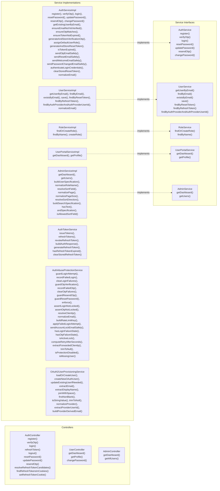
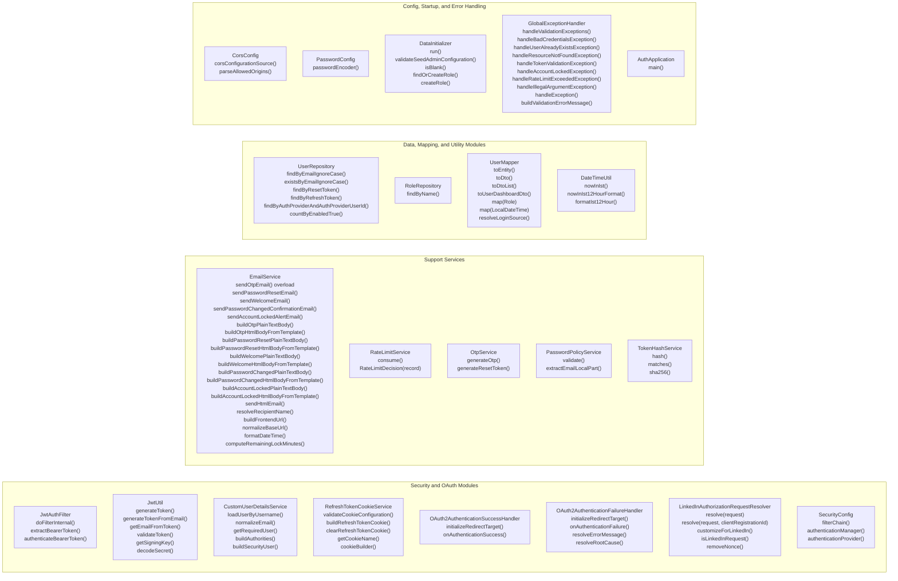

# Full-Stack Authentication System: Design and Implementation Documentation

## 0. Document Purpose
This document is a complete technical blueprint for designing and implementing the Full-Stack Authentication System from scratch.  
It is aligned with the current stack: Spring Boot 3, Java 21, Spring Security, PostgreSQL, Redis, React 19, Vite, and Docker.  
The focus is security-first authentication with OTP verification, JWT access tokens, refresh-token rotation, OAuth2 login, and role-based access control.  
Each section is organized to support both architecture decisions and practical execution by engineering teams.  
Use this as the primary reference for planning, development sequencing, QA validation, and deployment readiness.  
It is intentionally detailed so implementation can proceed task-by-task with minimal ambiguity.  

## 1. Requirements
### 1.1 Functional Requirements
The system must allow user registration using name, email, and password, with email verification enforced by OTP before full activation.  
It must support secure login and return a short-lived access token plus a refresh token in an HttpOnly cookie for session continuity.  
Users must be able to request password reset links, update forgotten passwords via token, and change passwords while authenticated.  
Role-based authorization must support at least two roles: `ROLE_USER` and `ROLE_ADMIN`, with endpoint-level restrictions.  
An admin area must provide dashboard metrics and user listing with pagination, filtering, searching, and sorting.  
OAuth2 sign-in must be available for Google, GitHub, Apple, and LinkedIn, with automatic local user provisioning when needed.  
Frontend routes must enforce protected navigation, role checks, and graceful recovery from expired sessions via refresh flow.  

### 1.2 Non-Functional Requirements
Security controls must include password hashing, token hashing, token rotation, OTP expiration, and centralized exception handling.  
Abuse prevention must include both Redis-backed rate limiting and account-level lockouts after repeated failures.  
The backend must be stateless for API auth flows (JWT-based), while allowing temporary session state required by OAuth2 login handshake.  
The application should be deployable with Docker containers for backend, frontend, PostgreSQL, and Redis.  
API response contracts should stay stable and predictable so frontend and automated tests do not break across internal refactors.  
The codebase should remain modular by layer (controller, service, repository, entity, dto, security) for maintainability and testing.  
Local development must be simple: one command for container stack or separate backend/frontend processes with shared services.  

### 1.3 Security and Compliance Requirements
Passwords must be stored with BCrypt and never logged or returned by API payloads.  
OTP, reset token, and refresh token values must be stored as hashes, not raw values, using a server-side pepper.  
Refresh tokens must be rotated on each refresh and invalidated on logout to reduce replay risk.  
CORS must allow only explicit trusted origins and must not use wildcard when credentials are enabled.  
Cookie security policy must support `HttpOnly`, configurable `SameSite`, and `Secure=true` in HTTPS production environments.  
Brute-force protections must throttle by IP and email and apply temporary lock windows with retry metadata.  
Unhandled exceptions must be masked from clients and logged server-side for diagnostics without leaking sensitive internals.  

### 1.4 Product Constraints and Assumptions
The primary persistence engine is PostgreSQL, and schema evolution is currently managed through JPA auto-update behavior.  
Redis is required for rate-limit counters; if Redis is unavailable, the current implementation fails open to avoid auth outage.  
Email delivery depends on configured SMTP credentials and should be treated as an infrastructure dependency in all environments.  
Frontend keeps only non-sensitive user profile metadata in localStorage and never stores refresh token in browser storage.  
Access token lifetime and refresh token lifetime are configuration-driven and should be environment-specific for security posture.  
The system assumes normalized lowercase email identity across registration, login, OTP, and password reset flows.  
Production deployments should terminate TLS before backend and enforce secure cookie + strict CORS origin mapping.  

## 2. Core Entities
### 2.1 Persisted Domain Entities
The system uses `User` and `Role` as primary persisted entities, with a many-to-many relation via `user_roles`.  
`User` carries identity (`name`, `email`), credential hash (`password`), account state (`enabled`), and audit timestamps (`createdAt`, `updatedAt`).  
`Role` maps directly to `RoleName` enum values (`ROLE_USER`, `ROLE_ADMIN`) and drives authorization decisions.  
Security lifecycle data is embedded in `User`: OTP hash/expiry, reset token hash/expiry, refresh token hash/expiry, and lock counters.  
This design minimizes table count and keeps credential lifecycle tied to user ownership boundaries.  
It is straightforward for MVP and moderate scale, but can evolve to dedicated token/session tables for multi-device session support.  
All user lookups normalize email and use case-insensitive repository methods for consistency.  

### 2.2 Entity Inventory
| Entity | Storage | Purpose | Key Fields | Notes |
|---|---|---|---|---|
| `User` | PostgreSQL (`users`) | Account identity + auth state | `id`, `name`, `email`, `password`, `enabled`, token/OTP fields, lock fields, provider fields, timestamps | Core aggregate for auth |
| `Role` | PostgreSQL (`roles`) | RBAC role definitions | `id`, `name` (`ROLE_USER`, `ROLE_ADMIN`) | Seeded if missing |
| `user_roles` | PostgreSQL join table | Many-to-many user role mapping | `user_id`, `role_id` | Eagerly loaded in current model |
| Rate-limit key | Redis | Fixed-window request throttling | key patterns like `auth:login:ip:<ip>` | TTL-based auto-expiration |

### 2.3 Logical Security Objects
The refresh token is represented as a logical session artifact and persisted as a hash in `User.refreshToken`.  
OTP verification challenge is represented by `verificationOtp` + `otpExpiry` and tied to a single account record.  
Password reset challenge is represented by `resetToken` + `resetTokenExpiry` and invalidated immediately after successful update.  
Login brute-force state uses `failedLoginAttempts` + `accountLockedUntil`, while OTP brute-force uses analogous OTP fields.  
OAuth identity linkage is represented by `authProvider` + `authProviderUserId` to support provider-stable account mapping.  
These fields enable strong security without introducing additional tables in the current version.  
Future evolution can externalize these objects for multi-session and auditing requirements.  

### 2.4 DTO Contracts
Request DTOs define strict payload boundaries for register, login, verify OTP, refresh, reset, update, and change password.  
Response DTOs include `AuthResponse` for token metadata and identity projection, and `MessageResponse` for operation status.  
Admin and user dashboard DTOs are intentionally narrow views, avoiding exposure of sensitive persistence fields.  
MapStruct mapping converts entities to API DTOs and applies standard timestamp formatting for consistent UI display.  
`loginSource` is derived from provider fields to support admin observability of account origin.  
DTO-driven APIs decouple transport contract from persistence schema and lower regression risk during refactoring.  
Validation annotations in request DTOs provide first-line input constraints before service-level policy checks.  

## 3. API Design
### 3.1 API Principles
All business APIs are versioned under `/api/v1` to support safe evolution and backward-compatible rollout strategy.  
Auth endpoints are intentionally public but internally guarded with validation, abuse protection, and lockout checks.  
Protected user/admin endpoints require valid bearer access token and role-based authorization constraints.  
Refresh token retrieval prefers secure cookie, with optional request-body fallback for non-browser clients.  
Response payloads are concise, consistent, and aligned with frontend consumption patterns.  
Error handling is centralized and returns normalized `MessageResponse` structures with appropriate HTTP status codes.  
Rate-limit and account-lock responses include `Retry-After` headers for explicit client behavior control.  

### 3.2 Endpoint Catalog
#### Auth APIs (`/api/v1/auth`)
| Method | Endpoint | Auth | Purpose |
|---|---|---|---|
| `POST` | `/register` | Public | Create account and send OTP |
| `POST` | `/verify-otp` | Public | Verify email with OTP |
| `POST` | `/login` | Public | Authenticate and issue tokens |
| `POST` | `/refresh` | Public | Rotate refresh token and issue new access token |
| `POST` | `/logout` | Public | Revoke refresh token and clear cookie |
| `POST` | `/reset-password` | Public | Send reset link (generic response) |
| `POST` | `/update-password` | Public | Update password using reset token |
| `POST` | `/resend-otp?email=` | Public | Resend OTP with cooldown/limits |

#### User APIs (`/api/v1/user`)
| Method | Endpoint | Auth | Purpose |
|---|---|---|---|
| `GET` | `/dashboard` | `ROLE_USER` or `ROLE_ADMIN` | User dashboard payload |
| `GET` | `/profile` | `ROLE_USER` or `ROLE_ADMIN` | User profile projection |
| `POST` | `/change-password` | `ROLE_USER` or `ROLE_ADMIN` | Authenticated password change |

#### Admin APIs (`/api/v1/admin`)
| Method | Endpoint | Auth | Purpose |
|---|---|---|---|
| `GET` | `/dashboard` | `ROLE_ADMIN` | Admin metrics |
| `GET` | `/users` | `ROLE_ADMIN` | Paginated/filterable user listing |

#### OAuth2 APIs (Spring Security managed)
| Method | Endpoint | Auth | Purpose |
|---|---|---|---|
| `GET` | `/oauth2/authorization/{provider}` | Public | Start OAuth2 flow |
| `GET` | `/login/oauth2/code/{provider}` | Public | Provider callback |

### 3.3 Key Request and Response Models
#### Register Request
```json
{
  "name": "Jane Doe",
  "email": "jane@example.com",
  "password": "Secure123"
}
```

#### Login Response
```json
{
  "code": 200,
  "accessToken": "<jwt>",
  "tokenType": "Bearer",
  "accessTokenExpiresInMs": 900000,
  "refreshTokenExpiresInMs": 604800000,
  "id": 1,
  "name": "Jane Doe",
  "email": "jane@example.com",
  "enabled": true,
  "roles": ["ROLE_USER"]
}
```

#### Standard Error Response
```json
{
  "message": "Too many login attempts from this IP. Please retry later.",
  "success": false,
  "code": 429
}
```

### 3.4 Error Model and Status Codes
Validation failures return `400`, preserving clear client-side correction behavior for bad payloads.  
Invalid credentials and token validation failures return `401` and should trigger session recovery or re-login.  
Duplicate email or already-verified conditions return `409` to communicate conflict in account lifecycle state.  
Missing resources return `404`, while account lockouts return `423`, and rate limits return `429`.  
Unexpected server failures return `500` with a generic message to avoid leaking internals.  
`Retry-After` headers are provided for `423` and `429` to inform UI countdown or retry logic.  
This unified model simplifies frontend toast/error handling and automated API contract testing.  

## 4. High-Level Design
### 4.1 Architecture Overview
The frontend is a React SPA that handles route-level protection, UI workflows, and API interaction through Axios.  
The backend is a layered Spring Boot service with controller, service, repository, and security components.  
PostgreSQL stores users, roles, and token/OTP/account-state attributes required for core authentication workflows.  
Redis stores fixed-window counters for rate-limiting and abuse throttling, keyed by IP and account dimensions.  
SMTP integration sends OTP, reset, welcome, and security alert emails using Thymeleaf templates.  
OAuth2 integration is delegated to Spring Security client registrations and custom success/failure handlers.  
Docker Compose orchestrates local full stack including observability utilities (Adminer and Redis Commander).  

### 4.2 Component Boundaries
`AuthController`, `UserController`, and `AdminController` expose HTTP APIs and map requests to domain services.  
`AuthServiceImpl` owns account lifecycle use-cases: register, verify OTP, login, reset/update password, resend OTP, change password.  
`AuthTokenService` manages JWT issuance and refresh-token rotation/revocation with hash-based persistence.  
`AuthAbuseProtectionService` combines Redis rate limits and per-account lock states for defensive throttling.  
`OAuth2UserProvisioningService` normalizes provider payloads and links or creates local users safely.  
`JwtAuthFilter` authenticates bearer tokens for protected APIs, while method-security annotations enforce role access.  
`UserMapper` and DTOs form the API contract boundary and prevent accidental domain overexposure.  

### 4.3 End-to-End Request Flow (Textual Diagram)
```text
Browser (React)
  -> Axios request (/api/v1/auth/login)
  -> Spring Security filter chain
  -> AuthController
  -> AuthServiceImpl + AuthAbuseProtectionService
  -> AuthenticationManager + UserService + AuthTokenService
  -> PostgreSQL (user read/update) + refresh cookie set
  -> JSON AuthResponse + HttpOnly refresh cookie
```

```text
Protected API request (/api/v1/user/dashboard)
  -> Axios adds Authorization: Bearer <accessToken>
  -> JwtAuthFilter validates token and sets SecurityContext
  -> UserController -> UserPortalService -> UserRepository
  -> DTO response returned to frontend
```

### 4.4 Deployment Model
Backend container runs Spring Boot app on port `8080` and depends on PostgreSQL and Redis service health.  
Frontend container builds static Vite assets and serves them via Nginx on port `5173` (mapped from container port `80`).  
PostgreSQL and Redis persist state via Docker volumes for local durability between restarts.  
Adminer and Redis Commander are optional auxiliary services for development diagnostics and data inspection.  
Environment variables are split between backend secrets/runtime config and frontend public API base URLs.  
For production, use HTTPS termination, `Secure` cookies, strict CORS origins, and secret management outside source control.  
CI/CD should include test execution, image build, vulnerability scan, and environment-specific deploy promotion gates.  

## 5. Deep Dives
### 5.1 Registration and OTP Verification
Registration validates uniqueness and password policy, stores a BCrypt password hash, and marks account as disabled.  
A 6-digit OTP is generated, hashed with `TokenHashService`, and stored with expiry in the user record.  
OTP email delivery is attempted with fail-safe logging so temporary SMTP outages do not crash the flow.  
Verification endpoint first applies abuse guards, then checks user existence, status, OTP hash match, and expiry window.  
On success, account is enabled, OTP state is cleared, and OTP failure counters/locks are reset.  
Welcome email is sent asynchronously in-process with exception shielding to preserve response stability.  
This flow enforces proof-of-email ownership before granting usable account access.  

### 5.2 Login, Access Token, and Refresh Rotation
Login first enforces IP/email rate limits and checks account-level lock status before credential authentication.  
On invalid credentials, failed login counters are incremented and lock window applied after threshold is reached.  
On success, a JWT access token is generated from email subject and short expiration policy.  
A high-entropy refresh token is generated, hashed, persisted, and returned only via HttpOnly cookie to the browser.  
Refresh endpoint accepts cookie token (or optional body token), validates hash+expiry, and rotates token on every call.  
Rotation invalidates old refresh token implicitly because only latest hash remains stored in user row.  
Frontend interceptors call refresh on `401` (excluding auth endpoints), then retry original request automatically.  

### 5.3 Logout and Session Revocation
Logout resolves refresh token candidates from body and cookies to support browser and non-browser clients.  
Each candidate token is hashed and looked up; matched session state is cleared by nulling stored refresh hash and expiry.  
Response always sends an expired refresh cookie to wipe browser state even if token was absent or already invalid.  
This design keeps logout idempotent and reduces edge-case failures on partially-expired sessions.  
Because access tokens are stateless JWTs, immediate access-token revocation is not performed in current implementation.  
Security posture relies on short access-token lifetime and refresh-token invalidation to limit residual window.  
Future hardening can introduce token deny-listing for high-security environments requiring immediate JWT revocation.  

### 5.4 Password Reset and Password Change
Forgot-password endpoint returns generic success text regardless of account existence to prevent email enumeration.  
When account exists, reset token is generated, hashed, expiry-bound, stored, and emailed as frontend URL query token.  
Update-password endpoint validates hashed token lookup, expiry, and strong password policy before password replacement.  
Reset token fields are cleared immediately after successful update to enforce one-time token semantics.  
Authenticated change-password requires current-password verification before policy-compliant new password is accepted.  
Both reset and change flows send password-change confirmation email to improve account security awareness.  
Rate limits on reset requests reduce abuse and mail flooding risk.  

### 5.5 Abuse Protection: Rate Limits and Lockouts
`RateLimitService` applies fixed-window counters in Redis and returns allow/deny with retry metadata and TTL.  
`AuthAbuseProtectionService` wraps these counters into endpoint-specific limits across login, OTP verify, resend OTP, and reset password.  
Login and OTP flows also maintain per-user failure counters persisted in PostgreSQL for account-centric brute-force defense.  
When failure threshold is crossed, account or OTP verification is locked for configured minutes and guarded by dedicated exceptions.  
Both lock and rate-limit exceptions include `Retry-After` headers so clients can enforce cooldown UX.  
If Redis fails, service intentionally fails open to preserve authentication availability rather than full outage.  
Operationally, this should be paired with monitoring and alerts on repeated Redis-rate-limit bypass conditions.  

### 5.6 OAuth2 Provisioning and Callback Flow
User initiates OAuth login from frontend by redirecting to backend `/oauth2/authorization/{provider}` endpoint.  
Spring Security handles provider redirect and callback, then custom success handler provisions or links a local account.  
Provisioning resolves provider user ID and email with provider-specific fallback logic for missing attributes.  
If existing user by provider mapping exists, profile fields are updated only when missing to avoid destructive overwrite.  
If only email match exists, account is linked to provider metadata and enabled for future OAuth logins.  
After provisioning, same token issuance pipeline is used: access token in body and refresh token in HttpOnly cookie.  
Frontend callback page finalizes session by calling `/auth/refresh` once and routing user by role.  

### 5.7 Admin Query Model
Admin users API supports page, size, search, enabled, role, sortBy, and sortDir query parameters.  
Service layer normalizes page/size bounds and restricts sortable fields to a safe allowlist.  
Search is implemented as case-insensitive partial match on user name and email columns.  
Role filter accepts both compact (`USER`) and explicit (`ROLE_USER`) formats for frontend convenience.  
Results are returned as Spring Data `Page<UserDto>` with stable serialization mode configured via `SpringDataWebConfig`.  
DTO mapping includes derived `loginSource` and IST-formatted timestamps for consistent admin table rendering.  
This query model balances flexibility and safety without exposing direct query composition to clients.  

### 5.8 Frontend Session and Route Protection
Frontend stores only non-sensitive user profile in localStorage, while keeping access token in in-memory variable.  
Axios request interceptor injects bearer access token, and response interceptor handles refresh+retry on unauthorized errors.  
Refresh calls are deduplicated during concurrent failures using subscriber queue to prevent refresh stampede.  
`AuthProvider` bootstraps session by calling refresh on app load except during OAuth callback route.  
`ProtectedRoute` blocks unauthenticated access and supports `adminOnly` guard for privileged screens.  
User dashboard exposes OTP reminder for unverified accounts, while admin dashboard consumes filtered paginated APIs.  
This design provides good UX continuity while reducing exposure of long-lived credentials in browser storage.  

## 6. Step-by-Step Implementation Plan (Task by Task)
### Task 1: Repository Initialization and Project Skeleton
Create backend and frontend modules with clear folder boundaries before writing business code.  
Initialize Spring Boot backend with dependencies for Web, Security, JPA, Validation, Mail, Redis, OAuth2, and Test.  
Initialize React + Vite frontend with routing, Axios client wrapper, and component/page structure.  
Establish shared coding conventions, DTO-first API contracts, and environment-variable naming standards.  
Add `.env.example` files for backend/frontend and baseline README with startup commands.  
Definition of done: backend and frontend both run independently with placeholder health checks.  

### Task 2: Local Infrastructure and Container Orchestration
Define Docker Compose services for PostgreSQL, Redis, backend app, frontend static server, and optional tools.  
Wire health checks so app startup waits for data dependencies to become ready.  
Mount named volumes for PostgreSQL and Redis to persist data across container restarts.  
Inject backend secrets/config as environment variables and frontend public variables as build arguments.  
Add service port mappings for development ergonomics and ensure no collisions with local tools.  
Definition of done: full stack starts and remains healthy with one compose command.  

### Task 3: Core Domain Modeling and Persistence Layer
Implement `User`, `Role`, and `RoleName` with required authentication, verification, and lock-state fields.  
Map many-to-many user-role relation via `user_roles` join table with role eager load for auth checks.  
Add repository methods for case-insensitive email lookup and token/provider-specific lookups.  
Implement timestamp lifecycle hooks and standardize timezone handling utilities for consistent outputs.  
Create role service to find-or-create roles and ensure role seeding at startup.  
Definition of done: schema auto-creates and repository queries satisfy auth workflow needs.  

### Task 4: Security Foundation (Password, JWT, Filters, CORS)
Configure BCrypt password encoder and custom `UserDetailsService` for authentication manager integration.  
Implement JWT utility for generation, validation, and subject extraction using strong secret validation.  
Implement `JwtAuthFilter` to parse bearer header and populate security context per protected request.  
Configure security filter chain for public auth/OAuth routes and role-protected user/admin routes.  
Set CORS to explicit trusted origins with credentials enabled and header allowlists defined.  
Definition of done: protected routes reject unauthorized requests and accept valid bearer JWT.  

### Task 5: Token Lifecycle Services
Implement `AuthTokenService` to issue access token + refresh token pair on login and OAuth success.  
Generate refresh token with cryptographically strong randomness and store only hashed token in database.  
Add refresh endpoint behavior to rotate token atomically and persist latest token hash/expiry.  
Add revoke flow to clear stored refresh session state and support idempotent logout behavior.  
Implement refresh cookie helper with configurable name, path, secure, same-site, and domain policies.  
Definition of done: login, refresh, and logout flows pass manual and automated validation scenarios.  

### Task 6: Password Policy and Token Hashing Utilities
Implement policy checks for minimum length, alphanumeric complexity, whitespace rejection, and blocklisted values.  
Add contextual validation to reject passwords containing user email local-part for predictability reduction.  
Implement deterministic SHA-256 token hashing with configurable server-side pepper.  
Provide constant-time comparison helper for OTP and token match checks to reduce timing leakage risk.  
Use these utilities consistently in OTP verify, reset password, refresh token, and resend workflows.  
Definition of done: weak passwords and invalid token inputs are rejected with clear error messages.  

### Task 7: Registration and OTP Verification Flows
Implement register flow: normalize email, check existence, validate password, hash password, assign role.  
Generate OTP, hash + store with expiry, persist user as disabled, and send verification email template.  
Implement OTP verify flow with guard checks, hash comparison, expiry validation, and account activation.  
Clear OTP state and failure counters after successful verification to avoid stale lock artifacts.  
Implement resend OTP endpoint with cooldown and request-window protection.  
Definition of done: user can complete register -> verify OTP -> login happy path.  

### Task 8: Login, Abuse Protection, and Lockout Controls
Implement login flow with pre-auth guard checks (IP/email throttling + lock-state validation).  
On failed credentials, increment failure counters and apply temporary lock after threshold breaches.  
On successful auth, clear prior failure state and issue token pair via token service.  
Add OTP verification failure counters and OTP lock duration to prevent brute-force code guessing.  
Return lock and rate-limit errors with `Retry-After` headers to support deterministic client behavior.  
Definition of done: brute-force simulations trigger throttling/lockouts as configured.  

### Task 9: Password Reset and Authenticated Password Change
Implement forgot-password endpoint with generic response semantics to prevent account enumeration leakage.  
Generate reset token, hash/store with expiry, and email frontend reset link when account exists.  
Implement update-password endpoint to validate token hash + expiry and set new BCrypt password hash.  
Clear reset token fields immediately after successful password change to enforce one-time usage.  
Implement authenticated change-password endpoint requiring current-password confirmation.  
Definition of done: reset and change flows both succeed and invalidate old credentials safely.  

### Task 10: OAuth2 Integration and User Provisioning
Configure OAuth2 client registrations and provider settings for Google, GitHub, Apple, and LinkedIn.  
Implement LinkedIn authorization request customization to resolve nonce-compatibility issues.  
Implement provisioning service to map provider attributes, resolve stable provider IDs, and normalize email/name.  
Link existing local account by provider or email when appropriate; otherwise create enabled OAuth user.  
Handle success by issuing tokens + cookie and redirecting frontend callback route without exposing token in URL.  
Definition of done: each enabled provider supports successful login and repeat login idempotently.  

### Task 11: Controller Layer and Global Exception Strategy
Expose auth, user, and admin endpoints with request validation and clear route versioning constants.  
Ensure refresh/logout can resolve token from both cookie and optional JSON body fallback.  
Add `@PreAuthorize` and endpoint authorization mappings for role-protected routes.  
Implement global exception handler to map validation, auth, domain, lockout, rate-limit, and unknown errors.  
Standardize error payload format (`MessageResponse`) to reduce client-side branching complexity.  
Definition of done: all expected error paths return consistent status codes and response schema.  

### Task 12: User and Admin Portal Services
Implement user dashboard/profile composition service using authenticated principal email context.  
Implement admin dashboard metrics with total/active counts and formatted timestamps.  
Implement admin user listing with page/size bounds, safe sort field allowlist, and dynamic specification filters.  
Map user entities to DTO projections with derived login source and role flattening.  
Enable stable page serialization format for frontend compatibility across framework changes.  
Definition of done: user/admin screens can fetch data correctly with role-appropriate access.  

### Task 13: Frontend API Client and Session Orchestration
Create Axios instance with base URL, JSON headers, credential inclusion, and auth helper methods.  
Implement in-memory access-token storage and localStorage user profile persistence with safe parsing.  
Add interceptor-based refresh-retry pipeline with refresh deduplication for concurrent 401 responses.  
Implement auth context with bootstrap refresh, login/logout methods, and role-check helpers.  
Route users after login/OAuth by role and clear auth state on refresh failure.  
Definition of done: page reload keeps session alive via refresh cookie until refresh expiry.  

### Task 14: Frontend Screens and Protected Routing
Build pages for login, register, OTP verify/resend, forgot password, reset password, user dashboard, admin dashboard.  
Implement protected route component for authentication gate and admin-only access enforcement.  
Use API error responses to show meaningful toast notifications and enforce retry/cooldown UX where needed.  
Include OTP input UX improvements like per-digit boxes, auto-focus, and paste support.  
Implement admin table controls for search, status filter, role filter, and pagination.  
Definition of done: all primary user journeys are navigable end-to-end from UI.  

### Task 15: Email Templates and Notification Pipeline
Create Thymeleaf templates for OTP, password reset, welcome, password changed, and account-locked alerts.  
Ensure each email has plain-text fallback body and HTML body for broad client compatibility.  
Inject brand, user, time, and action URLs as template variables for personalization and trust.  
Wrap outbound mail send in safe exception boundaries where business flow should not hard-fail on mail outage.  
Use SMTP app credentials and environment-specific sender configuration.  
Definition of done: all email-triggering flows send correctly formatted messages in integration testing.  

### Task 16: Testing and Quality Gates
Add unit tests for service logic: token rotation, password policy, OAuth provisioning, and abuse protection behavior.  
Add controller tests for happy path and key failure paths (validation, auth failure, lockout, rate limit).  
Add security tests ensuring unauthorized requests are rejected and role constraints are enforced.  
Add frontend tests or smoke checks for route guards, auth bootstrap, and refresh-retry behavior.  
Run backend `mvn test` and frontend lint/build in CI on pull requests.  
Definition of done: baseline automated suite protects critical auth regressions.  

### Task 17: Production Hardening and Operations
Set HTTPS-only deployment with `auth.refresh-token.cookie-secure=true` and strict origin-based CORS config.  
Store secrets in secure vaults or CI secret managers; never commit runtime `.env` files.  
Tune rate-limit and lockout thresholds from operational telemetry to balance UX and abuse resistance.  
Add structured logging, request tracing, and alerts for auth failures, lock spikes, and SMTP/Redis outages.  
Plan migration from JPA `ddl-auto=update` to versioned schema migrations for controlled production changes.  
Definition of done: system is observable, secure, and operable under expected traffic and threat conditions.  

## 7. Validation Checklist
User can register, receive OTP, verify, login, access dashboard, logout, and re-login.  
Refresh token auto-rotates and refresh endpoint issues new access token without exposing refresh token to JS.  
Forgot-password and reset-password flow works end-to-end with expiring one-time token behavior.  
Rate-limit and lockout protections trigger correctly and include `Retry-After` headers.  
OAuth2 login succeeds for configured providers and users are provisioned/linked correctly.  
Admin can view metrics and query users with filters, pagination, and stable sort behavior.  
Dockerized stack starts reliably and frontend/backend integrate correctly with configured environment values.  

## 8. Suggested Future Enhancements
Move refresh tokens from single-user-column storage to dedicated session table for multi-device concurrent sessions.  
Add audit tables/events for security-sensitive actions such as login, reset-password, role changes, and lockouts.  
Introduce MFA options beyond email OTP (TOTP app or WebAuthn) for stronger account protection.  
Adopt Flyway or Liquibase for deterministic schema versioning and rollback strategy.  
Add OpenAPI/Swagger generation for machine-readable API documentation and client SDK support.  
Implement centralized metrics dashboards and anomaly detection around auth and abuse-protection events.  
Consider token revocation list for immediate JWT invalidation in high-security use cases.  

## 9. Backend Mermaid Diagram (Backend Only)
This section is intentionally scoped to backend modules and backend methods only.

### 9.1 Backend Runtime Interaction Diagram

```mermaid
flowchart TB
  subgraph API["API Layer"]
    AC["AuthController<br/>register(), verifyOtp(), login(), refreshToken(), logout(), resetPassword(), updatePassword(), resendOtp()"]
    UC["UserController<br/>getDashboard(), getProfile(), changePassword()"]
    ADC["AdminController<br/>getDashboard(), getAllUsers()"]
  end

  subgraph CONTRACTS["Service Contracts"]
    AS["AuthService"]
    US["UserService"]
    RS["RoleService"]
    UPS["UserPortalService"]
    ADS["AdminService"]
  end

  subgraph CORE["Service Implementations"]
    ASI["AuthServiceImpl<br/>register(), verifyOtp(), login(), resetPassword(), updatePassword(), resendOtp(), changePassword()"]
    USI["UserServiceImpl<br/>getUserByEmail(), findByEmail(), existsByEmail(), save(), findByResetToken(), findByRefreshToken(), findByAuthProviderAndAuthProviderUserId()"]
    RSI["RoleServiceImpl<br/>findOrCreateRole(), findByName()"]
    UPSI["UserPortalServiceImpl<br/>getDashboard(), getProfile()"]
    ADSI["AdminServiceImpl<br/>getDashboard(), getUsers()"]
    ATS["AuthTokenService<br/>issueTokens(), refreshTokens(), revokeRefreshToken()"]
    AAPS["AuthAbuseProtectionService<br/>guardLoginAttempt(), recordFailedLogin(), clearLoginFailures(), guardOtpVerification(), recordFailedOtp(), clearOtpFailures(), guardResendOtp(), guardResetPassword()"]
    OUPS["OAuth2UserProvisioningService<br/>loadOrCreateUser()"]
  end

  subgraph SECURITY["Security and OAuth"]
    SC["SecurityConfig<br/>filterChain(), authenticationManager(), authenticationProvider()"]
    JAF["JwtAuthFilter<br/>doFilterInternal()"]
    JU["JwtUtil<br/>generateTokenFromEmail(), getEmailFromToken(), validateToken()"]
    CUDS["CustomUserDetailsService<br/>loadUserByUsername()"]
    RTCS["RefreshTokenCookieService<br/>buildRefreshTokenCookie(), clearRefreshTokenCookie(), getCookieName()"]
    O2S["OAuth2AuthenticationSuccessHandler<br/>onAuthenticationSuccess()"]
    O2F["OAuth2AuthenticationFailureHandler<br/>onAuthenticationFailure()"]
    LIR["LinkedInAuthorizationRequestResolver<br/>resolve(), resolve(request, clientRegistrationId)"]
  end

  subgraph SUPPORT["Support Utilities"]
    EMS["EmailService<br/>sendOtpEmail(), sendPasswordResetEmail(), sendWelcomeEmail(), sendPasswordChangedConfirmationEmail(), sendAccountLockedAlertEmail()"]
    OPS["OtpService<br/>generateOtp(), generateResetToken()"]
    PPS["PasswordPolicyService<br/>validate()"]
    THS["TokenHashService<br/>hash(), matches()"]
    RLS["RateLimitService<br/>consume()"]
  end

  subgraph DATA["Data and Mapping"]
    UR["UserRepository<br/>findByEmailIgnoreCase(), existsByEmailIgnoreCase(), findByResetToken(), findByRefreshToken(), findByAuthProviderAndAuthProviderUserId(), countByEnabledTrue()"]
    RR["RoleRepository<br/>findByName()"]
    UM["UserMapper<br/>toEntity(), toDto(), toDtoList(), toUserDashboardDto(), resolveLoginSource()"]
    DTU["DateTimeUtil<br/>nowInIst(), nowInIst12HourFormat(), formatIst12Hour()"]
  end

  subgraph BOOT["Bootstrapping and Error Handling"]
    DI["DataInitializer<br/>run(), findOrCreateRole(), createRole()"]
    GEH["GlobalExceptionHandler<br/>handleValidationExceptions(), handleBadCredentialsException(), handleUserAlreadyExistsException(), handleResourceNotFoundException(), handleTokenValidationException(), handleAccountLockedException(), handleRateLimitExceededException(), handleIllegalArgumentException(), handleException()"]
  end

  AC --> AS
  AC --> ATS
  AC --> RTCS
  UC --> AS
  UC --> UPS
  ADC --> ADS

  ASI -.implements.-> AS
  USI -.implements.-> US
  RSI -.implements.-> RS
  UPSI -.implements.-> UPS
  ADSI -.implements.-> ADS

  ASI --> US
  ASI --> RS
  ASI --> ATS
  ASI --> AAPS
  ASI --> OPS
  ASI --> PPS
  ASI --> THS
  ASI --> EMS
  ASI --> UM

  USI --> UR
  RSI --> RR
  UPSI --> US
  UPSI --> UM
  UPSI --> DTU
  ADSI --> UR
  ADSI --> UM
  ADSI --> DTU

  ATS --> JU
  ATS --> US
  ATS --> THS

  AAPS --> RLS
  AAPS --> US
  AAPS --> EMS

  OUPS --> US
  OUPS --> RS
  O2S --> OUPS
  O2S --> ATS
  O2S --> RTCS

  JAF --> JU
  JAF --> CUDS
  CUDS --> US
  SC --> JAF
  SC --> O2S
  SC --> O2F
  SC --> LIR

  DI --> UR
  DI --> RR

  UC -.errors.-> GEH
  AC -.errors.-> GEH
  ADC -.errors.-> GEH
```


### 9.2 Backend Module and Method Inventory (Controllers + Services)


### 9.3 Backend Module and Method Inventory (Security + Support + Data + Config)


### 9.4 Feature-to-Method Traceability Diagram (Backend)

```mermaid
flowchart LR
  classDef feature fill:#0f766e,stroke:#0f766e,color:#ffffff,stroke-width:1px;
  classDef controller fill:#0369a1,stroke:#075985,color:#ffffff,stroke-width:1px;
  classDef service fill:#166534,stroke:#14532d,color:#ffffff,stroke-width:1px;
  classDef helper fill:#b45309,stroke:#92400e,color:#ffffff,stroke-width:1px;
  classDef data fill:#475569,stroke:#334155,color:#ffffff,stroke-width:1px;

  subgraph CORE["Auth Core Features"]
    direction TB

    subgraph REG["Register Account"]
      direction LR
      REG_F["Feature"]:::feature --> REG_C["AuthController.register()"]:::controller
      REG_C --> REG_S["AuthServiceImpl.register()"]:::service
      REG_S --> REG_H1["UserService.existsByEmail()<br/>PasswordPolicyService.validate()<br/>UserMapper.toEntity()"]:::helper
      REG_S --> REG_H2["generateAndStoreVerificationOtp()<br/>OtpService.generateOtp()<br/>TokenHashService.hash()"]:::helper
      REG_S --> REG_H3["assignDefaultUserRole()<br/>RoleService.findOrCreateRole()"]:::helper
      REG_S --> REG_D["UserService.save()<br/>EmailService.sendOtpEmail()"]:::data
    end

    subgraph VOTP["Verify OTP"]
      direction LR
      VOTP_F["Feature"]:::feature --> VOTP_C["AuthController.verifyOtp()"]:::controller
      VOTP_C --> VOTP_S["AuthServiceImpl.verifyOtp()"]:::service
      VOTP_S --> VOTP_H1["AuthAbuseProtectionService.guardOtpVerification()<br/>RateLimitService.consume()"]:::helper
      VOTP_S --> VOTP_H2["getExistingUserByEmail()<br/>UserService.findByEmail()"]:::helper
      VOTP_S --> VOTP_H3["ensureOtpMatches()<br/>TokenHashService.matches()<br/>ensureTokenNotExpired()"]:::helper
      VOTP_S --> VOTP_D["clearOtpFailures()<br/>UserService.save()<br/>EmailService.sendWelcomeEmail()"]:::data
    end

    subgraph LOGIN["Login"]
      direction LR
      LOGIN_F["Feature"]:::feature --> LOGIN_C["AuthController.login()"]:::controller
      LOGIN_C --> LOGIN_S["AuthServiceImpl.login()"]:::service
      LOGIN_S --> LOGIN_H1["guardLoginAttempt()<br/>UserService.findByEmail()<br/>authenticateLoginCredentials()"]:::helper
      LOGIN_H1 --> LOGIN_H2["AuthenticationManager.authenticate()<br/>recordFailedLogin() on failure"]:::helper
      LOGIN_S --> LOGIN_T["AuthTokenService.issueTokens()"]:::service
      LOGIN_T --> LOGIN_H3["JwtUtil.generateTokenFromEmail()<br/>generateRefreshToken()<br/>TokenHashService.hash()<br/>UserService.save()<br/>buildAuthResponse()"]:::helper
      LOGIN_C --> LOGIN_D["setRefreshTokenCookie()<br/>RefreshTokenCookieService.buildRefreshTokenCookie()"]:::data
    end

    subgraph REFRESH["Refresh Token"]
      direction LR
      REFRESH_F["Feature"]:::feature --> REFRESH_C["AuthController.refreshToken()"]:::controller
      REFRESH_C --> REFRESH_H1["resolveRefreshTokenCandidates()<br/>findRefreshTokensInCookies()"]:::helper
      REFRESH_C --> REFRESH_S["AuthTokenService.refreshTokens()"]:::service
      REFRESH_S --> REFRESH_H2["TokenHashService.hash()<br/>UserService.findByRefreshToken()"]:::helper
      REFRESH_S --> REFRESH_H3["hasRefreshTokenExpired()<br/>clearStoredRefreshToken() when expired"]:::helper
      REFRESH_S --> REFRESH_H4["issueTokens()"]:::helper
      REFRESH_C --> REFRESH_D["setRefreshTokenCookie()<br/>buildRefreshTokenCookie()"]:::data
    end

    subgraph LOGOUT["Logout"]
      direction LR
      LOGOUT_F["Feature"]:::feature --> LOGOUT_C["AuthController.logout()"]:::controller
      LOGOUT_C --> LOGOUT_H1["resolveRefreshTokenCandidates()"]:::helper
      LOGOUT_C --> LOGOUT_S["AuthTokenService.revokeRefreshToken()"]:::service
      LOGOUT_S --> LOGOUT_H2["TokenHashService.hash()<br/>UserService.findByRefreshToken()<br/>clearStoredRefreshToken()<br/>UserService.save()"]:::helper
      LOGOUT_C --> LOGOUT_D["RefreshTokenCookieService.clearRefreshTokenCookie()"]:::data
    end
  end
```

```mermaid
flowchart LR
  classDef feature fill:#0f766e,stroke:#0f766e,color:#ffffff,stroke-width:1px;
  classDef controller fill:#0369a1,stroke:#075985,color:#ffffff,stroke-width:1px;
  classDef service fill:#166534,stroke:#14532d,color:#ffffff,stroke-width:1px;
  classDef helper fill:#b45309,stroke:#92400e,color:#ffffff,stroke-width:1px;
  classDef data fill:#475569,stroke:#334155,color:#ffffff,stroke-width:1px;

  subgraph RECOVERY["Credential Recovery and Portal Features"]
    direction TB

    subgraph RESET_REQ["Request Password Reset"]
      direction LR
      RQ_F["Feature"]:::feature --> RQ_C["AuthController.resetPassword()"]:::controller
      RQ_C --> RQ_S["AuthServiceImpl.resetPassword()"]:::service
      RQ_S --> RQ_H1["guardResetPassword()<br/>UserService.findByEmail()"]:::helper
      RQ_S --> RQ_H2["generateAndStoreResetToken()<br/>OtpService.generateResetToken()<br/>TokenHashService.hash()"]:::helper
      RQ_S --> RQ_D["UserService.save()<br/>EmailService.sendPasswordResetEmail()"]:::data
    end

    subgraph RESET_UPD["Update Password (Reset Token)"]
      direction LR
      RU_F["Feature"]:::feature --> RU_C["AuthController.updatePassword()"]:::controller
      RU_C --> RU_S["AuthServiceImpl.updatePassword()"]:::service
      RU_S --> RU_H1["TokenHashService.hash()<br/>UserService.findByResetToken()<br/>ensureTokenNotExpired()"]:::helper
      RU_S --> RU_H2["PasswordPolicyService.validate()<br/>PasswordEncoder.encode()<br/>clearStoredResetToken()"]:::helper
      RU_S --> RU_D["UserService.save()<br/>EmailService.sendPasswordChangedConfirmationEmail()"]:::data
    end

    subgraph RESEND_OTP["Resend OTP"]
      direction LR
      RO_F["Feature"]:::feature --> RO_C["AuthController.resendOtp()"]:::controller
      RO_C --> RO_S["AuthServiceImpl.resendOtp()"]:::service
      RO_S --> RO_H1["guardResendOtp()<br/>getExistingUserByEmail()<br/>UserService.findByEmail()"]:::helper
      RO_S --> RO_H2["generateAndStoreVerificationOtp()<br/>OtpService.generateOtp()<br/>TokenHashService.hash()"]:::helper
      RO_S --> RO_D["UserService.save()<br/>EmailService.sendOtpEmail()"]:::data
    end

    subgraph CHANGE_PWD["Change Password (Authenticated)"]
      direction LR
      CP_F["Feature"]:::feature --> CP_C["UserController.changePassword()"]:::controller
      CP_C --> CP_S["AuthServiceImpl.changePassword()"]:::service
      CP_S --> CP_H["getExistingUserByEmail()<br/>UserService.findByEmail()<br/>PasswordEncoder.matches()<br/>PasswordPolicyService.validate()<br/>PasswordEncoder.encode()"]:::helper
      CP_S --> CP_D["UserService.save()<br/>EmailService.sendPasswordChangedConfirmationEmail()"]:::data
    end

    subgraph USER_PORTAL["User Dashboard and Profile"]
      direction LR
      UP_F["Feature"]:::feature --> UP_C["UserController.getDashboard()<br/>UserController.getProfile()"]:::controller
      UP_C --> UP_S["UserPortalServiceImpl.getDashboard()<br/>UserPortalServiceImpl.getProfile()"]:::service
      UP_S --> UP_H["UserService.getUserByEmail()<br/>UserMapper.toUserDashboardDto()<br/>UserMapper.toDto()<br/>DateTimeUtil.nowInIst12HourFormat()"]:::helper
    end

    subgraph ADMIN_PORTAL["Admin Dashboard and User List"]
      direction LR
      AP_F["Feature"]:::feature --> AP_C["AdminController.getDashboard()<br/>AdminController.getAllUsers()"]:::controller
      AP_C --> AP_S["AdminServiceImpl.getDashboard()<br/>AdminServiceImpl.getUsers()"]:::service
      AP_S --> AP_H1["count(), countByEnabledTrue(), nowInIst12HourFormat()"]:::helper
      AP_S --> AP_H2["normalizePage(), normalizePageSize(), resolveSortField(), resolveSortDirection()<br/>buildUserSpecification(), buildSearchSpecification(), normalizeRoleName(), andSpecification()"]:::helper
      AP_S --> AP_D["UserRepository.findAll(specification, pageable)<br/>UserMapper.toDto()"]:::data
    end
  end
```

```mermaid
flowchart LR
  classDef feature fill:#0f766e,stroke:#0f766e,color:#ffffff,stroke-width:1px;
  classDef controller fill:#0369a1,stroke:#075985,color:#ffffff,stroke-width:1px;
  classDef service fill:#166534,stroke:#14532d,color:#ffffff,stroke-width:1px;
  classDef helper fill:#b45309,stroke:#92400e,color:#ffffff,stroke-width:1px;
  classDef data fill:#475569,stroke:#334155,color:#ffffff,stroke-width:1px;

  subgraph SEC_FLOWS["OAuth2 and Protected API Security Flows"]
    direction TB

    subgraph OAUTH_FLOW["OAuth2 Login Flow"]
      direction LR
      OA_F["Feature"]:::feature --> OA_C["OAuth2AuthenticationSuccessHandler.onAuthenticationSuccess()"]:::controller
      OA_C --> OA_S["OAuth2UserProvisioningService.loadOrCreateUser()"]:::service
      OA_S --> OA_H["findByAuthProviderAndAuthProviderUserId()<br/>findByEmail()<br/>findOrCreateRole()<br/>save()"]:::helper
      OA_C --> OA_D["AuthTokenService.issueTokens()<br/>RefreshTokenCookieService.buildRefreshTokenCookie()"]:::data
      OA_E["OAuth2AuthenticationFailureHandler.onAuthenticationFailure()<br/>resolveErrorMessage()<br/>resolveRootCause()"]:::helper
      OA_L["LinkedInAuthorizationRequestResolver.resolve()<br/>customizeForLinkedIn()<br/>removeNonce()"]:::helper
    end

    subgraph JWT_FLOW["Protected API JWT Authentication"]
      direction LR
      JW_F["Feature"]:::feature --> JW_C["SecurityConfig.filterChain()"]:::controller
      JW_C --> JW_S["JwtAuthFilter.doFilterInternal()"]:::service
      JW_S --> JW_H1["extractBearerToken()<br/>JwtUtil.validateToken()"]:::helper
      JW_S --> JW_H2["authenticateBearerToken()<br/>JwtUtil.getEmailFromToken()<br/>CustomUserDetailsService.loadUserByUsername()<br/>UserService.findByEmail()"]:::helper
    end
  end
```






## 10. Project Roadmap (Execution Timeline)
This roadmap translates the implementation plan into a date-driven delivery sequence.

### 10.1 Timeline and Milestones
| Phase | Calendar Window | Backend Delivery Scope | Exit Criteria |
|---|---|---|---|
| Phase 1: Foundation and Contracts | March 9-13, 2026 | Finalize API contracts, DTO validation rules, security config baseline, CORS/cookie policy defaults | API contract freeze completed and security baseline reviewed |
| Phase 2: Core Auth and Token Lifecycle | March 16-27, 2026 | Register/verify/login/refresh/logout flows with JWT + refresh rotation + cookie handling | End-to-end auth happy path passes locally and in CI |
| Phase 3: Abuse Protection and Recovery Flows | March 30-April 10, 2026 | Rate limiting, lockouts, OTP resend controls, reset/update/change password, account-lock alert email | Brute-force and recovery scenarios pass service/controller tests |
| Phase 4: OAuth2 and Admin/User Portal Services | April 13-24, 2026 | OAuth2 provisioning + handlers, dashboard services, admin user query filters/sorting/pagination | OAuth providers work and role-based portal APIs are stable |
| Phase 5: Test Hardening and Observability | April 27-May 8, 2026 | Expand unit/controller/security tests, improve logging/alerts, validate error contracts | Regression suite green and alerting hooks verified |
| Phase 6: Release Readiness and Deployment | May 11-22, 2026 | Production config hardening, container readiness, rollout checklist, rollback plan | Release candidate approved for deployment |

### 10.2 Dependency Order
1. Security foundation (`SecurityConfig`, `JwtUtil`, `JwtAuthFilter`) must be stable before full endpoint hardening.
2. `AuthTokenService` and `RefreshTokenCookieService` must be complete before frontend session orchestration is finalized.
3. `AuthAbuseProtectionService` and `RateLimitService` should be enabled before opening public registration/login traffic.
4. OAuth2 handlers depend on successful completion of token issuance and user provisioning modules.
5. Admin/user dashboard modules should follow stable mapper and repository query behavior.
6. Production cutover should happen only after lockout/rate-limit and reset-password paths are test-covered.

### 10.3 Weekly Delivery Cadence
1. Week 1-2: Core auth APIs complete and demoable.
2. Week 3-4: Security protections and password recovery complete.
3. Week 5-6: OAuth2 + admin/user portals complete.
4. Week 7-8: QA hardening, operational checks, release preparation.
