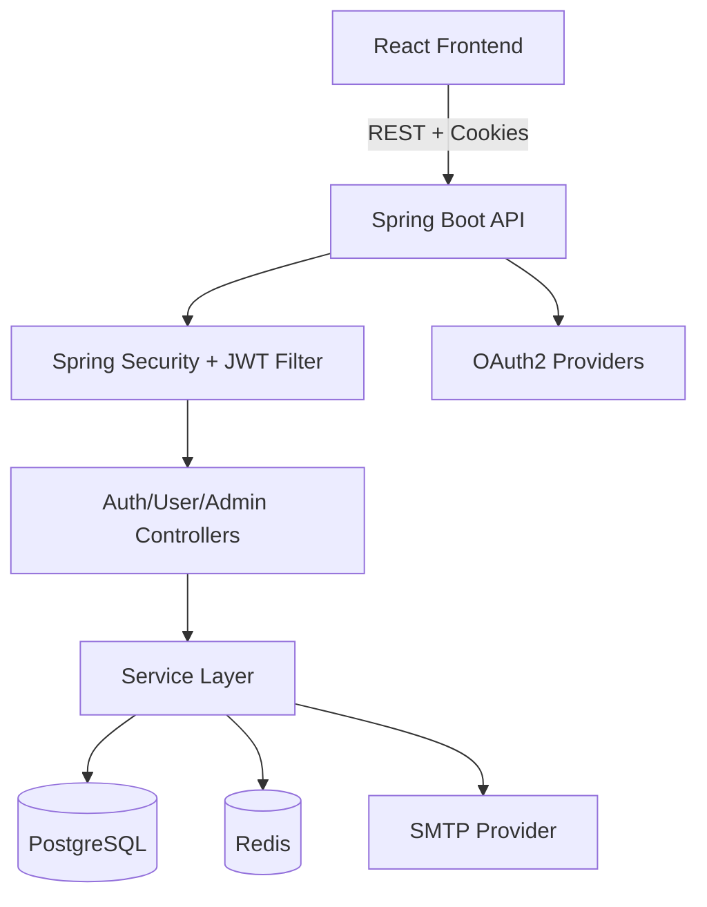

# Matrix Auth System

Production-ready full-stack authentication system with a Matrix-inspired UI.

- Backend: Spring Boot 3.5, Spring Security 6, JWT, OAuth2, PostgreSQL, Redis
- Frontend: React 19, React Router 7, Vite, Axios, Bootstrap 5
- Auth model: short-lived access token + rotated refresh token in HttpOnly cookie

## Table of Contents

- [Overview](#overview)
- [Core Features](#core-features)
- [Tech Stack](#tech-stack)
- [Architecture](#architecture)
- [Authentication Flow](#authentication-flow)
- [API Summary](#api-summary)
- [Project Structure](#project-structure)
- [Local Setup](#local-setup)
- [Docker Setup](#docker-setup)
- [Configuration Reference](#configuration-reference)
- [Security Notes](#security-notes)
- [Admin Scaling Features](#admin-scaling-features)
- [Frontend UX/Performance Notes](#frontend-uxperformance-notes)
- [Testing and Validation](#testing-and-validation)
- [Troubleshooting](#troubleshooting)
- [Production Checklist](#production-checklist)

## Overview

This project implements a complete authentication platform with:

- Email/password signup and login
- Email OTP verification
- Password reset flow
- OAuth2 login (Google, GitHub, Apple, LinkedIn)
- User and Admin role-based access
- Refresh token rotation and revocation
- Redis-backed abuse protection (rate limiting + lockouts)
- Admin user listing with pagination/search/filtering/sorting

## Core Features

### Backend

- Spring Security filter chain with JWT authorization
- OAuth2 login handlers with frontend callback flow
- Access token issuance + refresh token rotation
- Refresh token stored in secure cookie (`/api/auth` path)
- Refresh/reset/OTP values stored as hashes (not plaintext)
- Strong password policy enforcement: minimum 12 chars, upper/lowercase, number, symbol, no spaces, common-password blocklist, and email local-part rejection
- Brute-force protection and rate limiting for login, OTP verify, resend OTP, and reset password
- User and Admin dashboards
- Admin user query with paging/filter/search

### Frontend

- React 19 app with protected routing
- Role-aware route guards (`user` vs `admin`)
- Central auth context and session bootstrap
- Axios interceptors for Bearer token + auto-refresh
- OAuth callback completion page (`/oauth2/callback`)
- Bootstrap 5 + Bootstrap JS bundle integrated
- Matrix background animation with reduced-motion support and low-power fallback

## Tech Stack

| Layer | Technologies |
| --- | --- |
| Backend | Java 21, Spring Boot 3.5.10, Spring Security 6, Spring Data JPA, Spring Validation, Spring Mail, Spring OAuth2 Client, Spring Data Redis |
| Security | JWT (jjwt 0.12.x), BCrypt, role-based authorization, refresh cookies |
| Database | PostgreSQL 16 |
| Cache/Protection | Redis 7 |
| Frontend | React 19, React Router DOM 7, Vite, Axios, Bootstrap 5, Bootstrap Icons, react-hot-toast |
| Build/Runtime | Maven, Docker, Docker Compose |

## Architecture


```mermaid
graph TD
    A[React Frontend] -->|REST + Cookies| B[Spring Boot API]
    B --> C[Spring Security + JWT Filter]
    C --> D[Auth/User/Admin Controllers]
    D --> E[Service Layer]
    E --> F[(PostgreSQL)]
    E --> G[(Redis)]
    E --> H[SMTP Provider]
    B --> I[OAuth2 Providers]
```

## Authentication Flow

### Email/Password

1. User logs in via `/api/auth/login`.
2. Backend authenticates credentials.
3. Backend returns `accessToken` in response body.
4. Backend sets refresh token in HttpOnly cookie.
5. Frontend stores access token and user payload in localStorage.
6. On access-token expiry, frontend calls `/api/auth/refresh`.
7. Backend rotates refresh token and returns new access token.

### OAuth2

1. Frontend redirects to `/oauth2/authorization/{provider}`.
2. Provider authenticates user and redirects to backend callback.
3. Backend provisions/loads local user.
4. Backend issues tokens and sets refresh cookie.
5. Backend redirects to frontend `/oauth2/callback` without access token in URL.
6. Frontend calls refresh endpoint to finalize session.

## API Summary

Detailed collection: [API_DOCUMENTATION.md](API_DOCUMENTATION.md)

### Auth (`/api/auth`)

| Method | Endpoint | Description |
| --- | --- | --- |
| POST | `/register` | Register account |
| POST | `/verify-otp` | Verify account OTP |
| POST | `/login` | Login with email/password |
| POST | `/refresh` | Rotate refresh token and issue new access token |
| POST | `/logout` | Revoke refresh token |
| POST | `/reset-password` | Request reset link/token |
| POST | `/update-password` | Set new password using token |
| POST | `/resend-otp?email=` | Resend verification OTP |

### User (`/api/user`)

| Method | Endpoint | Access |
| --- | --- | --- |
| GET | `/dashboard` | ROLE_USER or ROLE_ADMIN |
| GET | `/profile` | ROLE_USER or ROLE_ADMIN |
| POST | `/change-password` | ROLE_USER or ROLE_ADMIN |

### Admin (`/api/admin`)

| Method | Endpoint | Access |
| --- | --- | --- |
| GET | `/dashboard` | ROLE_ADMIN |
| GET | `/users` | ROLE_ADMIN |

`/api/admin/users` supports:

- `page` (default `0`)
- `size` (default `20`, max `100`)
- `search` (name/email)
- `enabled` (`true`/`false`)
- `role` (`USER`, `ADMIN`, `ROLE_USER`, `ROLE_ADMIN`)
- `sortBy` (`id`, `name`, `email`, `enabled`, `createdAt`)
- `sortDir` (`asc`, `desc`)

## Project Structure

```text
Full-Stack-Authentication-System/
├── backend/
│   ├── src/main/java/com/auth/
│   │   ├── config/
│   │   ├── controller/
│   │   ├── dto/
│   │   ├── entity/
│   │   ├── exception/
│   │   ├── repository/
│   │   ├── security/
│   │   └── service/
│   ├── src/main/resources/application.properties
│   ├── docker-compose.yaml
│   ├── Dockerfile
│   └── pom.xml
├── frontend/
│   ├── src/components/
│   ├── src/context/
│   ├── src/pages/
│   ├── src/services/
│   └── package.json
├── API_DOCUMENTATION.md
└── README.md
```

## Local Setup

### Prerequisites

- Java 21+
- Maven 3.9+
- Node.js 18+
- npm 9+
- PostgreSQL 16+
- Redis 7+

### 1) Start PostgreSQL + Redis (recommended via Docker)

```bash
cd backend
docker compose up -d postgres redis
```

### 2) Run backend

```bash
cd backend
mvn spring-boot:run
```

Backend default URL: `http://localhost:8080`

### Default seeded admin (development)

On startup, a default admin is seeded if not present:

- Email: `admin@admin.com`
- Password: `admin123`

Change this immediately for any shared/non-local environment.

### 3) Run frontend

```bash
cd frontend
npm install
npm run dev
```

Frontend default URL: `http://localhost:5173`

## Docker Setup

Run full backend stack from `backend/`:

```bash
docker compose up -d --build
```

Services:

- `postgres` on `5432`
- `redis` on `6379`
- `app` on `8080`

## Configuration Reference

### Backend (`backend/src/main/resources/application.properties`)

Main groups used by the app:

- Server and cookie settings
- PostgreSQL datasource
- Redis connection
- SMTP mail settings
- JWT settings (`jwt.secret`, expirations)
- Frontend URL and cookie options
- Abuse-protection and lockout thresholds
- OAuth2 provider registrations

OAuth2 login starts at:

- `http://localhost:8080/oauth2/authorization/google`
- `http://localhost:8080/oauth2/authorization/github`
- `http://localhost:8080/oauth2/authorization/apple`
- `http://localhost:8080/oauth2/authorization/linkedin`

### Frontend env options

Optional Vite variables:

- `VITE_API_URL` (default `http://localhost:8080/api`)
- `VITE_OAUTH_BASE_URL` (default `http://localhost:8080`)

## Security Notes

- Passwords are BCrypt-hashed.
- Refresh/reset/OTP values are stored as hashes (SHA-256 + pepper).
- Refresh token rotation is enforced.
- Refresh token is sent in cookie with configurable `Secure` and `SameSite`.
- Global exception handler standardizes API errors.
- Login/OTP/reset endpoints include rate limiting and temporary lockouts.

## Admin Scaling Features

Admin users API is designed for scale:

- No full-table fetch for listing
- Pagination and bounded `size`
- Search by name/email
- Role and status filters
- Safe server-side sort-field allowlist

## Frontend UX/Performance Notes

- Bootstrap JS bundle is loaded for navbar/dropdown/collapse behavior.
- Matrix animation respects `prefers-reduced-motion`.
- Matrix animation reduces FPS/work on low-memory or low-core devices.
- Axios interceptors centralize token handling and auto-refresh.

## Testing and Validation

### Frontend

```bash
cd frontend
npm run lint
npm run build
```

### Backend

```bash
cd backend
mvn test
```

### Quick integration smoke checks

```bash
# unauthenticated refresh should return 401
curl -i -X POST http://localhost:8080/api/auth/refresh

# CORS preflight from frontend origin should succeed
curl -i -X OPTIONS http://localhost:8080/api/auth/register \
  -H 'Origin: http://localhost:5173' \
  -H 'Access-Control-Request-Method: POST'
```

## Troubleshooting

1. `Operation not permitted` while binding ports or opening sockets:
Ensure Docker Desktop is running and local permissions are granted.
2. `Unable to determine Dialect without JDBC metadata`:
Verify PostgreSQL is up and datasource credentials/URL are correct.
3. OAuth login redirects but no frontend session:
Confirm frontend callback route `/oauth2/callback` and cookie settings (`SameSite`, `Secure`) match environment.
4. Navbar collapse not working:
Ensure Bootstrap JS bundle import remains in `frontend/src/main.jsx`.

## Production Checklist

- Move all secrets to environment variables (DB, mail, JWT, OAuth).
- Rotate any credentials previously committed to git history.
- Change `spring.jpa.hibernate.ddl-auto` from `create-drop` to `validate` or managed migrations.
- Set `auth.refresh-token.cookie-secure=true` behind HTTPS.
- Tighten CORS to exact production frontend origin(s).
- Use reverse proxy + `X-Forwarded-*` handling for correct client IP rate limiting.
- Add DB migrations (Flyway/Liquibase), monitoring, and structured audit logging.

---

If you want, I can also generate a matching `.env.example` and `application.properties.example` so onboarding is one command and no secrets are kept in tracked config files.
