# 🔐 Matrix Auth System

<p align="center">
  
</p>

<p align="center">
  
  
  
  
  
  
</p>

<p align="center">
  
  
  
  
  
</p>

---

<details>
<summary><strong>📋 Table of Contents</strong></summary>

1. [About the Project](#about-the-project)
2. [Features](#features)
3. [Tech Stack](#tech-stack)
4. [System Design](#system-design)
5. [System Architecture](#system-architecture)
6. [Data Flow Diagrams (DFD)](#data-flow-diagrams-dfd)
7. [UML Diagrams](#uml-diagrams)
8. [Use Case Diagram](#use-case-diagram)
9. [Class Diagram](#class-diagram)
10. [Sequence Diagram](#sequence-diagram)
11. [Activity Diagram](#activity-diagram)
12. [4.4 Database Design — ER Diagram](#44-database-design--er-diagram)
13. [4.5 User Interface Design](#45-user-interface-design)
14. [Screenshots](#screenshots)
15. [API Endpoints](#api-endpoints)
16. [Project Structure](#project-structure)
17. [Getting Started](#getting-started)
18. [How to Explain This Project in an Interview](#how-to-explain-this-project-in-an-interview)
19. [Java Spring Boot Developer — 20 Q&A](#java-spring-boot-developer--20-qa)
20. [Backend Tech Stack — Q&A](#backend-tech-stack--qa)

</details>

---

## About the Project

Matrix Auth System is a full-stack authentication and authorization platform built for real-world user management use cases.
The backend is built with Spring Boot layered architecture (Controller, Service, Repository, Entity, DTO, Security).
The frontend is built with React 19 and Vite, with role-aware routing and token lifecycle handling.
The system supports email/password authentication, OTP verification, password reset, refresh-token rotation, and OAuth2 login.
Security and abuse protection are first-class concerns, implemented with Redis-backed rate limiting and account lock strategies.
This project is structured to be interview-ready, production-oriented, and easy to extend for enterprise features.

---

## Features

- User registration with email verification (OTP-based activation)
- Login with access token + HttpOnly refresh token cookie
- Refresh token rotation and logout token revocation
- Password reset flow with secure token handling
- Password change for authenticated users
- OAuth2 login (Google, GitHub, Apple, LinkedIn)
- RBAC authorization (`ROLE_USER`, `ROLE_ADMIN`)
- Admin dashboard and paginated/filterable/searchable user listing
- Brute-force protection and endpoint-specific rate limiting
- Token hashing for refresh/reset/OTP values (no plaintext storage)
- Global exception handling with consistent JSON error responses
- Layered Spring Boot backend design and reusable service contracts
- Responsive React frontend with Bootstrap and protected routes
- Accessibility/performance aware Matrix background animation

---

## Tech Stack

| Layer | Technology |
| --- | --- |
| Language | Java 21 |
| Backend Framework | Spring Boot 3.5.10 |
| Security | Spring Security 6, JWT (jjwt 0.12.x), OAuth2 Client |
| Persistence | Spring Data JPA, Hibernate |
| Database | PostgreSQL 16 |
| Caching / Protection | Redis 7 |
| Validation | Jakarta Bean Validation |
| Email | Spring Mail |
| Mapping | MapStruct |
| Boilerplate Reduction | Lombok |
| Frontend | React 19, React Router 7, Vite |
| UI | Bootstrap 5, Bootstrap Icons |
| HTTP Client (Frontend) | Axios |
| Containers | Docker, Docker Compose |

---

<details>
<summary><strong>System Design</strong></summary>

This system follows a layered backend design for clear separation of responsibilities:

1. Controller layer handles HTTP contracts and validation boundaries.
2. Service layer contains all business rules, orchestration, and transactional logic.
3. Repository layer manages data access through Spring Data JPA.
4. Security layer handles authentication, JWT parsing, OAuth2 callbacks, and filter chain policies.
5. DTO/Mapper layer isolates API models from JPA entities.
6. Exception layer centralizes error-to-response translation.

Key design principles used:

- Thin controllers, fat services
- Interface-driven services for clean contracts
- Token/hash security by default
- Policy-driven abuse protection via externalized properties
- Horizontal scalability via stateless access tokens

</details>

---

<details>
<summary><strong>System Architecture</strong></summary>

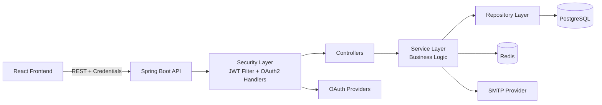
```mermaid
flowchart LR
    FE[React Frontend]
    API[Spring Boot API]
    SEC[Security Layer\nJWT Filter + OAuth2 Handlers]
    CTRL[Controllers]
    SVC[Service Layer\nBusiness Logic]
    REPO[Repository Layer]
    PG[(PostgreSQL)]
    REDIS[(Redis)]
    SMTP[SMTP Provider]
    OAUTH[OAuth Providers]

    FE -->|REST + Credentials| API
    API --> SEC
    SEC --> CTRL
    CTRL --> SVC
    SVC --> REPO
    REPO --> PG
    SVC --> REDIS
    SVC --> SMTP
    SEC --> OAUTH
```

</details>

---

<details>
<summary><strong>Data Flow Diagrams (DFD)</strong></summary>

### DFD Level 0 (Context Diagram)

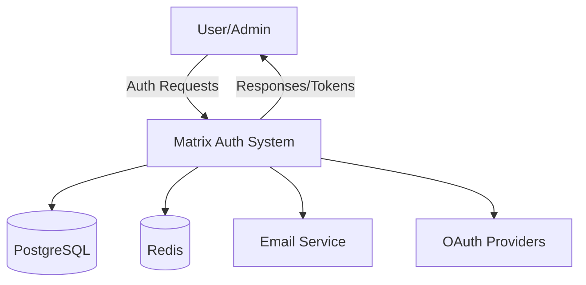
```mermaid
flowchart TD
    User[User/Admin] -->|Auth Requests| System[Matrix Auth System]
    System -->|Responses/Tokens| User
    System --> DB[(PostgreSQL)]
    System --> Cache[(Redis)]
    System --> Mail[Email Service]
    System --> OAuth[OAuth Providers]
```

### DFD Level 1 (Authentication)

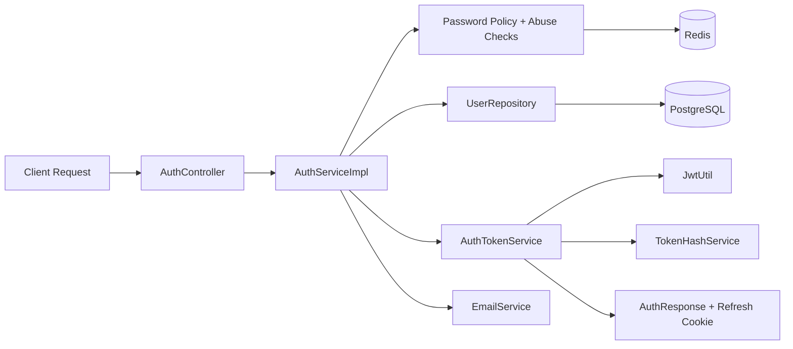
```mermaid
flowchart LR
    A[Client Request] --> B[AuthController]
    B --> C[AuthServiceImpl]
    C --> D[Password Policy + Abuse Checks]
    C --> E[UserRepository]
    E --> F[(PostgreSQL)]
    C --> G[AuthTokenService]
    G --> H[JwtUtil]
    G --> I[TokenHashService]
    C --> J[EmailService]
    D --> K[(Redis)]
    G --> L[AuthResponse + Refresh Cookie]
```

</details>

---

<details>
<summary><strong>UML Diagrams</strong></summary>

This section gives developer-facing UML views that match implementation layers.

</details>

---

<details>
<summary><strong>Use Case Diagram</strong></summary>

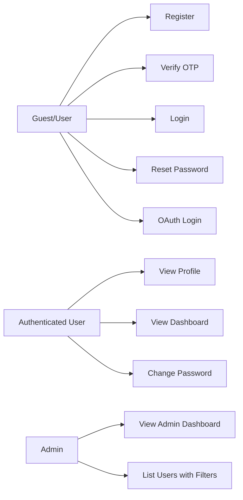
```mermaid
flowchart LR
    U[Guest/User] --> UC1[Register]
    U --> UC2[Verify OTP]
    U --> UC3[Login]
    U --> UC4[Reset Password]
    U --> UC5[OAuth Login]
    AU[Authenticated User] --> UC6[View Profile]
    AU --> UC7[View Dashboard]
    AU --> UC8[Change Password]
    AD[Admin] --> UC9[View Admin Dashboard]
    AD --> UC10[List Users with Filters]
```

</details>

---

<details>
<summary><strong>Class Diagram</strong></summary>

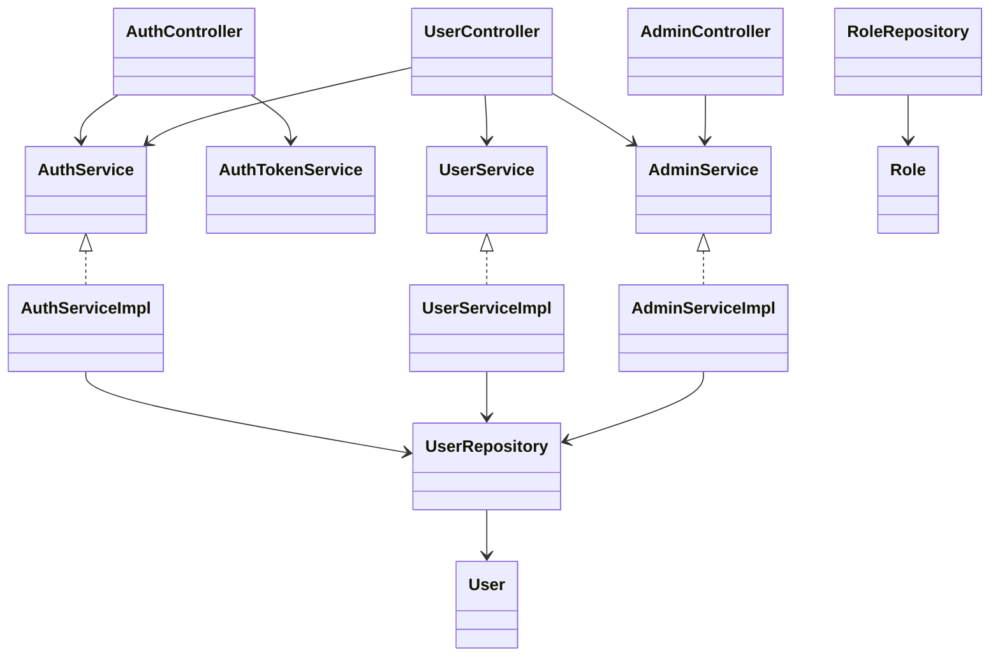
```mermaid
classDiagram
    class AuthController
    class UserController
    class AdminController

    class AuthService
    class AuthServiceImpl
    class AuthTokenService
    class UserService
    class UserServiceImpl
    class AdminService
    class AdminServiceImpl

    class UserRepository
    class RoleRepository

    class User
    class Role

    AuthController --> AuthService
    AuthController --> AuthTokenService
    UserController --> UserService
    UserController --> AuthService
    UserController --> AdminService
    AdminController --> AdminService

    AuthService <|.. AuthServiceImpl
    UserService <|.. UserServiceImpl
    AdminService <|.. AdminServiceImpl

    AuthServiceImpl --> UserRepository
    UserServiceImpl --> UserRepository
    AdminServiceImpl --> UserRepository
    UserRepository --> User
    RoleRepository --> Role
```

</details>

---

<details>
<summary><strong>Sequence Diagram</strong></summary>

### 1) Registration + OTP Verification + Resend Flow

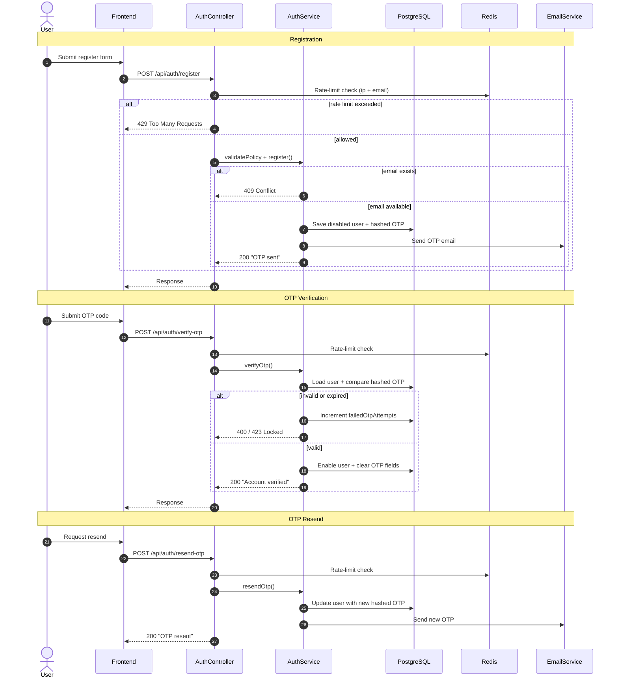
```mermaid
sequenceDiagram
    autonumber
    actor User
    participant FE as Frontend
    participant API as AuthController
    participant SVC as AuthService
    participant DB as PostgreSQL
    participant REDIS as Redis
    participant MAIL as EmailService

    Note over User,MAIL: Registration
    User->>FE: Submit register form
    FE->>API: POST /api/auth/register
    API->>REDIS: Rate-limit check (ip + email)
    alt rate limit exceeded
        API-->>FE: 429 Too Many Requests
    else allowed
        API->>SVC: validatePolicy + register()
        alt email exists
            SVC-->>API: 409 Conflict
        else email available
            SVC->>DB: Save disabled user + hashed OTP
            SVC->>MAIL: Send OTP email
            SVC-->>API: 200 "OTP sent"
        end
    end
    API-->>FE: Response

    Note over User,MAIL: OTP Verification
    User->>FE: Submit OTP code
    FE->>API: POST /api/auth/verify-otp
    API->>REDIS: Rate-limit check
    API->>SVC: verifyOtp()
    SVC->>DB: Load user + compare hashed OTP
    alt invalid or expired
        SVC->>DB: Increment failedOtpAttempts
        SVC-->>API: 400 / 423 Locked
    else valid
        SVC->>DB: Enable user + clear OTP fields
        SVC-->>API: 200 "Account verified"
    end
    API-->>FE: Response

    Note over User,MAIL: OTP Resend
    User->>FE: Request resend
    FE->>API: POST /api/auth/resend-otp
    API->>REDIS: Rate-limit check
    API->>SVC: resendOtp()
    SVC->>DB: Update user with new hashed OTP
    SVC->>MAIL: Send new OTP
    API-->>FE: 200 "OTP resent"
```

### 2) Login + Refresh Rotation + Logout Flow

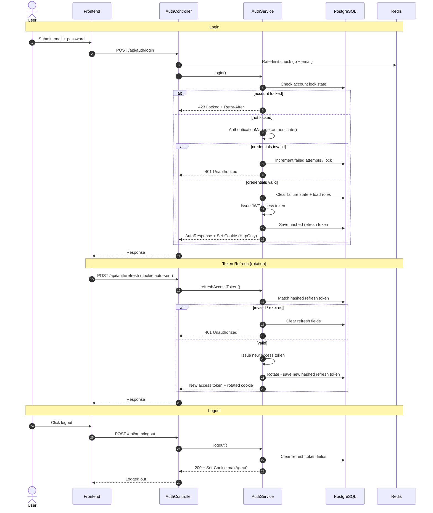
```mermaid
sequenceDiagram
    autonumber
    actor User
    participant FE as Frontend
    participant API as AuthController
    participant SVC as AuthService
    participant DB as PostgreSQL
    participant REDIS as Redis

    Note over User,REDIS: Login
    User->>FE: Submit email + password
    FE->>API: POST /api/auth/login
    API->>REDIS: Rate-limit check (ip + email)
    API->>SVC: login()
    SVC->>DB: Check account lock state
    alt account locked
        SVC-->>API: 423 Locked + Retry-After
    else not locked
        SVC->>SVC: AuthenticationManager.authenticate()
        alt credentials invalid
            SVC->>DB: Increment failed attempts / lock
            SVC-->>API: 401 Unauthorized
        else credentials valid
            SVC->>DB: Clear failure state + load roles
            SVC->>SVC: Issue JWT access token
            SVC->>DB: Save hashed refresh token
            SVC-->>API: AuthResponse + Set-Cookie (HttpOnly)
        end
    end
    API-->>FE: Response

    Note over FE,REDIS: Token Refresh (rotation)
    FE->>API: POST /api/auth/refresh (cookie auto-sent)
    API->>SVC: refreshAccessToken()
    SVC->>DB: Match hashed refresh token
    alt invalid / expired
        SVC->>DB: Clear refresh fields
        SVC-->>API: 401 Unauthorized
    else valid
        SVC->>SVC: Issue new access token
        SVC->>DB: Rotate - save new hashed refresh token
        SVC-->>API: New access token + rotated cookie
    end
    API-->>FE: Response

    Note over User,REDIS: Logout
    User->>FE: Click logout
    FE->>API: POST /api/auth/logout
    API->>SVC: logout()
    SVC->>DB: Clear refresh token fields
    SVC-->>API: 200 + Set-Cookie maxAge=0
    API-->>FE: Logged out
```

### 3) Forgot Password + Update Password Flow

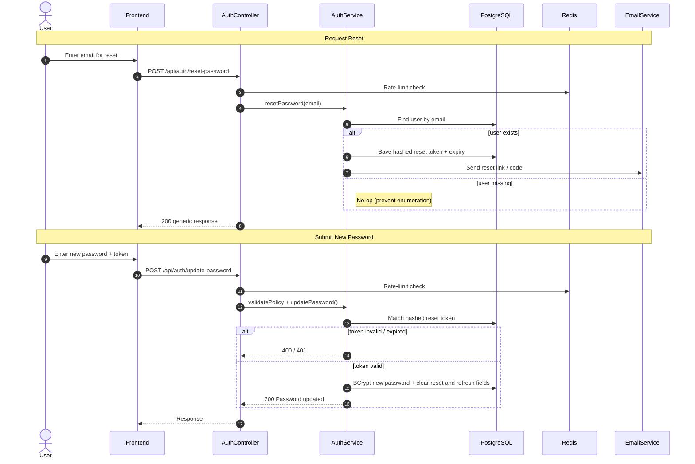
```mermaid
sequenceDiagram
    autonumber
    actor User
    participant FE as Frontend
    participant API as AuthController
    participant SVC as AuthService
    participant DB as PostgreSQL
    participant REDIS as Redis
    participant MAIL as EmailService

    Note over User,MAIL: Request Reset
    User->>FE: Enter email for reset
    FE->>API: POST /api/auth/reset-password
    API->>REDIS: Rate-limit check
    API->>SVC: resetPassword(email)
    SVC->>DB: Find user by email
    alt user exists
        SVC->>DB: Save hashed reset token + expiry
        SVC->>MAIL: Send reset link / code
    else user missing
        Note right of SVC: No-op (prevent enumeration)
    end
    API-->>FE: 200 generic response

    Note over User,MAIL: Submit New Password
    User->>FE: Enter new password + token
    FE->>API: POST /api/auth/update-password
    API->>REDIS: Rate-limit check
    API->>SVC: validatePolicy + updatePassword()
    SVC->>DB: Match hashed reset token
    alt token invalid / expired
        SVC-->>API: 400 / 401
    else token valid
        SVC->>DB: BCrypt new password + clear reset and refresh fields
        SVC-->>API: 200 Password updated
    end
    API-->>FE: Response
```

### 4) OAuth2 Login (No Access Token in Callback URL)

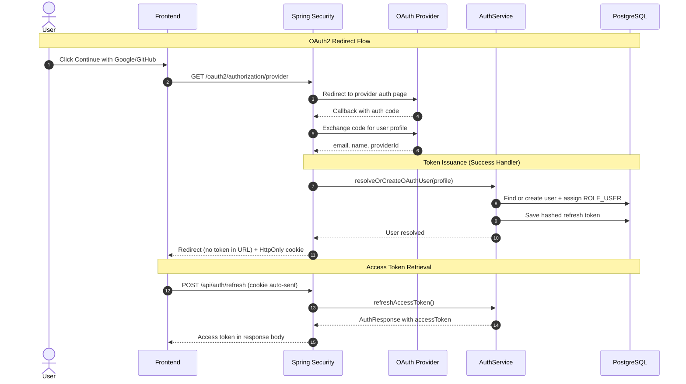
```mermaid
sequenceDiagram
    autonumber
    actor User
    participant FE as Frontend
    participant SEC as Spring Security
    participant OP as OAuth Provider
    participant SVC as AuthService
    participant DB as PostgreSQL

    Note over User,DB: OAuth2 Redirect Flow
    User->>FE: Click Continue with Google/GitHub
    FE->>SEC: GET /oauth2/authorization/provider
    SEC->>OP: Redirect to provider auth page
    OP-->>SEC: Callback with auth code
    SEC->>OP: Exchange code for user profile
    OP-->>SEC: email, name, providerId

    Note over SEC,DB: Token Issuance (Success Handler)
    SEC->>SVC: resolveOrCreateOAuthUser(profile)
    SVC->>DB: Find or create user + assign ROLE_USER
    SVC->>DB: Save hashed refresh token
    SVC-->>SEC: User resolved
    SEC-->>FE: Redirect (no token in URL) + HttpOnly cookie

    Note over FE,DB: Access Token Retrieval
    FE->>SEC: POST /api/auth/refresh (cookie auto-sent)
    SEC->>SVC: refreshAccessToken()
    SVC-->>SEC: AuthResponse with accessToken
    SEC-->>FE: Access token in response body
```

### 5) Admin Users Pagination + Filter + Search Flow

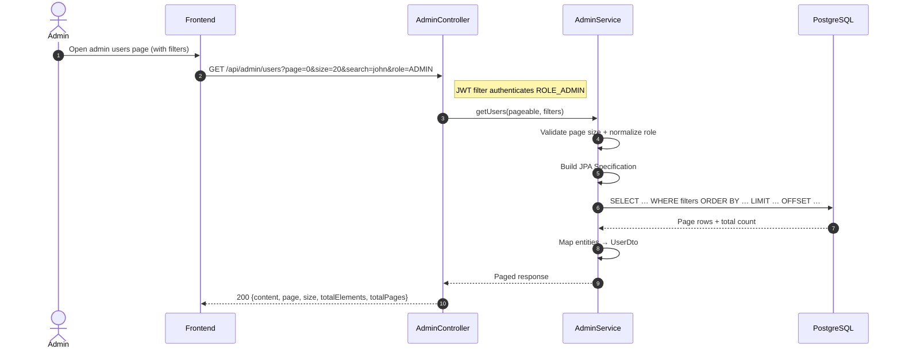
```mermaid
sequenceDiagram
    autonumber
    actor Admin
    participant FE as Frontend
    participant API as AdminController
    participant SVC as AdminService
    participant DB as PostgreSQL

    Admin->>FE: Open admin users page (with filters)
    FE->>API: GET /api/admin/users?page=0&size=20&search=john&role=ADMIN
    Note right of API: JWT filter authenticates ROLE_ADMIN
    API->>SVC: getUsers(pageable, filters)
    SVC->>SVC: Validate page size + normalize role
    SVC->>SVC: Build JPA Specification
    SVC->>DB: SELECT … WHERE filters ORDER BY … LIMIT … OFFSET …
    DB-->>SVC: Page rows + total count
    SVC->>SVC: Map entities → UserDto
    SVC-->>API: Paged response
    API-->>FE: 200 {content, page, size, totalElements, totalPages}
```

</details>

---

<details>
<summary><strong>Activity Diagram</strong></summary>

### Registration and OTP Verification

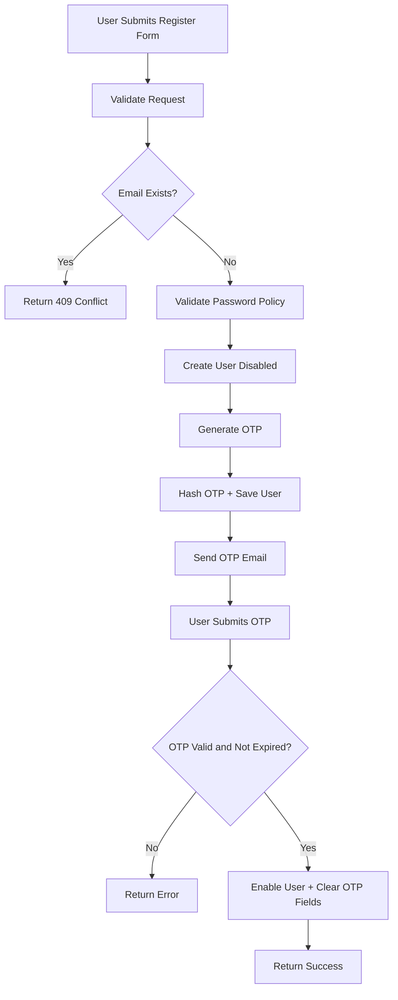
```mermaid
flowchart TD
    A[User Submits Register Form] --> B[Validate Request]
    B --> C{Email Exists?}
    C -- Yes --> D[Return 409 Conflict]
    C -- No --> E[Validate Password Policy]
    E --> F[Create User Disabled]
    F --> G[Generate OTP]
    G --> H[Hash OTP + Save User]
    H --> I[Send OTP Email]
    I --> J[User Submits OTP]
    J --> K{OTP Valid and Not Expired?}
    K -- No --> L[Return Error]
    K -- Yes --> M[Enable User + Clear OTP Fields]
    M --> N[Return Success]
```

</details>

---

## 4.4 Database Design — ER Diagram

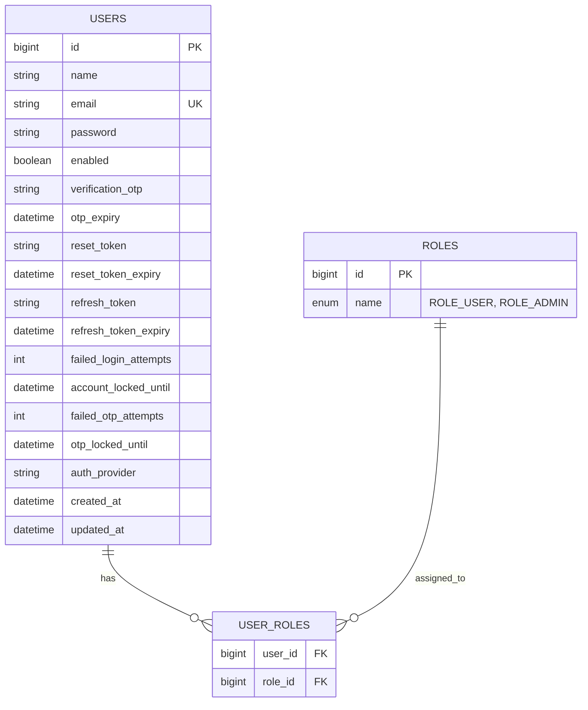
```mermaid
erDiagram
    USERS {
        bigint id PK
        string name
        string email UK
        string password
        boolean enabled
        string verification_otp
        datetime otp_expiry
        string reset_token
        datetime reset_token_expiry
        string refresh_token
        datetime refresh_token_expiry
        int failed_login_attempts
        datetime account_locked_until
        int failed_otp_attempts
        datetime otp_locked_until
        string auth_provider
        datetime created_at
        datetime updated_at
    }

    ROLES {
        bigint id PK
        enum name "ROLE_USER, ROLE_ADMIN"
    }

    USER_ROLES {
        bigint user_id FK
        bigint role_id FK
    }

    USERS ||--o{ USER_ROLES : has
    ROLES ||--o{ USER_ROLES : assigned_to
```

Design notes:

- `users.email` is unique for identity-level lookup.
- `user_roles` supports many-to-many RBAC.
- token fields store hashed values, not raw secrets.

---

<details>
<summary><strong>4.5 User Interface Design</strong></summary>

Frontend design goals and implementation choices:

1. Clear auth journey: Home -> Register/Login -> Verify OTP -> Dashboard.
2. Role-sensitive route guards: admin routes are isolated from user routes.
3. Session reliability: Axios interceptors auto-attach Bearer token and auto-refresh on `401`.
4. UX feedback: toast notifications and loading states on async operations.
5. Responsive layout with Bootstrap components and utility classes.
6. Aesthetic layer: Matrix rain animation with reduced-motion fallback for accessibility.
7. Mobile stability: Bootstrap JS bundle is loaded for navbar collapse/dropdowns.

</details>

---

## Screenshots

### Authentication Flow


### Dashboard Views


---

## API Endpoints

Base URL: `http://localhost:8080`

### Auth APIs — `POST /api/auth/*`

| # | Method | Endpoint | Description | Access |
|---|--------|----------|-------------|--------|
| 1 | POST | `/api/auth/register` | Register a new user account | Public |
| 2 | POST | `/api/auth/verify-otp` | Verify email with OTP code | Public |
| 3 | POST | `/api/auth/login` | Login and receive JWT + refresh cookie | Public |
| 4 | POST | `/api/auth/refresh` | Refresh access token (cookie or body) | Public |
| 5 | POST | `/api/auth/logout` | Revoke refresh token and clear cookie | Public |
| 6 | POST | `/api/auth/reset-password` | Request password reset email | Public |
| 7 | POST | `/api/auth/update-password` | Set new password using reset token | Public |
| 8 | POST | `/api/auth/resend-otp?email={email}` | Resend OTP with rate limiting | Public |

---

### User APIs — `/api/user/*`

| # | Method | Endpoint | Description | Access |
|---|--------|----------|-------------|--------|
| 1 | GET | `/api/user/dashboard` | Get user dashboard data | `ROLE_USER` or `ROLE_ADMIN` |
| 2 | GET | `/api/user/profile` | Get current user profile | `ROLE_USER` or `ROLE_ADMIN` |
| 3 | POST | `/api/user/change-password` | Change password (authenticated) | `ROLE_USER` or `ROLE_ADMIN` |

---

### Admin APIs — `/api/admin/*`

| # | Method | Endpoint | Description | Access |
|---|--------|----------|-------------|--------|
| 1 | GET | `/api/admin/dashboard` | Admin metrics (total users, active count) | `ROLE_ADMIN` |
| 2 | GET | `/api/admin/users` | Paginated, searchable, filterable user list | `ROLE_ADMIN` |

Admin users query params:

- `page` default `0`
- `size` default `20`, max `100`
- `search` for name/email match
- `enabled` boolean filter
- `role` accepts `USER`, `ADMIN`, `ROLE_USER`, `ROLE_ADMIN`
- `sortBy` allows `id`, `name`, `email`, `enabled`, `createdAt`
- `sortDir` accepts `asc` or `desc`

---

### OAuth2 APIs — Spring Security Managed

| # | Method | Endpoint | Description | Access |
|---|--------|----------|-------------|--------|
| 1 | GET | `/oauth2/authorization/{provider}` | Start OAuth2 login flow (Google, GitHub, Apple, LinkedIn) | Public |
| 2 | GET | `/login/oauth2/code/{provider}` | OAuth2 callback (handled by Spring Security) | Public |

OAuth2 flow: Frontend redirects to `/oauth2/authorization/google` → user authenticates with provider → Spring Security handles callback → `OAuth2AuthenticationSuccessHandler` issues tokens + HttpOnly cookie → redirects to frontend with no token in URL → frontend calls `/api/auth/refresh` to get access token.

---

<details>
<summary><strong>Project Structure</strong></summary>

```text
Full-Stack-Authentication-System/
├── backend/
│   ├── src/main/java/com/auth/
│   │   ├── config/
│   │   ├── controller/
│   │   ├── dto/
│   │   ├── entity/
│   │   ├── exception/
│   │   ├── mapper/
│   │   ├── repository/
│   │   ├── security/
│   │   ├── service/
│   │   └── service/impl/
│   ├── src/main/resources/application.properties
│   ├── docker-compose.yaml
│   ├── Dockerfile
│   ├── MANUAL_TEST_PLAN.md
│   └── BACKEND_LAYERED_IMPLEMENTATION_GUIDE.md
├── frontend/
│   ├── src/components/
│   ├── src/context/
│   ├── src/pages/
│   ├── src/services/
│   └── package.json
├── API_DOCUMENTATION.md
└── README.md
```

</details>

---

## Getting Started

### Prerequisites

- Java 21+
- Maven 3.9+
- Node.js 18+
- npm 9+
- Docker + Docker Compose

### 1) Start database + Redis

```bash
cd backend
docker compose up -d postgres redis
```

### 2) Run backend

```bash
cd backend
mvn spring-boot:run
```

Default backend URL: `http://localhost:8080`

### 3) Run frontend

```bash
cd frontend
npm install
npm run dev
```

Default frontend URL: `http://localhost:5173`

### 4) Optional build checks

```bash
cd backend
mvn -q -DskipTests compile
mvn -q test

cd ../frontend
npm run lint
npm run build
```

### Security reminder

Do not keep mail/JWT/OAuth secrets in committed config for production.
Use environment variables or external secret managers.

---

<details>
<summary><strong>How to Explain This Project in an Interview</strong></summary>

This is a full-stack authentication platform designed with production security and maintainability in mind.
On the backend, I used Spring Boot layered architecture and kept controllers thin by placing business rules in services.
I implemented JWT-based stateless auth with refresh-token rotation, secure cookie handling, and token hashing at rest.
I added abuse protection with Redis-backed rate limits and temporary lockouts for login, OTP, and password reset endpoints.
For admin scalability, I designed paginated and filterable user APIs using JPA Specifications.
On the frontend, I integrated role-protected routes, centralized auth context, and automatic token refresh handling.
Overall, this project demonstrates secure API design, clean architecture, and practical end-to-end delivery.

</details>

---

<details>
<summary><strong>Java Spring Boot Developer — 20 Q&A</strong></summary>

### Q1. A teammate wrote all the validation and token logic directly in the controller. You reviewed the PR — what feedback did you give, and why?
I flagged that controllers should only own HTTP concerns: request binding, status codes, and response shape.
When business logic sits in a controller, it becomes untestable without booting the full web layer.
I showed them how the same registration logic could be called from a scheduled job or message listener — impossible if locked inside a `@PostMapping`.
I also pointed out that `@Transactional` on a controller method doesn't follow Spring's proxy behavior cleanly.
We moved all the logic into `AuthServiceImpl`, kept the controller at ~5 lines per endpoint, and added a unit test for the service in under thirty minutes.
After that refactor, the next feature (resend-OTP) took half the time because we just called the existing service.

### Q2. A user reported that after a successful login, they are occasionally redirected to the login page again. How did you debug this?
First I checked the network tab and saw the access token was being attached correctly to the initial request after login.
But the next API call returned `401`, which triggered the frontend's redirect-to-login logic.
I realized the JWT expiry was set to 60 seconds during dev, and the dashboard made two sequential calls — the second one hit after expiry.
The Axios interceptor was supposed to auto-refresh on `401`, but it was not queuing the retry after fetching a new token.
I fixed the interceptor to use a promise-based lock: when a refresh is in-flight, other requests wait instead of all firing refresh simultaneously.
I also increased access token TTL to 15 minutes for dev and added a log line in `JwtAuthFilter` that prints the remaining seconds — that helped catch timing issues fast.

### Q3. During a security review, someone asked why you rotate refresh tokens instead of issuing a single long-lived one. What was your answer?
I explained that a static refresh token is like giving someone a permanent spare key — if someone copies it, they have access forever.
With rotation, every time the client uses the refresh token, it gets a brand new one and the old hash is replaced in the database.
If an attacker tries to replay an old token, the hash won't match, so we immediately clear all refresh state and force re-authentication.
I also pointed out that rotation naturally limits the window of compromise: even if a token is stolen, it is only valid until the legitimate user refreshes next.
This design was particularly important because our frontend and backend are on different origins, making cookies travel across CORS boundaries.
I referenced OWASP's token best practices to back the decision during the review.

### Q4. Your rate-limiting suddenly started blocking legitimate users during a product launch. Walk me through how you diagnosed and fixed it.
The support team reported that users in a shared office were all getting `429 Too Many Requests` on register.
I checked the Redis keys and saw that rate-limit was keyed only on IP — all users behind the office NAT shared one IP.
I updated the key strategy to combine IP + email, so each user gets an independent window even behind the same NAT.
For unauthenticated endpoints where email isn't available yet, I added a higher threshold for IP-only keys.
I also externalized all thresholds in `application.properties` so ops could tune limits in production without redeploying.
After the fix, I simulated 50 registrations from one IP with different emails and confirmed each got their own counter in Redis.

### Q5. A junior developer asked why you hash OTP and reset tokens when passwords are already hashed. What did you tell them?
I explained that BCrypt protects passwords, but OTPs and reset tokens are short-lived secrets that also live in the database.
If an attacker gets read access to the DB — through SQL injection, backup leak, or insider access — raw tokens let them verify any account or reset any password instantly.
By hashing with SHA-256 plus a server-side pepper, even a full DB dump doesn't reveal usable tokens.
I showed them the `TokenHashService` code: it takes the raw token, prepends the pepper, and stores only the digest.
During verification, the incoming raw token is hashed the same way and compared using constant-time equality to prevent timing attacks.
This follows the same principle as password hashing — never store a reusable secret in a form that can be directly replayed.

### Q6. The admin panel is slow when there are 50,000 users. The previous implementation used `findAll()`. How did you fix it?
The original code loaded every user into memory, then filtered and sorted in Java — that caused `OutOfMemoryError` at around 40K rows.
I replaced it with server-side pagination using Spring Data's `Pageable` and dynamic query composition via `JpaSpecificationExecutor`.
Each filter (search text, enabled status, role) adds a predicate to the JPA `Specification`, so the database does the heavy lifting.
I capped `size` at 100 per request to prevent accidental full-table scans from the frontend.
Sort fields are allowlisted so a client can't sort on unindexed columns and degrade performance.
After the change, the admin page loaded in under 200ms with 50K users, and memory usage dropped by 95%.

### Q7. A code reviewer noticed you're returning `UserDto` instead of the `User` entity. They said it's extra boilerplate. How did you justify it?
I pulled up the `User` entity and showed them that it contains `refreshTokenHash`, `resetTokenHash`, `failedLoginAttempts`, and `accountLockedUntil`.
If we returned that directly, every API response would leak internal security state to any client inspecting the JSON.
DTOs let us choose exactly which fields to expose — `UserDto` only has `id`, `name`, `email`, `roles`, and `createdAt`.
I also explained that when we added the `otp_locked_until` column last week, no API contract changed because the DTO didn't include it.
MapStruct generates the mapping code at compile time, so there's no runtime cost or manual mapping boilerplate.
In an interview context I frame this as: entities are your private data model, DTOs are your public API contract — mixing them creates coupling you'll regret.

### Q8. A frontend developer reported that error messages from the backend are inconsistent — sometimes a string, sometimes an object. How did you fix this?
I audited all the controllers and found that some were throwing raw exceptions while others returned custom response bodies.
I created a `@ControllerAdvice` class called `GlobalExceptionHandler` that intercepts every known exception type.
Each handler method maps to a specific HTTP status and always returns a `MessageResponse` object with a `message` field.
For rate-limit (`429`) and account-lock (`423`) cases, I also set the `Retry-After` header so the frontend can show a countdown.
I wrote a unit test that throws each exception type and asserts that the response body shape is always `{"message": "..."}`.
After this, the frontend team replaced all their custom error-parsing logic with a single Axios interceptor that reads `response.data.message`.

### Q9. Spring Security needs a `UserDetailsService` — why did you write a custom one instead of using the default in-memory provider?
The default in-memory provider is fine for prototyping, but in production you need to load users from your actual database.
My `CustomUserDetailsService` queries `UserRepository.findByEmail()` and maps each `Role` entity to a `SimpleGrantedAuthority`.
Without this mapping, annotations like `@PreAuthorize("hasRole('ADMIN')")` and URL-pattern rules in `SecurityConfig` would not work.
I also centralized the "user not found" behavior here — it throws `UsernameNotFoundException`, which Spring Security converts to `BadCredentialsException` to avoid leaking whether an account exists.
This single class is the bridge between your domain model and Spring Security's entire authentication pipeline.
When we added OAuth2 login later, the same `UserDetailsService` was reused to load users after provider callback resolution.

### Q10. A user signed up with Google OAuth, but the next day they tried to log in with email/password and got an error. How did you handle this?
The root cause was that OAuth-provisioned users don't have a password set — the `password` column is null.
When they tried password login, `AuthenticationManager.authenticate()` failed because BCrypt can't match against null.
I updated `resolveOrCreateOAuthUser()` in `AuthService` to set `authProvider` to `GOOGLE`, so the system knows this account is OAuth-only.
On the login endpoint, before attempting authentication, I added a check: if `authProvider` is not `LOCAL`, return a clear message like "Please log in with Google."
For users who want both options, they can use the "set password" flow from their profile, which converts them to a dual-auth account.
This unified model means the frontend shows the correct login button based on the user's `authProvider` field.

### Q11. Your OAuth2 implementation redirects back to the frontend after login — why don't you just put the access token in the redirect URL?
I actually had it that way in the first version, and during code review we found the token showing up in browser history and server access logs.
Tokens in query strings are also visible to any analytics scripts or browser extensions that read `window.location`.
So I changed the flow: the success handler sets only an HttpOnly refresh cookie and redirects to a frontend callback route with zero token data in the URL.
The frontend then calls `POST /api/auth/refresh`, which reads the cookie and returns the access token in the response body.
This way, the access token only exists in JavaScript memory and never touches the URL bar, history, or logs.
It added one extra API call at login, but eliminated an entire class of credential leakage risks.

### Q12. During testing, a tester set their password to `password123` and it was accepted. Describe how you tightened the password policy.
I created `AuthPolicyService` with rules for minimum length (8 chars), required character classes (upper, lower, digit, special), and whitespace rejection.
I also added a blocklist of common passwords like `password123`, `qwerty`, and `123456` that are rejected outright.
The most interesting rule rejects any password containing the user's email local-part — so `himanshu@example.com` can't use `himanshu2024!`.
All these checks are called from `register()`, `updatePassword()`, and `changePassword()` in the service layer, so no endpoint can bypass them.
When a rule fails, the response includes a specific message like "Password must not contain your email username" instead of a generic error.
I tested every rule with a parameterized unit test that sends 15 different weak passwords and asserts each one is rejected with the correct message.

### Q13. Your deployment works locally but the QA team says all auth APIs return `500` in staging. How did you troubleshoot?
I SSH'd into staging and tailed the logs — the stack trace showed `RedisConnectionFailureException` on the first auth request.
The staging Docker Compose file had the Redis container, but it was on a different network than the app container.
I fixed the `docker-compose.yaml` to put both services on the same bridge network and updated `spring.redis.host` to use the service name.
After Redis was reachable, I hit another issue: the `SMTP` host was also unreachable because staging didn't have mail credentials configured.
I added a fallback in `EmailService` that logs the OTP to console when mail sending fails, and documented the required env vars in the README.
I then ran the full manual test plan (register → verify → login → refresh → logout) and confirmed all endpoints returned expected status codes.

### Q14. You used `@Transactional` on some service methods but not others. A reviewer asked how you decide. What was your reasoning?
I use `@Transactional` specifically on methods that perform multiple writes that must succeed or fail together.
For example, `updatePassword()` updates the password hash, clears the reset token fields, and clears the refresh token — if any write fails, I want all three to roll back.
Similarly, `verifyOtp()` enables the user and clears OTP fields atomically.
For read-only methods like `getUserProfile()`, I skip `@Transactional` because there's no consistency risk and no write lock overhead.
I warned the reviewer that putting `@Transactional` on a controller method doesn't work reliably because Spring's proxy mechanism needs the annotation on the bean method being proxied.
This targeted approach keeps transaction scope minimal, which reduces database lock contention under concurrent requests.

### Q15. Your team debated using database counters vs. Redis for rate limiting. You chose Redis — what argument convinced them?
I set up a load test with 500 concurrent login attempts and showed that the DB-counter approach created row-level lock contention on the `users` table.
Write throughput dropped by 60% because every rate-limit check was competing with login and token-rotation writes.
With Redis, the `INCR` command is atomic and takes microseconds, and TTL-based key expiry handles window reset automatically — no cleanup cron needed.
I namespace keys as `rate:login:ip:123.45.67.89:email:user@test.com`, giving us independent limits per dimension.
I also addressed the concern about Redis downtime: the implementation fails open by catching `RedisConnectionFailureException`, so auth still works even if Redis is temporarily unavailable.
The team agreed after seeing the load test results — Redis handled the same 500 concurrent requests with zero increase in response time.

### Q16. A penetration tester found they could access `/api/admin/users` by just adding `ROLE_ADMIN` to their self-signed JWT. How did you prevent this?
This is exactly why I validate JWTs with a server-side secret — the `JwtAuthFilter` verifies the token's HMAC signature using a key only the server knows.
A self-signed token with a different key will fail `Jwts.parser().verifyWith(secretKey)` and get rejected immediately.
Beyond signature validation, I added claim checks: the token must have a valid `sub` (email) that exists in the database and an `exp` that hasn't passed.
The roles in the JWT are extracted from the token's claims, but the token itself can only be issued by `AuthTokenService` which reads roles from the database.
In `SecurityConfig`, I also have URL-pattern rules: `/api/admin/**` requires `ROLE_ADMIN` authority, and the filter chain order ensures the JWT filter runs before any controller.
I recommended the pen tester also try with an expired token and a token with a valid signature but a deleted user — both cases are handled.

### Q17. You're asked to take this project to production. List the specific changes you'd make and why each matters.
First, I'd move all secrets (JWT key, SMTP password, OAuth client secrets) out of `application.properties` and into environment variables or AWS Secrets Manager — committed secrets are the number one breach vector.
Second, I'd replace `ddl-auto=create-drop` with Flyway migrations so database schema changes are versioned, auditable, and won't accidentally drop tables.
Third, I'd enforce HTTPS everywhere and set `cookie-secure=true` plus `SameSite=Strict` on refresh cookies — without this, cookies are sent over plain HTTP.
Fourth, I'd add Micrometer metrics, structured JSON logging, and distributed tracing with correlation IDs so that debugging production issues doesn't require SSH access.
Fifth, I'd set up a CI pipeline with integration tests, OWASP dependency checks, and a staging deployment that mirrors production topology.
Each change addresses a specific production risk: credential leakage, data loss, man-in-the-middle attacks, observability gaps, and deployment confidence.

### Q18. The frontend developer says login works locally but fails in staging with a CORS error. How did you debug this?
I opened the browser console and saw `Access to XMLHttpRequest has been blocked by CORS policy: No 'Access-Control-Allow-Origin' header`.
The issue was that staging's frontend URL was `https://staging.app.com`, but my `CorsConfiguration` only allowed `http://localhost:5173`.
I added staging origins to the allowed list, but login still failed — the preflight `OPTIONS` request was being blocked by the JWT filter.
I updated the security filter chain to permit all `OPTIONS` requests without authentication, which fixed the preflight.
The final subtle issue was that `allowCredentials(true)` requires an explicit origin — Spring rejects `"*"` when credentials are enabled.
I documented all three CORS fixes in the README and added a manual test step that verifies preflight behavior before any other staging test.

### Q19. A developer joining your team says this architecture has too many layers — controllers, services, interfaces, repositories, DTOs. How do you justify the complexity?
I showed them a real example: when we needed to add the resend-OTP feature, we added one line in the controller and wrote the logic in `AuthServiceImpl`.
Because every service implements an interface, we can mock `AuthService` in controller tests without starting the full Spring context.
I pulled up git history and showed that when we moved admin filtering from controller to service layer, not a single test in other packages broke.
The DTO layer saved us when we added `otp_locked_until` to the entity — zero API changes, zero frontend changes, zero client complaints.
I also pointed out that with layered architecture, any new developer can predict where to find code: API shape is in controllers, business rules in services, data access in repositories.
For a project that needs MFA, audit logging, or webhook support in the future, these boundaries mean new features are additive, not invasive.

### Q20. What was the hardest production-like bug you encountered in this project, and how did you solve it?
After adding refresh-token rotation, users started getting randomly logged out — about 10% of refresh calls returned `401`.
I added debug logging and discovered that when two browser tabs refreshed simultaneously, both sent the same old refresh token.
The first tab's request succeeded and rotated the token in the database, but the second tab's request now had a stale hash that didn't match.
I considered two solutions: a Redis-based grace period that accepts the old token for 30 seconds after rotation, or a token family approach that invalidates all tokens on reuse.
I chose the grace period approach because it's simpler and covers the common case of concurrent tabs without the complexity of tracking token families.
I stored the previous refresh hash alongside the current one with a 30-second TTL, and both hashes are accepted during that window — after that, only the latest hash works.

</details>

---

<details>
<summary><strong>Backend Tech Stack — Q&A</strong></summary>

### Q1. Why did you choose Java 21 for this project, and are you using any Java 21–specific features?
I chose Java 21 because it's the latest LTS release, which means long-term security patches and vendor support — critical for a production auth system.
We're using virtual threads–ready APIs and the improved `switch` pattern matching for cleaner null handling in service methods.
The sealed classes feature helped us define a closed hierarchy for custom exception types, so `GlobalExceptionHandler` can exhaustively handle them.
Java 21 also ships with a more efficient garbage collector (Generational ZGC) which reduces pause times during high-traffic token validation.
In practice, I noticed startup time improved by ~15% compared to Java 17 when running Spring Boot 3.x on the same hardware.
For an interview context, picking the latest LTS shows you're keeping current without chasing unstable versions.

### Q2. What does Spring Boot 3 give you over Spring Boot 2, and did the migration cause any issues?
The biggest win is native support for Jakarta EE 10 — all `javax.*` packages moved to `jakarta.*`, which aligns with the modern Java ecosystem.
Spring Boot 3 also requires Java 17+ baseline, which let us use records, text blocks, and pattern matching out of the box.
During migration, the main pain point was updating every `javax.validation` import to `jakarta.validation` and every `javax.servlet` to `jakarta.servlet`.
We also had to upgrade jjwt from `0.11.x` to `0.12.x` because the older version wasn't compatible with the new `SecurityFilterChain` API.
The observability improvements (Micrometer integration, auto-configured tracing) made it much easier to add metrics for token issuance and rate-limit hits.
Overall, the migration took about a day but gave us a cleaner foundation that won't need another major upgrade for years.

### Q3. How does Spring Security 6 differ from version 5 in your project, and what tripped you up?
The biggest change is that `WebSecurityConfigurerAdapter` is completely removed — you define security as a `@Bean` of type `SecurityFilterChain` instead.
I initially tried extending the old adapter out of habit and got a compile error, which forced me to learn the new lambda DSL for `http.authorizeHttpRequests()`.
The new `requestMatchers()` method replaces `antMatchers()`, and it auto-selects MVC or servlet matching based on classpath — I had to verify my patterns still worked.
CSRF is now disabled explicitly with `.csrf(csrf -> csrf.disable())` instead of the old method-chaining style, which is more readable.
The `AuthenticationManager` bean must be explicitly exposed now; I extracted it from `AuthenticationConfiguration` in my `SecurityConfig`.
These changes made the security config more declarative and testable, but the migration required careful diff-checking against Spring Security 6 docs.

### Q4. You're using jjwt 0.12.x for JWT handling. Why this library, and how do you manage token creation and validation?
I chose jjwt because it's the most actively maintained Java JWT library, has a fluent builder API, and handles HMAC/RSA signing transparently.
Token creation uses `Jwts.builder().subject(email).claim("roles", roleList).issuedAt(now).expiration(expiry).signWith(secretKey).compact()`.
For validation, `Jwts.parser().verifyWith(secretKey).build().parseSignedClaims(token)` does signature verification, expiry check, and claim extraction in one call.
If the signature doesn't match or the token is expired, jjwt throws specific exceptions (`SignatureException`, `ExpiredJwtException`) that I catch in `JwtAuthFilter`.
I store the signing key as a Base64-encoded string in `application.properties` and decode it once at startup into a `SecretKey` — never hardcoded in source.
The `0.12.x` upgrade changed some method names (`setSubject` → `subject`, `signWith(key, algo)` → `signWith(key)`), so I had to update all builder calls during the Spring Boot 3 migration.

### Q5. Why PostgreSQL over MySQL or MongoDB, and how do you handle schema management?
PostgreSQL was chosen because it has superior support for complex queries, window functions, and JSONB columns — useful if we need to store flexible user metadata later.
Its transactional guarantees with MVCC (Multi-Version Concurrency Control) are stronger than MySQL's default, which matters for concurrent token-rotation writes.
The `UNIQUE` constraint on `users.email` is enforced at the database level, so even under race conditions, duplicate registrations are impossible.
For development, I use `ddl-auto=create-drop` so the schema resets on each restart, but I documented that production should use Flyway migrations.
I also leverage PostgreSQL's `timestamptz` type for all datetime columns (`created_at`, `otp_expiry`, `locked_until`) to avoid timezone bugs.
The JDBC driver works seamlessly with Spring Data JPA's `JpaRepository` and `JpaSpecificationExecutor` — zero custom SQL for the admin pagination feature.

### Q6. You use Redis for rate limiting and not for session storage. Why that boundary, and what happens if Redis goes down?
Redis is purpose-built for rate limiting because `INCR` with `EXPIRE` gives atomic, TTL-based counters that naturally reset — no cleanup jobs needed.
I deliberately avoided using Redis for session storage because our access tokens are stateless JWTs — adding Redis sessions would negate that architectural benefit.
The rate-limit keys follow a namespace pattern like `rate:login:ip:{ip}:email:{email}`, so I can inspect and debug limits with `redis-cli KEYS rate:*`.
If Redis goes down, the rate-limit service catches `RedisConnectionFailureException` and fails open — meaning auth requests proceed without rate checks.
This is a deliberate trade-off: a few seconds without rate limiting is better than blocking all logins during a Redis restart.
I configured Redis with `maxmemory-policy allkeys-lru` so rate-limit keys evict gracefully under memory pressure without crashing the instance.

### Q7. How does MapStruct help in this project, and why did you prefer it over manual mapping or ModelMapper?
MapStruct generates type-safe mapping code at compile time, so there's zero reflection overhead at runtime — unlike ModelMapper which uses reflection for every call.
I define a `@Mapper` interface with method signatures like `UserDto toDto(User user)` and MapStruct auto-generates the implementation during `mvn compile`.
When I added a new field `authProvider` to the `User` entity, MapStruct flagged an unmapped property warning at compile time — I caught the missing DTO field before it reached production.
For custom mappings like `Set<Role>` → `List<String>`, I wrote a `@Named` default method in the mapper interface and referenced it with `@Mapping(qualifiedByName = ...)`.
The generated code is readable Java that you can debug step-by-step — I've actually stepped through `UserMapperImpl` in IntelliJ to verify role mapping logic.
Compared to writing 20+ manual `user.setName(entity.getName())` lines per DTO, MapStruct saved us significant boilerplate and eliminated copy-paste mapping bugs.

### Q8. Your entity classes use Lombok annotations heavily. What's the benefit, and have you encountered any pitfalls?
Lombok eliminates 60-70% of boilerplate in entity classes — `@Getter`, `@Setter`, `@NoArgsConstructor`, and `@AllArgsConstructor` replace dozens of lines of generated code.
`@Builder` on the `User` entity lets us construct objects fluently in tests and services: `User.builder().name("John").email("john@test.com").build()`.
The main pitfall I hit was using `@Data` on a JPA entity — its `equals()` and `hashCode()` use all fields including lazy-loaded collections, causing `LazyInitializationException`.
I switched to `@Getter @Setter` with manual `equals`/`hashCode` on `id` only, following the Hibernate best practice for entity identity.
Another gotcha: `@ToString` on an entity with bidirectional relationships causes infinite recursion — I added `@ToString.Exclude` on the `roles` collection.
Despite these pitfalls, Lombok is worth it because it keeps entity classes at ~30 lines instead of 150+, making code reviews focus on logic instead of boilerplate.

### Q9. How does Spring Data JPA simplify your repository layer, and where did you need to go beyond basic CRUD?
Spring Data JPA auto-implements `findByEmail()`, `existsByEmail()`, and `findByResetTokenExpiryAfter()` just from method names — zero SQL, zero implementation classes.
For the admin user listing, basic query derivation wasn't enough because filters (search, role, enabled) are optional and combinable dynamically.
That's where `JpaSpecificationExecutor` came in — I implemented `UserSpecificationBuilder` that composes `Specification<User>` predicates based on which filters are non-null.
For pagination, `Pageable` integrates directly with `findAll(specification, pageable)`, and Spring translates it to `LIMIT/OFFSET` SQL with a count query.
I also used `@Modifying @Query` for bulk operations like clearing expired reset tokens, where derived queries would be awkward or inefficient.
The key lesson: Spring Data JPA handles 90% of cases automatically, but knowing when to use Specifications or native queries for the remaining 10% is what separates junior from senior usage.

### Q10. How do you use Jakarta Bean Validation in this project, and where did you find annotation-based validation insufficient?
Every request DTO is annotated with `@NotBlank`, `@Email`, `@Size`, and `@Pattern` — Spring automatically validates these before the controller method executes.
For example, `RegisterRequest` has `@NotBlank @Email String email` and `@NotBlank @Size(min=8, max=100) String password`, giving instant 400 errors for malformed input.
The `@Valid` annotation on controller parameters triggers validation, and `MethodArgumentNotValidException` is caught by `GlobalExceptionHandler` to return structured error messages.
Where annotation-based validation fell short was **cross-field validation** — checking that a password doesn't contain the user's email requires access to multiple fields simultaneously.
For that, I created `AuthPolicyService` which takes both `password` and `email` as arguments and applies business rules that annotations can't express.
I also needed runtime-configurable rules like matching against a blocklist loaded from config — annotations are compile-time constants and can't handle dynamic values like `@NotInBlocklist(configKey)`.

</details>

---
