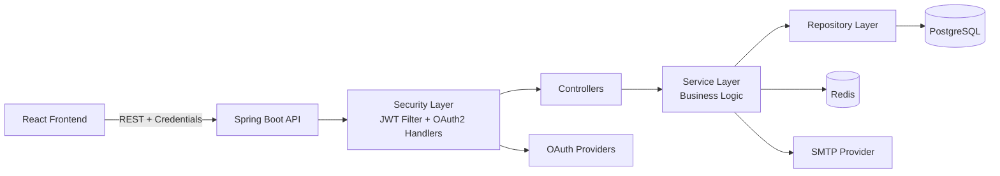
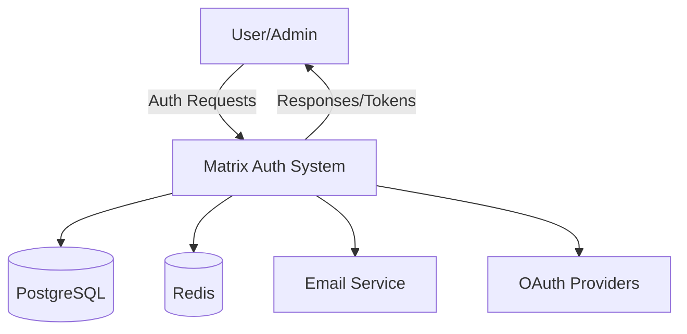
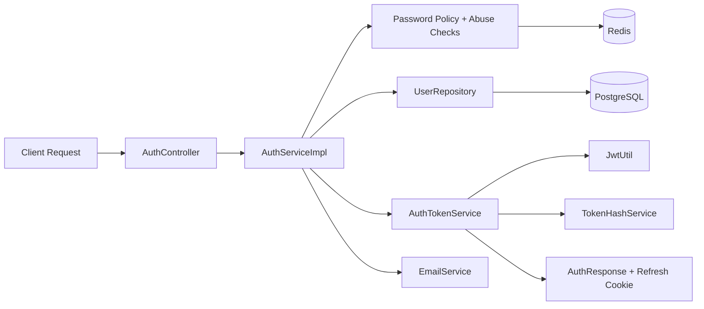
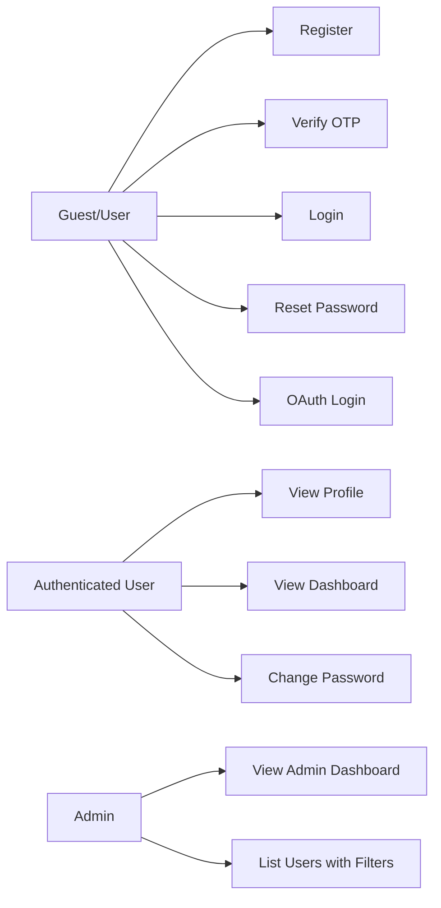
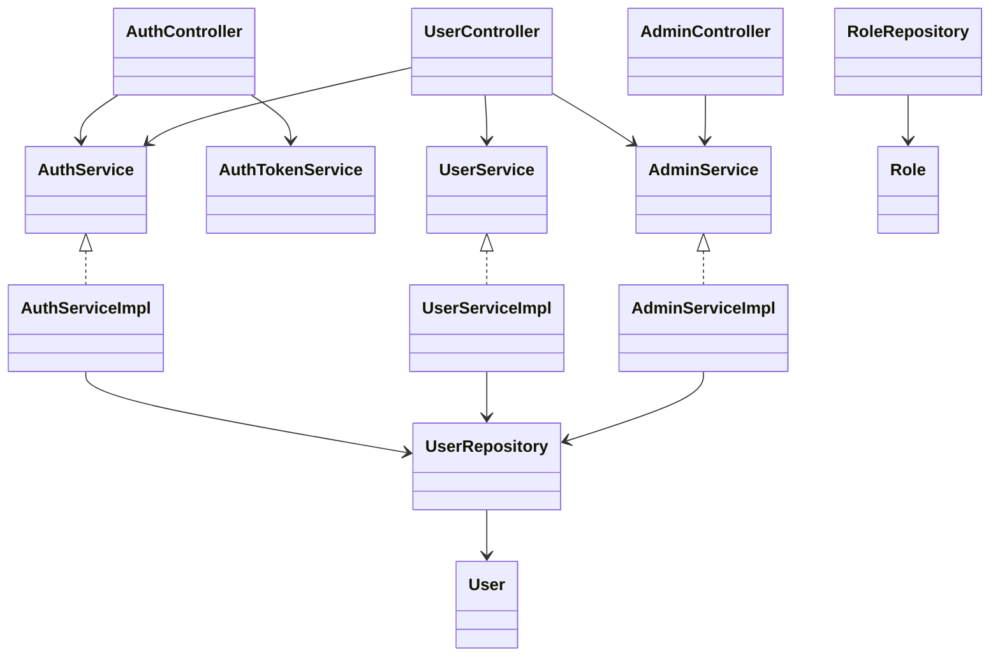
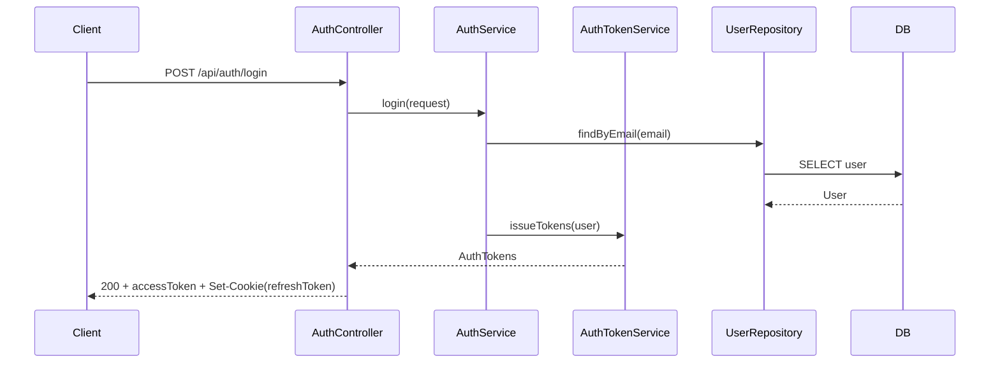
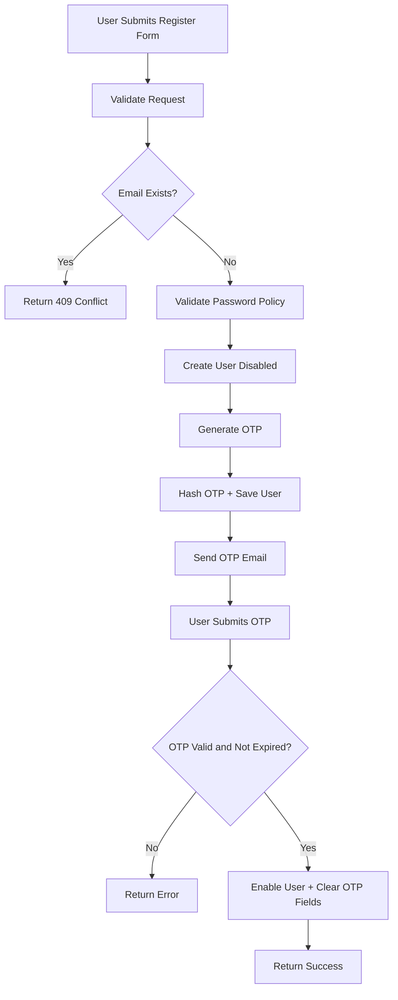
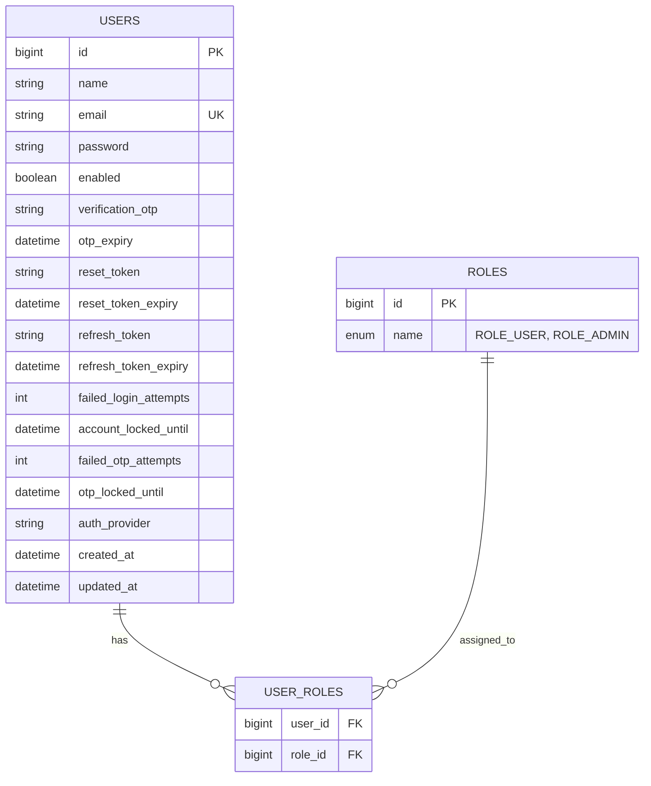

# Matrix Auth System

## Table of Contents

1. [About the Project](#about-the-project)
2. [Features](#features)
3. [Tech Stack](#tech-stack)
4. [System Design](#system-design)
5. [System Architecture](#system-architecture)
6. [Data Flow Diagrams (DFD)](#data-flow-diagrams-dfd)
7. [UML Diagrams](#uml-diagrams)
8. [Use Case Diagram](#use-case-diagram)
9. [Class Diagram](#class-diagram)
10. [Sequence Diagram](#sequence-diagram)
11. [Activity Diagram](#activity-diagram)
12. [4.4 Database Design — ER Diagram](#44-database-design--er-diagram)
13. [4.5 User Interface Design](#45-user-interface-design)
14. [API Endpoints](#api-endpoints)
15. [Project Structure](#project-structure)
16. [Getting Started](#getting-started)
17. [How to Explain This Project in an Interview](#how-to-explain-this-project-in-an-interview)
18. [Java Spring Boot Developer — 20 Q&A](#java-spring-boot-developer--20-qa)

---

## About the Project

Matrix Auth System is a full-stack authentication and authorization platform built for real-world user management use cases.  
The backend is built with Spring Boot layered architecture (Controller, Service, Repository, Entity, DTO, Security).  
The frontend is built with React 19 and Vite, with role-aware routing and token lifecycle handling.  
The system supports email/password authentication, OTP verification, password reset, refresh-token rotation, and OAuth2 login.  
Security and abuse protection are first-class concerns, implemented with Redis-backed rate limiting and account lock strategies.  
This project is structured to be interview-ready, production-oriented, and easy to extend for enterprise features.

---

## Features

- User registration with email verification (OTP-based activation)
- Login with access token + HttpOnly refresh token cookie
- Refresh token rotation and logout token revocation
- Password reset flow with secure token handling
- Password change for authenticated users
- OAuth2 login (Google, GitHub, Apple, LinkedIn)
- RBAC authorization (`ROLE_USER`, `ROLE_ADMIN`)
- Admin dashboard and paginated/filterable/searchable user listing
- Brute-force protection and endpoint-specific rate limiting
- Token hashing for refresh/reset/OTP values (no plaintext storage)
- Global exception handling with consistent JSON error responses
- Layered Spring Boot backend design and reusable service contracts
- Responsive React frontend with Bootstrap and protected routes
- Accessibility/performance aware Matrix background animation

---

## Tech Stack

| Layer | Technology |
| --- | --- |
| Language | Java 21 |
| Backend Framework | Spring Boot 3.5.10 |
| Security | Spring Security 6, JWT (jjwt 0.12.x), OAuth2 Client |
| Persistence | Spring Data JPA, Hibernate |
| Database | PostgreSQL 16 |
| Caching / Protection | Redis 7 |
| Validation | Jakarta Bean Validation |
| Email | Spring Mail |
| Mapping | MapStruct |
| Boilerplate Reduction | Lombok |
| Frontend | React 19, React Router 7, Vite |
| UI | Bootstrap 5, Bootstrap Icons |
| HTTP Client (Frontend) | Axios |
| Containers | Docker, Docker Compose |

---

## System Design

This system follows a layered backend design for clear separation of responsibilities:

1. Controller layer handles HTTP contracts and validation boundaries.
2. Service layer contains all business rules, orchestration, and transactional logic.
3. Repository layer manages data access through Spring Data JPA.
4. Security layer handles authentication, JWT parsing, OAuth2 callbacks, and filter chain policies.
5. DTO/Mapper layer isolates API models from JPA entities.
6. Exception layer centralizes error-to-response translation.

Key design principles used:

- Thin controllers, fat services
- Interface-driven services for clean contracts
- Token/hash security by default
- Policy-driven abuse protection via externalized properties
- Horizontal scalability via stateless access tokens

---

## System Architecture


```mermaid
flowchart LR
    FE[React Frontend]
    API[Spring Boot API]
    SEC[Security Layer\nJWT Filter + OAuth2 Handlers]
    CTRL[Controllers]
    SVC[Service Layer\nBusiness Logic]
    REPO[Repository Layer]
    PG[(PostgreSQL)]
    REDIS[(Redis)]
    SMTP[SMTP Provider]
    OAUTH[OAuth Providers]

    FE -->|REST + Credentials| API
    API --> SEC
    SEC --> CTRL
    CTRL --> SVC
    SVC --> REPO
    REPO --> PG
    SVC --> REDIS
    SVC --> SMTP
    SEC --> OAUTH
```

---

## Data Flow Diagrams (DFD)

### DFD Level 0 (Context Diagram)


```mermaid
flowchart TD
    User[User/Admin] -->|Auth Requests| System[Matrix Auth System]
    System -->|Responses/Tokens| User
    System --> DB[(PostgreSQL)]
    System --> Cache[(Redis)]
    System --> Mail[Email Service]
    System --> OAuth[OAuth Providers]
```

### DFD Level 1 (Authentication)


```mermaid
flowchart LR
    A[Client Request] --> B[AuthController]
    B --> C[AuthServiceImpl]
    C --> D[Password Policy + Abuse Checks]
    C --> E[UserRepository]
    E --> F[(PostgreSQL)]
    C --> G[AuthTokenService]
    G --> H[JwtUtil]
    G --> I[TokenHashService]
    C --> J[EmailService]
    D --> K[(Redis)]
    G --> L[AuthResponse + Refresh Cookie]
```

---

## UML Diagrams

This section gives developer-facing UML views that match implementation layers.

---

## Use Case Diagram


```mermaid
flowchart LR
    U[Guest/User] --> UC1[Register]
    U --> UC2[Verify OTP]
    U --> UC3[Login]
    U --> UC4[Reset Password]
    U --> UC5[OAuth Login]
    AU[Authenticated User] --> UC6[View Profile]
    AU --> UC7[View Dashboard]
    AU --> UC8[Change Password]
    AD[Admin] --> UC9[View Admin Dashboard]
    AD --> UC10[List Users with Filters]
```

---

## Class Diagram


```mermaid
classDiagram
    class AuthController
    class UserController
    class AdminController

    class AuthService
    class AuthServiceImpl
    class AuthTokenService
    class UserService
    class UserServiceImpl
    class AdminService
    class AdminServiceImpl

    class UserRepository
    class RoleRepository

    class User
    class Role

    AuthController --> AuthService
    AuthController --> AuthTokenService
    UserController --> UserService
    UserController --> AuthService
    UserController --> AdminService
    AdminController --> AdminService

    AuthService <|.. AuthServiceImpl
    UserService <|.. UserServiceImpl
    AdminService <|.. AdminServiceImpl

    AuthServiceImpl --> UserRepository
    UserServiceImpl --> UserRepository
    AdminServiceImpl --> UserRepository
    UserRepository --> User
    RoleRepository --> Role
```

---

## Sequence Diagram

### Login + Refresh Cookie Flow


```mermaid
sequenceDiagram
    participant Client
    participant AuthController
    participant AuthService
    participant AuthTokenService
    participant UserRepository
    participant DB

    Client->>AuthController: POST /api/auth/login
    AuthController->>AuthService: login(request)
    AuthService->>UserRepository: findByEmail(email)
    UserRepository->>DB: SELECT user
    DB-->>UserRepository: User
    AuthService->>AuthTokenService: issueTokens(user)
    AuthTokenService-->>AuthController: AuthTokens
    AuthController-->>Client: 200 + accessToken + Set-Cookie(refreshToken)
```

---

## Activity Diagram

### Registration and OTP Verification


```mermaid
flowchart TD
    A[User Submits Register Form] --> B[Validate Request]
    B --> C{Email Exists?}
    C -- Yes --> D[Return 409 Conflict]
    C -- No --> E[Validate Password Policy]
    E --> F[Create User Disabled]
    F --> G[Generate OTP]
    G --> H[Hash OTP + Save User]
    H --> I[Send OTP Email]
    I --> J[User Submits OTP]
    J --> K{OTP Valid and Not Expired?}
    K -- No --> L[Return Error]
    K -- Yes --> M[Enable User + Clear OTP Fields]
    M --> N[Return Success]
```

---

## 4.4 Database Design — ER Diagram


```mermaid
erDiagram
    USERS {
        bigint id PK
        string name
        string email UK
        string password
        boolean enabled
        string verification_otp
        datetime otp_expiry
        string reset_token
        datetime reset_token_expiry
        string refresh_token
        datetime refresh_token_expiry
        int failed_login_attempts
        datetime account_locked_until
        int failed_otp_attempts
        datetime otp_locked_until
        string auth_provider
        datetime created_at
        datetime updated_at
    }

    ROLES {
        bigint id PK
        enum name "ROLE_USER, ROLE_ADMIN"
    }

    USER_ROLES {
        bigint user_id FK
        bigint role_id FK
    }

    USERS ||--o{ USER_ROLES : has
    ROLES ||--o{ USER_ROLES : assigned_to
```

Design notes:

- `users.email` is unique for identity-level lookup.
- `user_roles` supports many-to-many RBAC.
- token fields store hashed values, not raw secrets.

---

## 4.5 User Interface Design

Frontend design goals and implementation choices:

1. Clear auth journey: Home -> Register/Login -> Verify OTP -> Dashboard.
2. Role-sensitive route guards: admin routes are isolated from user routes.
3. Session reliability: Axios interceptors auto-attach Bearer token and auto-refresh on `401`.
4. UX feedback: toast notifications and loading states on async operations.
5. Responsive layout with Bootstrap components and utility classes.
6. Aesthetic layer: Matrix rain animation with reduced-motion fallback for accessibility.
7. Mobile stability: Bootstrap JS bundle is loaded for navbar collapse/dropdowns.

---

## API Endpoints

Base URL: `http://localhost:8080/api`

### Auth APIs (`/auth`)

| Method | Endpoint | Description | Access |
| --- | --- | --- | --- |
| POST | `/register` | Register user account | Public |
| POST | `/verify-otp` | Verify registration OTP | Public |
| POST | `/login` | Login and issue tokens | Public |
| POST | `/refresh` | Refresh access token via cookie/body token | Public |
| POST | `/logout` | Revoke refresh token and clear cookie | Public |
| POST | `/reset-password` | Request reset token | Public |
| POST | `/update-password` | Update password with reset token | Public |
| POST | `/resend-otp?email=` | Resend OTP with cooldown/rate limits | Public |

### User APIs (`/user`)

| Method | Endpoint | Description | Access |
| --- | --- | --- | --- |
| GET | `/dashboard` | User dashboard payload | ROLE_USER / ROLE_ADMIN |
| GET | `/profile` | Current profile info | ROLE_USER / ROLE_ADMIN |
| POST | `/change-password` | Change password (authenticated) | ROLE_USER / ROLE_ADMIN |

### Admin APIs (`/admin`)

| Method | Endpoint | Description | Access |
| --- | --- | --- | --- |
| GET | `/dashboard` | Admin metrics (total users, active users) | ROLE_ADMIN |
| GET | `/users` | Paginated/searchable/filterable users list | ROLE_ADMIN |

Admin users query params:

- `page` default `0`
- `size` default `20`, max `100`
- `search` for name/email match
- `enabled` boolean filter
- `role` accepts `USER`, `ADMIN`, `ROLE_USER`, `ROLE_ADMIN`
- `sortBy` allows `id`, `name`, `email`, `enabled`, `createdAt`
- `sortDir` accepts `asc` or `desc`

---

## Project Structure

```text
Full-Stack-Authentication-System/
├── backend/
│   ├── src/main/java/com/auth/
│   │   ├── config/
│   │   ├── controller/
│   │   ├── dto/
│   │   ├── entity/
│   │   ├── exception/
│   │   ├── mapper/
│   │   ├── repository/
│   │   ├── security/
│   │   ├── service/
│   │   └── service/impl/
│   ├── src/main/resources/application.properties
│   ├── docker-compose.yaml
│   ├── Dockerfile
│   ├── MANUAL_TEST_PLAN.md
│   └── BACKEND_LAYERED_IMPLEMENTATION_GUIDE.md
├── frontend/
│   ├── src/components/
│   ├── src/context/
│   ├── src/pages/
│   ├── src/services/
│   └── package.json
├── API_DOCUMENTATION.md
└── README.md
```

---

## Getting Started

### Prerequisites

- Java 21+
- Maven 3.9+
- Node.js 18+
- npm 9+
- Docker + Docker Compose

### 1) Start database + Redis

```bash
cd backend
docker compose up -d postgres redis
```

### 2) Run backend

```bash
cd backend
mvn spring-boot:run
```

Default backend URL: `http://localhost:8080`

### 3) Run frontend

```bash
cd frontend
npm install
npm run dev
```

Default frontend URL: `http://localhost:5173`

### 4) Optional build checks

```bash
cd backend
mvn -q -DskipTests compile
mvn -q test

cd ../frontend
npm run lint
npm run build
```

### Security reminder

Do not keep mail/JWT/OAuth secrets in committed config for production.  
Use environment variables or external secret managers.

---

## How to Explain This Project in an Interview

This is a full-stack authentication platform designed with production security and maintainability in mind.  
On the backend, I used Spring Boot layered architecture and kept controllers thin by placing business rules in services.  
I implemented JWT-based stateless auth with refresh-token rotation, secure cookie handling, and token hashing at rest.  
I added abuse protection with Redis-backed rate limits and temporary lockouts for login, OTP, and password reset endpoints.  
For admin scalability, I designed paginated and filterable user APIs using JPA Specifications.  
On the frontend, I integrated role-protected routes, centralized auth context, and automatic token refresh handling.  
Overall, this project demonstrates secure API design, clean architecture, and practical end-to-end delivery.

---

## Java Spring Boot Developer — 20 Q&A

### Q1. Why did you keep business logic in services and not controllers?
I keep controllers limited to transport concerns such as request mapping, DTO binding, and HTTP status output.  
This makes business logic reusable from multiple entry points and easier to unit test in isolation.  
It also prevents controller classes from becoming fragile when requirements grow.  
In real projects, cross-cutting logic like retries, lock checks, and transaction boundaries belongs in services.  
When logic lives in services, architecture reviews and onboarding become faster because flow is consistent.  
This approach reduced regression risk when I moved admin filtering logic out of `AdminController`.

### Q2. How do you handle login securely in this project?
I authenticate credentials using Spring Security’s `AuthenticationManager` and never compare plaintext manually.  
Passwords are stored with BCrypt, so even a database leak does not reveal real passwords directly.  
After successful auth, I issue short-lived access tokens and separate refresh tokens.  
Refresh tokens are stored hashed in DB and delivered in HttpOnly cookies.  
I also clear failure counters on success to avoid accidental lock persistence.  
This balances UX and security while keeping stateless access control for APIs.

### Q3. Why use refresh token rotation instead of static refresh tokens?
Static refresh tokens increase replay risk if one token is leaked and remains valid for long periods.  
Rotation replaces refresh tokens on each refresh call, reducing window of misuse.  
In this system, old refresh token hashes are replaced with a new hash and new expiry.  
If token validation fails, refresh state is cleared and user must re-authenticate.  
This approach is widely used in production auth systems for stronger session protection.  
It is especially useful when frontend and backend are separated across origins.

### Q4. How do you prevent brute-force attacks?
I implemented endpoint-level rate limits via Redis counters and windowed thresholds.  
Separate keys are used for IP and email dimensions to reduce bypass vectors.  
I also track failed login and OTP attempts on user records for temporary lockouts.  
When thresholds are exceeded, API returns `429` or `423` with `Retry-After`.  
These controls protect both infrastructure and user accounts from credential stuffing.  
The thresholds are externalized in properties so tuning does not need code changes.

### Q5. Why hash reset/OTP/refresh tokens before storing them?
Storing raw tokens means anyone with DB read access can immediately hijack flows.  
I hash these opaque tokens with SHA-256 plus server-side pepper before persistence.  
Validation hashes incoming token and compares using constant-time operations.  
This follows the same principle as password hashing: never store reusable secrets in plaintext.  
It significantly reduces blast radius in partial data compromise scenarios.  
This was a deliberate hardening step for reset and refresh flows.

### Q6. How do you ensure admin user listing scales?
The admin list endpoint uses pagination with bounded page size and server-side filtering.  
I used `JpaSpecificationExecutor` to compose dynamic query criteria cleanly.  
Search is done on name/email; role and enabled status are optional filters.  
Sort fields are allowlisted to prevent invalid/unindexed sort behavior.  
This avoids `findAll()` memory blowups and keeps response times predictable.  
It also supports UI pagination and filter chips without overfetching.

### Q7. Why use DTOs even when entities already exist?
Entities represent persistence shape, but API contracts should remain stable and explicit.  
DTOs prevent exposing internal columns such as hashed tokens or lock counters.  
They also keep validation constraints close to request boundaries.  
When database schema evolves, DTO contracts can remain backward compatible.  
This separation reduces accidental data leaks and coupling between layers.  
In this project, `UserDto` and `AuthResponse` are examples of that boundary.

### Q8. How do you handle global errors consistently?
I use a centralized exception handler with `@ControllerAdvice`.  
Each known exception maps to a clear HTTP status and a `MessageResponse` body.  
Validation, bad credentials, token errors, rate limits, and lockouts are handled separately.  
For rate and lock cases, response includes `Retry-After` header for client behavior.  
This prevents ad-hoc error handling duplicated across controllers.  
It gives frontend a consistent error contract for all APIs.

### Q9. What is the purpose of `CustomUserDetailsService`?
Spring Security needs a `UserDetailsService` to load identities and authorities.  
My implementation loads user by email and maps roles to granted authorities.  
It bridges domain user model and Spring Security’s authentication pipeline.  
Without this mapping, role-based checks in security config and `@PreAuthorize` fail.  
It also centralizes normalization and not-found behavior in one place.  
This keeps auth stack aligned with repository data.

### Q10. How do OAuth2 logins integrate with local accounts?
On OAuth callback, I extract provider identity and resolve reliable email/name attributes.  
If user exists, I update provider metadata and enable account if needed.  
If user does not exist, I provision a local account with ROLE_USER.  
Then I issue the same internal access/refresh tokens used by password login.  
This creates a unified downstream authorization model regardless of auth provider.  
It simplifies frontend because all post-login flows are identical.

### Q11. Why not send access token in OAuth callback URL?
Tokens in query strings leak through browser history, server logs, and referrers.  
Instead, callback redirects without token material in URL.  
Frontend then calls refresh endpoint and gets access token through controlled channel.  
Refresh token remains in HttpOnly cookie and cannot be read by JS directly.  
This design reduces accidental credential disclosure in normal operations.  
It’s a practical security improvement over naive OAuth callback implementations.

### Q12. How is password policy enforced in real behavior?
Policy is enforced in service layer during registration, reset update, and password change.  
Rules include length, character classes, whitespace rejection, and blocklist checks.  
I also reject passwords containing email local-part to reduce guessability.  
Because checks are centralized, all entry points apply same policy consistently.  
Clients receive clear validation messages when policy fails.  
This prevents weak passwords from entering system through alternate flows.

### Q13. How do you test this backend manually end-to-end?
I use a phase-based manual test plan: baseline, auth, reset, admin, abuse, CORS, OAuth.  
Each step uses concrete curl commands and explicit expected status codes.  
I validate cookie behavior, retry headers, and role-restricted endpoints separately.  
For admin APIs, I test pagination bounds and invalid filter/sort combinations.  
For abuse controls, I verify transition from `401` to `429`/`423`.  
This catches integration issues that unit tests alone may miss.

### Q14. What transactions are important in this project?
Critical state-changing operations are annotated with `@Transactional`.  
Examples include token rotation, password reset updates, and account verification steps.  
This ensures partial updates do not leave inconsistent user state.  
If an exception occurs mid-flow, DB changes roll back atomically.  
I keep read-heavy methods non-transactional unless consistency demands otherwise.  
The goal is correctness first, then performance-aware scope.

### Q15. Why use Redis here instead of DB counters for rate limiting?
Redis offers low-latency atomic increment and TTL semantics ideal for rate windows.  
DB-based counters under heavy traffic create write contention and cleanup overhead.  
With Redis, key expiry naturally handles window reset.  
I can also namespace keys by endpoint, IP, and email dimensions cleanly.  
If Redis is unavailable, current implementation fails open to avoid auth outage.  
That behavior can be adjusted per environment risk tolerance.

### Q16. How do you protect routes by role?
Security config defines route-level constraints for `/api/user/**` and `/api/admin/**`.  
At method level, I also use `@PreAuthorize` for explicit authorization checks.  
JWT filter populates `SecurityContext` with authorities from user roles.  
Role strings are standardized (`ROLE_USER`, `ROLE_ADMIN`) for consistency.  
Unauthorized access returns `403` while unauthenticated returns `401`.  
This dual-layer model reduces accidental exposure during future endpoint additions.

### Q17. How would you make this production-ready beyond local setup?
First, move secrets to env vars or secret manager and rotate any exposed credentials.  
Second, replace `ddl-auto=create-drop` with migration tooling like Flyway.  
Third, enforce HTTPS and `cookie-secure=true` in production deployments.  
Fourth, add observability: metrics, structured logs, distributed tracing, alerts.  
Fifth, add integration/security tests in CI and stricter static checks.  
These steps convert a solid dev system into operationally reliable software.

### Q18. How do you handle CORS safely with credentials?
CORS allows only trusted frontend origins, not wildcard, when credentials are enabled.  
I explicitly allow required methods and headers and expose needed headers only.  
Credentialed requests require exact origin matching by browser policy.  
This is crucial because refresh cookie flow depends on `withCredentials=true`.  
Misconfigured CORS causes login/refresh failures that look like auth bugs.  
So I always validate preflight behavior early in manual testing.

### Q19. Why layered architecture for this project instead of quick monolith style?
Layered architecture gives predictable boundaries and easier team collaboration.  
New developers can quickly locate logic in controller/service/repository paths.  
Refactors like moving business logic from controllers become safe and incremental.  
Testing strategy is cleaner: unit test services, integration test controllers/repositories.  
It also keeps technical debt lower as features like MFA or audit trails are added.  
For interview projects, this strongly demonstrates engineering discipline.

### Q20. What was the hardest real issue you solved here?
A major issue was keeping security hardening aligned with frontend usability.  
Token rotation, cookie path/samesite handling, and OAuth callback flow had to work together.  
At the same time, abuse protection needed strong limits without locking legitimate users too early.  
I solved this by centralizing policy in services and externalizing thresholds in properties.  
Then I validated behavior using a strict manual phase plan and endpoint smoke checks.  
The result is a backend that is both secure and practical for real user traffic.

---

If you want, I can also generate matching `README_INTERVIEW_SHORT.md` and `README_TECHNICAL_DEEP_DIVE.md` versions (short recruiter version + deep engineer version).
