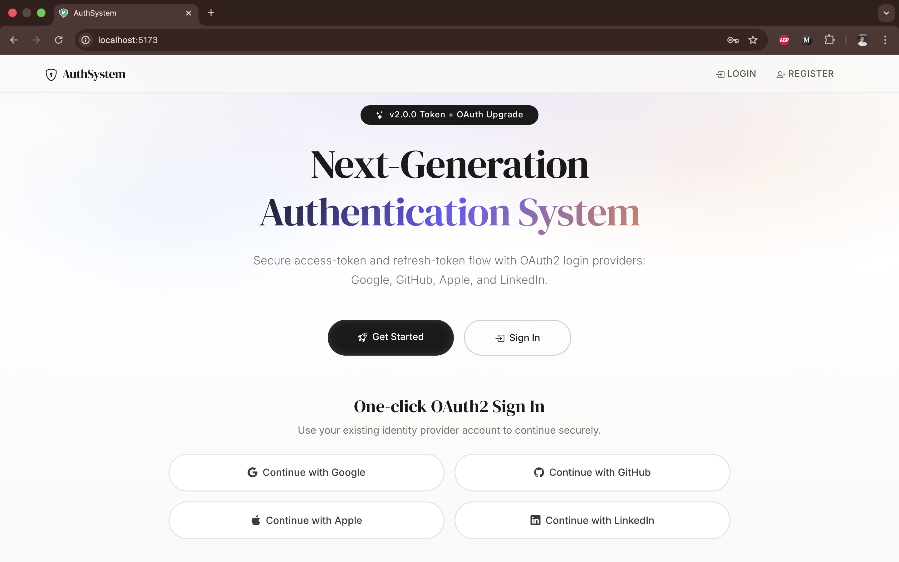

# 🔐 Full-Stack Auth System

<p align="center">
  
</p>

<p align="center">
  
  
  
  
  
  
</p>

<p align="center">
  
  
  
  
  
</p>

---

## 

This project is a backend-focused authentication and authorization service built with Spring Boot.
It follows a clean layered architecture (Controller, Service, Repository, Entity, DTO, Security) for maintainable API development.
The service handles signup, OTP verification, login, token refresh, logout, password reset, and OAuth2 provider login.
Access control is enforced with role-based authorization for `ROLE_USER` and `ROLE_ADMIN`.
Security is treated as a core requirement through refresh-token rotation, token hashing, Redis-backed rate limiting, and account lock protection.
The codebase is structured to reflect production-grade backend engineering practices and is easy to extend.

---

## 

- Email/password registration with OTP-based account verification
- Secure login with short-lived access token and HttpOnly refresh-token cookie
- Refresh-token rotation with server-side revocation on logout
- Password reset by email and authenticated password change support
- OAuth2 login providers: Google, GitHub, Apple, and LinkedIn
- Role-based authorization for `ROLE_USER` and `ROLE_ADMIN`
- Admin module with dashboard metrics and paginated user management
- Search, filter, and sort support for admin user listing endpoints
- Redis-backed rate limiting and lockout strategy against brute-force abuse
- Hashed storage for refresh tokens, reset tokens, and OTP values
- Centralized global exception handling with consistent JSON responses
- Clean layered backend architecture with reusable service contracts
- Responsive frontend routing with protected role-aware pages
- Accessibility- and performance-conscious UI behavior

---

## 

| Layer | Technology |
| --- | --- |
| Language | Java 21 |
| Backend Framework | Spring Boot 3.5.10 |
| Security | Spring Security 6, JWT (jjwt 0.12.x), OAuth2 Client |
| Persistence | Spring Data JPA, Hibernate |
| Database | PostgreSQL 16 |
| Caching / Protection | Redis 7 |
| Validation | Jakarta Bean Validation |
| Email | Spring Mail |
| Mapping | MapStruct |
| Boilerplate Reduction | Lombok |
| Frontend | React 19, React Router 7, Vite |
| UI | Bootstrap 5, Bootstrap Icons |
| HTTP Client (Frontend) | Axios |
| Containers | Docker, Docker Compose |

---

## 

<p align="center">
  
</p>

---

## 

Base URL: `http://localhost:8080`

### Auth APIs — `POST /api/auth/*`

| # | Method | Endpoint | Description | Access |
|---|--------|----------|-------------|--------|
| 1 | POST | `/api/auth/register` | Register a new user account | Public |
| 2 | POST | `/api/auth/verify-otp` | Verify email with OTP code | Public |
| 3 | POST | `/api/auth/login` | Login and receive JWT + refresh cookie | Public |
| 4 | POST | `/api/auth/refresh` | Refresh access token (cookie or body) | Public |
| 5 | POST | `/api/auth/logout` | Revoke refresh token and clear cookie | Public |
| 6 | POST | `/api/auth/reset-password` | Request password reset email | Public |
| 7 | POST | `/api/auth/update-password` | Set new password using reset token | Public |
| 8 | POST | `/api/auth/resend-otp?email={email}` | Resend OTP with rate limiting | Public |

### User APIs — `/api/user/*`

| # | Method | Endpoint | Description | Access |
|---|--------|----------|-------------|--------|
| 1 | GET | `/api/user/dashboard` | Get user dashboard data | `ROLE_USER` or `ROLE_ADMIN` |
| 2 | GET | `/api/user/profile` | Get current user profile | `ROLE_USER` or `ROLE_ADMIN` |
| 3 | POST | `/api/user/change-password` | Change password (authenticated) | `ROLE_USER` or `ROLE_ADMIN` |

### Admin APIs — `/api/admin/*`

| # | Method | Endpoint | Description | Access |
|---|--------|----------|-------------|--------|
| 1 | GET | `/api/admin/dashboard` | Admin metrics (total users, active count) | `ROLE_ADMIN` |
| 2 | GET | `/api/admin/users` | Paginated, searchable, filterable user list | `ROLE_ADMIN` |

Admin users query params:

- `page` default `0`
- `size` default `20`, max `100`
- `search` for name/email match
- `enabled` boolean filter
- `role` accepts `USER`, `ADMIN`, `ROLE_USER`, `ROLE_ADMIN`
- `sortBy` allows `id`, `name`, `email`, `enabled`, `createdAt`
- `sortDir` accepts `asc` or `desc`

### OAuth2 APIs — Spring Security Managed

| # | Method | Endpoint | Description | Access |
|---|--------|----------|-------------|--------|
| 1 | GET | `/oauth2/authorization/{provider}` | Start OAuth2 login flow (Google, GitHub, Apple, LinkedIn) | Public |
| 2 | GET | `/login/oauth2/code/{provider}` | OAuth2 callback (handled by Spring Security) | Public |

OAuth2 flow: Frontend redirects to `/oauth2/authorization/google` → user authenticates with provider → Spring Security handles callback → `OAuth2AuthenticationSuccessHandler` issues tokens + HttpOnly cookie → redirects to frontend with no token in URL → frontend calls `/api/auth/refresh` to get access token.

---

## 

### Prerequisites

- Java 21+
- Maven 3.9+
- Node.js 18+
- npm 9+
- Docker + Docker Compose

### 1) Configure environment files

```bash
cd backend
cp .env.example .env
# edit backend/.env and set at least: SPRING_DATASOURCE_PASSWORD, JWT_SECRET

cd ../frontend
cp .env.example .env
```

Security note:

- Never commit `.env` files.
- Never put secrets in `VITE_*` variables (they are exposed to the browser).

### 2) Start database + Redis

```bash
cd backend
docker compose up -d postgres redis
```

### 3) Run backend

```bash
cd backend
mvn spring-boot:run
```

Default backend URL: `http://localhost:8080`

### 4) Run frontend

```bash
cd frontend
npm install
npm run dev
```

Default frontend URL: `http://localhost:5173`

### 5) Optional build checks

```bash
cd backend
mvn -q -DskipTests compile
mvn -q test

cd ../frontend
npm run lint
npm run build
```

---
