# 🛡️ Matrix Auth System

A modern, production-ready full-stack authentication system featuring a premium **Matrix-inspired Glassmorphism UI**. Built with **Spring Boot 3** and **React 18**, this project combines robust security with a stunning, high-performance frontend.

---

## 📑 Table of Contents

- [Tech Stack](#-tech-stack)
- [High-Level System Architecture](#-high-level-system-architecture)
- [Component Interaction Diagram](#-component-interaction-diagram)
- [User Flow Diagrams](#-user-flow-diagrams)
- [Class Diagram](#-class-diagram)
- [Data Model](#-data-model)
- [Security Architecture](#-security-architecture)
- [API Endpoints](#-api-endpoints)
- [Getting Started](#-getting-started)

---

## 🛠️ Tech Stack

| Category | Technology | Description |
|----------|------------|-------------|
| **Backend** | Spring Boot 3.2 | Core framework for REST API |
| | Spring Security 6 | Authentication & Authorization |
| | Spring Data JPA | ORM & Database interactions |
| | Hibernate | JPA Implementation |
| | JJWT (Java JWT) | JWT Token generation & validation |
| | Java Mail Sender | Sending emails (OTP, Password Reset) |
| | MySQL 8.0 | Relational Database |
| **Frontend** | React 18 | UI Library |
| | Vite | Next Gen Frontend Tooling |
| | Axios | HTTP Client |
| | React Router DOM 6 | Client-side routing |
| | Bootstrap 5 | CSS Framework for responsive UI |
| | Bootstrap Icons | Icon library |

---

## 🎨 UI/UX & Theming

The application features a unique **Matrix Light** aesthetic designed for a premium user experience:

*   **Glassmorphism**: Extensively used `backdrop-filter` blur effects for cards and overlays.
*   **Custom Color Palette**: A sophisticated **Teal** (`#0C7779`) primary color scheme against a deep background.
*   **Interactive Elements**: Bouncy hover effects, gradient text, and smooth page transitions.
*   **Responsive Design**: Fully mobile-optimized layout with a floating glass navbar.
*   **Animation**: Subtle background Matrix rain animation for visual depth.

---

## 📸 Screenshots

| **Home Page** | **Login** |
|:---:|:---:|
|  |  |

| **Register** |
|:---:|
|  |

---

## 🏗️ High-Level System Architecture

This diagram illustrates the overall architecture where the Client (React App) interacts with the Backend API (Spring Boot) through RESTful endpoints. The backend manages authentication, business logic, and database operations.

```mermaid
graph TD
    Client["📱 React Client"] -->|"REST API Requests"| Gateway["🛡️ API Gateway / Controller"]
    Gateway -->|"Validation & Auth"| Security["🔒 Spring Security Filter Chain"]
    Security -->|"Authorized"| Controller["🎮 Rest Controllers"]
    Controller -->|"Business Logic"| Service["⚙️ Service Layer"]
    Service -->|"Data Access"| Repository["💾 Repository Layer"]
    Repository -->|"SQL Queries"| Database[("🗄️ MySQL Database")]
    Service -->|"SMTP"| Email["📧 Email Service (Gmail)"]
```

---

## 🔄 Component Interaction Diagram

Key interaction flow for **User Login**:

---

## 👥 User Flow Diagrams

### Registration & Verification Flow

---

## 📐 Class Diagram

Core backend classes demonstrating the relationship between Controllers, Services, and Entities.

---

## 📊 Data Model

Database schema illustrating users and roles relationship.

---

## 🛡️ Security Architecture

1.  **JWT (JSON Web Token)**: Stateless authentication. Tokens are generated upon login and must be included in the `Authorization` header (`Bearer <token>`) for protected requests.
2.  **BCrypt Password Hashing**: Passwords are never stored in plain text. They are hashed using BCrypt before storage.
3.  **Role-Based Access Control (RBAC)**:
    *   `ROLE_USER`: Access to personal dashboard and profile.
    *   `ROLE_ADMIN`: Access to user management and system stats.
    *   annotation `@PreAuthorize("hasRole('ADMIN')")` enforces checks.
4.  **CORS Policy**: Configured to allow requests only from trusted frontend origins (e.g., `http://localhost:5173`).
5.  **OTP Verification**: 6-digit random code sent via email for account activation to prevent fake registrations.

---

## 🔗 API Endpoints

<strong>Click to view detailed API documentation</strong>

### 🟢 Authentication (`/api/auth`)

| Method | Endpoint | Description | Access |
| :--- | :--- | :--- | :--- |
| `POST` | `/register` | Register a new user account | 🌐 Public |
| `POST` | `/login` | Authenticate user & get JWT | 🌐 Public |
| `POST` | `/verify-otp` | Verify email OTP code | 🌐 Public |
| `POST` | `/resend-otp` | Resend verification email | 🌐 Public |
| `POST` | `/reset-password` | Initiate password reset | 🌐 Public |
| `POST` | `/update-password` | complete password reset | 🌐 Public |

### 🔵 User Operations (`/api/user`)

| Method | Endpoint | Description | Access |
| :--- | :--- | :--- | :--- |
| `GET` | `/dashboard` | Retrieve user dashboard statistics | 🔐 User |
| `GET` | `/profile` | Get current user profile details | 🔐 User |
| `POST` | `/change-password` | Update account password | 🔐 User |

### 🔴 Administration (`/api/admin`)

| Method | Endpoint | Description | Access |
| :--- | :--- | :--- | :--- |
| `GET` | `/dashboard` | View system-wide statistics | 🛡️ Admin |
| `GET` | `/users` | Retrieve paginated list of users | 🛡️ Admin |
| `GET` | `/users/{id}` | Get specific user details | 🛡️ Admin |
| `PUT` | `/users/{id}` | Update user roles/status | 🛡️ Admin |
| `DELETE` | `/users/{id}` | Delete a user account | 🛡️ Admin |

---

## 🚀 Getting Started

### Prerequisites
- Java 17+
- Node.js 18+
- MySQL 8.0+
- Maven

### Backend Setup
1.  Navigate to `/backend`.
2.  Update `src/main/resources/application.properties` with your MySQL and Mail credentials.
3.  Run application: `mvn spring-boot:run`

### Frontend Setup
1.  Navigate to `/frontend`.
2.  Install dependencies: `npm install`
3.  Start dev server: `npm run dev`

---
