# 🛡️ Matrix Auth System

A modern, production-ready full-stack authentication system featuring a premium **Matrix-inspired Glassmorphism UI**. Built with **Spring Boot 3** and **React 18**, this project combines robust security with a stunning, high-performance frontend.

---

## 📑 Table of Contents

- [Tech Stack](#-tech-stack)
- [High-Level System Architecture](#-high-level-system-architecture)
- [Component Interaction Diagram](#-component-interaction-diagram)
- [User Flow Diagrams](#-user-flow-diagrams)
- [Class Diagram](#-class-diagram)
- [Data Model](#-data-model)
- [Security Architecture](#-security-architecture)
- [API Endpoints](#-api-endpoints)
- [Getting Started](#-getting-started)

---

## 🛠️ Tech Stack

| Category | Technology | Description |
|----------|------------|-------------|
| **Backend** | Spring Boot 3.5.10 | Core framework for REST API |
| | Spring Security 6 | Authentication & Authorization |
| | Spring Data JPA | ORM & Database interactions |
| | Hibernate | JPA Implementation |
| | JJWT (Java JWT) | JWT Token generation & validation |
| | Java Mail Sender | Sending emails (OTP, Password Reset) |
| | MySQL 8.0 | Relational Database |
| **Frontend** | React 18 | UI Library |
| | Vite | Next Gen Frontend Tooling |
| | Axios | HTTP Client |
| | React Router DOM 6 | Client-side routing |
| | Bootstrap 5 | CSS Framework for responsive UI |
| | Bootstrap Icons | Icon library |

---

## 🎨 UI/UX & Theming

The application features a unique **Matrix Light** aesthetic designed for a premium user experience:

*   **Glassmorphism**: Extensively used `backdrop-filter` blur effects for cards and overlays.
*   **Custom Color Palette**: A sophisticated **Teal** (`#0C7779`) primary color scheme against a deep background.
*   **Interactive Elements**: Bouncy hover effects, gradient text, and smooth page transitions.
*   **Responsive Design**: Fully mobile-optimized layout with a floating glass navbar.
*   **Animation**: Subtle background Matrix rain animation for visual depth.

---

## 📸 Screenshots

### 🌟 Home Page

### 📱 Interface Overview

| **Secure Login** | **User Registration** |
|:---:|:---:|
|  |  |

| **Interactive Dashboard** |
|:---:|
|  |

---

## 🏗️ High-Level System Architecture

This diagram illustrates the overall architecture where the Client (React App) interacts with the Backend API (Spring Boot) through RESTful endpoints. The backend manages authentication, business logic, and database operations.

```mermaid
graph TD
    Client["📱 React Client"] -->|"REST API Requests"| Gateway["🛡️ API Gateway / Controller"]
    Gateway -->|"Validation & Auth"| Security["🔒 Spring Security Filter Chain"]
    Security -->|"Authorized"| Controller["🎮 Rest Controllers"]
    Controller -->|"Business Logic"| Service["⚙️ Service Layer"]
    Service -->|"Data Access"| Repository["💾 Repository Layer"]
    Repository -->|"SQL Queries"| Database[("🗄️ MySQL Database")]
    Service -->|"SMTP"| Email["📧 Email Service (Gmail)"]
```

---

## 🔄 Component Interaction Diagram

Key interaction flow for **User Login**:

---

## 👥 User Flow Diagrams

### Registration & Verification Flow

---

## 📐 Class Diagram

Core backend classes demonstrating the relationship between Controllers, Services, and Entities.

---

## 📊 Data Model

Database schema illustrating users and roles relationship.

---

## 🛡️ Security Architecture

1.  **JWT (JSON Web Token)**: Stateless authentication. Tokens are generated upon login and must be included in the `Authorization` header (`Bearer <token>`) for protected requests.
2.  **BCrypt Password Hashing**: Passwords are never stored in plain text. They are hashed using BCrypt before storage.
3.  **Role-Based Access Control (RBAC)**:
    *   `ROLE_USER`: Access to personal dashboard and profile.
    *   `ROLE_ADMIN`: Access to user management and system stats.
    *   annotation `@PreAuthorize("hasRole('ADMIN')")` enforces checks.
4.  **CORS Policy**: Configured to allow requests only from trusted frontend origins (e.g., `http://localhost:5173`).
5.  **OTP Verification**: 6-digit random code sent via email for account activation to prevent fake registrations.

---

## 🔗 API Endpoints

> **📄 [View Full API Documentation](API_DOCUMENTATION.md)**

For a detailed guide on how to use the API (compatible with Postman), please refer to the [API_DOCUMENTATION.md](API_DOCUMENTATION.md) file.

<strong>Quick Reference</strong>

### 🟢 Authentication (`/api/auth`)

| Method | Endpoint | Description | Access |
| :--- | :--- | :--- | :--- |
| `POST` | `/register` | Register a new user account | 🌐 Public |
| `POST` | `/login` | Authenticate user & get JWT | 🌐 Public |
| `POST` | `/verify-otp` | Verify email OTP code | 🌐 Public |
| `POST` | `/resend-otp` | Resend verification email | 🌐 Public |
| `POST` | `/reset-password` | Initiate password reset | 🌐 Public |
| `POST` | `/update-password` | complete password reset | 🌐 Public |

### 🔵 User Operations (`/api/user`)

| Method | Endpoint | Description | Access |
| :--- | :--- | :--- | :--- |
| `GET` | `/dashboard` | Retrieve user dashboard statistics | 🔐 User |
| `GET` | `/profile` | Get current user profile details | 🔐 User |
| `POST` | `/change-password` | Update account password | 🔐 User |

### 🔴 Administration (`/api/admin`)

| Method | Endpoint | Description | Access |
| :--- | :--- | :--- | :--- |
| `GET` | `/dashboard` | View system-wide statistics | 🛡️ Admin |
| `GET` | `/users` | Retrieve paginated list of users | 🛡️ Admin |
| `GET` | `/users/{id}` | Get specific user details | 🛡️ Admin |
| `PUT` | `/users/{id}` | Update user roles/status | 🛡️ Admin |
| `DELETE` | `/users/{id}` | Delete a user account | 🛡️ Admin |

---

## 🚀 Getting Started

### Prerequisites
- **Java 21+**
- Node.js 18+
- MySQL 8.0+
- Maven

### Backend Setup
1.  Navigate to `/backend`.
2.  Update `src/main/resources/application.properties` with your MySQL and Mail credentials.
3.  Run application: `mvn spring-boot:run`

### Frontend Setup
1.  Navigate to `/frontend`.
2.  Install dependencies: `npm install`
3.  Start dev server: `npm run dev`

---

## ❓ Real-World Interview Questions (20+)

Use this project to verify your full-stack knowledge. These questions touch on the specific decisions made in this codebase.

### **🔐 Security & Authentication**

1.  **JWT vs. Session:** Why did we choose `Stateless` session policy in `SecurityConfig.java`? What are the trade-offs compared to traditional Server-Side Sessions?
    

    
<strong>Answer</strong>

    We use <code>SessionCreationPolicy.STATELESS</code> because JWTs are self-contained. The server does not need to store session data in memory or a database, making the application easier to scale horizontally (stateless). Trade-off: We cannot easily invalidate a token before it expires (server-side sessions can just be deleted).
    

2.  **CSRF Configuration:** We disabled CSRF (`csrf.disable()`) but enabled CORS. In what specific scenario is this safe? If we stored the JWT in an `HttpOnly` cookie, would we need to re-enable it?
    

    
<strong>Answer</strong>

    CSRF (Cross-Site Request Forgery) attacks rely on the browser automatically sending cookies. Since we store the JWT in <code>LocalStorage</code> and manually attach it to the header, the browser won't send it automatically for cross-site requests, making CSRF impossible. If we moved to <code>HttpOnly</code> cookies, the browser <em>would</em> send them automatically, so we would need to re-enable CSRF protection (or use SameSite=Strict cookies).
    

3.  **Password Storage:** Explain why we use `BCryptPasswordEncoder`? If an attacker dumps the database, can they reverse these passwords? What is a "Salt" and does BCrypt handle it automatically?
    

    
<strong>Answer</strong>

    BCrypt is a slow hashing algorithm designed to resist brute-force attacks. It is a one-way hash, so it cannot be reversed. BCrypt automatically generates a random "salt" for every password and includes it in the final hash string, ensuring that two users with the same password have different hash values in the database.
    

4.  **Filter Chain:** How does the `JwtAuthFilter` interact with the `UsernamePasswordAuthenticationFilter`? Why must it run *before* the standard authentication filter?
    

    
<strong>Answer</strong>

    The <code>JwtAuthFilter</code> intercepts every request to check for a "Bearer" token. It must run <em>before</em> the <code>UsernamePasswordAuthenticationFilter</code> so that if a valid token is present, it sets the authentication in the <code>SecurityContext</code> immediately. This allows Spring Security to skip the default login process for that request.
    

5.  **Role-Based Access:** We use `@PreAuthorize("hasRole('ADMIN')")`. How does Spring Security know which user has which role? Walk through the `UserDetails` implementation.
    

    
<strong>Answer</strong>

    When the <code>CustomUserDetailsService</code> loads a user from the database, it maps the user's roles to <code>SimpleGrantedAuthority</code> objects (e.g., "ROLE_ADMIN"). These authorities are returned as part of the <code>UserDetails</code> object. Spring Security then checks these authorities against the <code>@PreAuthorize</code> annotation.
    

6.  **Token Expiry & Security:** If a user's token is stolen, the attacker acts as the user until expiry. How would you implement a "Logout" feature that immediately invalidates a stateless JWT? (Hint: Redis blocklist).
    

    
<strong>Answer</strong>

    Since JWTs are stateless, the server doesn't know they exist. To "invalidate" one, we would store the token's ID (JTI) or signature in a fast database like Redis with a "Blocklist" key and an expiry time equal to the token's remaining life. The <code>JwtAuthFilter</code> would check this Redis blocklist for every request.
    

### **☕ Spring Boot & Backend Architecture**

7.  **Dependency Injection:** In `AuthController`, we use constructor/field injection for `AuthService`. What is Inversion of Control (IoC) and why is it better than `new AuthService()`?
    

    
<strong>Answer</strong>

    IoC means the Spring Container manages the lifecycle of objects (Beans). Instead of us creating dependencies with <code>new</code>, Spring provides them. This makes code loosely coupled and easier to test (we can easily inject mock services during unit testing).
    

8.  **DTO Pattern:** Why do we have `RegisterRequest` and `UserDto` classes? Why not just pass the `User` Entity directly to the controller?
    

    
<strong>Answer</strong>

    Passing Entities directly exposes internal database structure (security risk) and creates tight coupling. DTOs (Data Transfer Objects) allow us to define exactly what data we accept (input) and exactly what data we return (output), often hiding sensitive fields like <code>password</code> or unnecessary relationships.
    

9.  **Transactional Integrity:** If the "Save User" succeeds but the "Send Email" fails during registration, what happens? How would you use `@Transactional` to ensure data consistency?
    

    
<strong>Answer</strong>

    Without transactional management, the user would be saved but receive no OTP, leading to a "zombie" account. Annotating the service method with <code>@Transactional</code> ensures that if the email sending throws an exception, the database insert for the user is rolled back, keeping the data consistent.
    

10. **Validation:** We use `@Valid` in the controller. If a user sends an invalid email format, how is the error handled? Where is the global exception handler?
    

    
<strong>Answer</strong>

    Spring throws a <code>MethodArgumentNotValidException</code>. We should have a <code>@RestControllerAdvice</code> class with an <code>@ExceptionHandler</code> to catch this exception and return a clean JSON response (e.g., "Email is invalid") instead of a 500 stack trace.
    

11. **N+1 Problem:** If we have an endpoint `getAllUsers()` that also fetches their roles, how do you prevent Hibernate from executing one query for users + N queries for roles?
    

    
<strong>Answer</strong>

    This happens with <code>Lazy Loading</code>. To fix it, we use a <strong>JOIN FETCH</strong> in the JPQL query (e.g., <code>SELECT u FROM User u JOIN FETCH u.roles</code>) to retrieve the user and their roles in a single SQL query.
    

### **⚛️ React & Frontend**

12. **State Management:** How are we handling the user's login state? Is it persistent across page reloads? How does the `AuthContext` (or similar) work?
    

    
<strong>Answer</strong>

    We likely use React Context API (<code>AuthContext</code>) to hold the <code>user</code> object and <code>token</code>. To persist across reloads, we initialize this state by reading from <code>localStorage.getItem('token')</code> when the app starts.
    

13. **Protected Routes:** How does the `ProtectedRoute` component prevent unauthenticated users from accessing `/dashboard`? Does this provide real security, or is it just UX?
    

    
<strong>Answer</strong>

    It checks if a user is authenticated (e.g., has a token). If not, it uses <code>&lt;Navigate to="/login" /&gt;</code>. This is <strong>only UX</strong>. Real security happens on the backend API; an attacker could still use Postman to call the API directly unless the backend verifies the token.
    

14. **Axios Interceptors:** How would you centrally attach the JWT token to every API request without manually adding the header in every `axios.get()` call?
    

    
<strong>Answer</strong>

    We configure an <code>axios.interceptors.request.use()</code> function. This function checks <code>localStorage</code> for a token and, if found, adds <code>config.headers.Authorization = `Bearer ${token}`</code> to the request config before it leaves the browser.
    

15. **React Hooks:** Explain the usage of `useEffect` in the dashboard. What happens if you forget the dependency array?
    

    
<strong>Answer</strong>

    <code>useEffect</code> is used for side effects like data fetching. If the dependency array <code>[]</code> is missing, the effect runs on <em>every render</em>, potentially causing an infinite loop if the effect updates state (which triggers a re-render).
    

16. **XSS Prevention:** React escapes content by default. In what scenario would this application still be vulnerable to Cross-Site Scripting (XSS)?
    

    
<strong>Answer</strong>

    React is safe by default, but if we use <code>dangerouslySetInnerHTML</code> or evaluate user input in <code>href</code> attributes (e.g., <code>javascript:alert(1)</code>), we introduce XSS vulnerabilities. Also, if we reflect untrusted data in the initial HTML from the server before React loads.
    

### **🏗️ System Design & Scalability**

17. **Async Processing:** Sending emails (OTP) is slow. If 1,000 users register at once, the API will hang. How would you offload email sending to a background queue (e.g., RabbitMQ or Kafka)?
    

    
<strong>Answer</strong>

    We would implement a "Producer-Consumer" pattern. The registration endpoint publishes a message (<code>SendOtpEvent</code>) to a generic queue (RabbitMQ/Kafka) and returns "Success" immediately. A separate worker service listens to the queue and handles the slow email sending (SMTP) process asynchronously.
    

18. **Database Scaling:** As the `users` table grows to 10 million rows, queries by email will become slow. How do you verify if the `email` column is indexed?
    

    
<strong>Answer</strong>

    We check the database schema or run <code>EXPLAIN ANALYZE SELECT * FROM users WHERE email = '...';</code>. In JPA, using <code>@Column(unique = true)</code> often automatically creates an index. If missing, the database would have to do a "Full Table Scan", which is O(N) and very slow.
    

19. **Rate Limiting:** How would you prevent an attacker from spamming the `/api/auth/login` endpoint to brute-force passwords?
    

    
<strong>Answer</strong>

    Implement Rate Limiting (e.g., using Bucket4j in Spring or a gateway like Nginx/Redis). We would track login attempts by IP or Email. After 5 failed attempts in 1 minute, we block requests from that source for a 15-minute cooldown period.
    

20. **High Availability:** If we deploy this Spring Boot app to 3 different servers behind a Load Balancer, does the JWT authentication still work? Why or why not?
    

    
<strong>Answer</strong>

    Yes, it works perfectly because JWTs are <strong>stateless</strong>. The token contains all necessary user info and is signed. Any of the 3 servers can verify the signature using the same shared "Secret Key". If we used server-side sessions, we would need "Sticky Sessions" or a shared Session Store (Redis).
    

### **🐞 Debugging & DevOps**

21. **CORS Errors:** A user reports a `Access-Control-Allow-Origin` error. Is this a backend or frontend issue? How do you fix it specifically in Spring Security?
    

    
<strong>Answer</strong>

    It is a browser security feature, but the configuration fix is on the <strong>Backend</strong>. The server must incorrectly configured headers. In Spring Security, we configure the <code>CorsConfigurationSource</code> bean to allowing specific origins (e.g., <code>http://localhost:5173</code>) and methods (GET, POST).
    

22. **Environment Variables:** Why do we verify that `application.properties` does not contain hardcoded API keys or database passwords before committing to GitHub?
    

    
<strong>Answer</strong>

    Hardcoded secrets in git history are compromised forever. Hackers scan public repos for AWS keys/DB passwords. We should use environment variables (<code>${DB_PASSWORD}</code>) or a secrets manager, and add the real <code>application.properties</code> (or <code>.env</code>) to <code>.gitignore</code>.
    

