# 🛡️ Matrix Auth System

A modern, production-ready full-stack authentication system featuring a premium **Matrix-inspired Glassmorphism UI**. Built with **Spring Boot 3** and **React 18**, this project combines robust security with a stunning, high-performance frontend.

---

## 📑 Table of Contents

- [Tech Stack](#-tech-stack)
- [UI/UX & Theming](#-uiux--theming)
- [Screenshots](#-screenshots)
- [High-Level System Architecture](#-high-level-system-architecture)
- [Component Interaction Diagram](#-component-interaction-diagram)
- [User Flow Diagrams](#-user-flow-diagrams)
- [Class Diagram](#-class-diagram)
- [Data Model](#-data-model)
- [Security Architecture](#-security-architecture)
- [API Endpoints](#-api-endpoints)
- [Getting Started](#-getting-started)
- [🗣️ How to Explain This Project in an Interview](#-how-to-explain-this-project-in-an-interview)
- [❓ Java Spring Boot Developer Q&A](#-java-spring-boot-developer-qa)

---

## 🛠️ Tech Stack

| Category | Technology | Description |
|----------|------------|-------------|
| **Backend** | Spring Boot 3.5.10 | Core framework for REST API |
| | Spring Security 6 | Authentication & Authorization |
| | Spring Data JPA | ORM & Database interactions |
| | Hibernate | JPA Implementation |
| | JJWT (Java JWT) | JWT Token generation & validation |
| | Java Mail Sender | Sending emails (OTP, Password Reset) |
| | MySQL 8.0 | Relational Database |
| **Frontend** | React 18 | UI Library |
| | Vite | Next Gen Frontend Tooling |
| | Axios | HTTP Client |
| | React Router DOM 6 | Client-side routing |
| | Bootstrap 5 | CSS Framework for responsive UI |
| | Bootstrap Icons | Icon library |

---

## 🎨 UI/UX & Theming

The application features a unique **Matrix Light** aesthetic designed for a premium user experience:

*   **Glassmorphism**: Extensively used `backdrop-filter` blur effects for cards and overlays.
*   **Custom Color Palette**: A sophisticated **Teal** (`#0C7779`) primary color scheme against a deep background.
*   **Interactive Elements**: Bouncy hover effects, gradient text, and smooth page transitions.
*   **Responsive Design**: Fully mobile-optimized layout with a floating glass navbar.
*   **Animation**: Subtle background Matrix rain animation for visual depth.

---

## 📸 Screenshots

### 🌟 Home Page

### 📱 Interface Overview

| **Secure Login** | **User Registration** |
|:---:|:---:|
|  |  |

| **Interactive Dashboard** |
|:---:|
|  |

---

## 🏗️ High-Level System Architecture

This diagram illustrates the overall architecture where the Client (React App) interacts with the Backend API (Spring Boot) through RESTful endpoints. The backend manages authentication, business logic, and database operations.

```mermaid
%%{init: {'theme': 'base', 'themeVariables': {'primaryColor': '#0C7779', 'primaryTextColor': '#ffffff', 'primaryBorderColor': '#0A5C5E', 'lineColor': '#888888', 'secondaryColor': '#0A192F', 'tertiaryColor': '#112240', 'fontFamily': 'Inter, sans-serif'}}}%%
graph TD
    Client["📱 React Client"] -->|"REST API Requests"| Gateway["🛡️ API Gateway / Controller"]
    Gateway -->|"Validation & Auth"| Security["🔒 Spring Security Filter Chain"]
    Security -->|"Authorized"| Controller["🎮 Rest Controllers"]
    Controller -->|"Business Logic"| Service["⚙️ Service Layer"]
    Service -->|"Data Access"| Repository["💾 Repository Layer"]
    Repository -->|"SQL Queries"| Database[("🗄️ MySQL Database")]
    Service -->|"SMTP"| Email["📧 Email Service (Gmail)"]
    
    classDef default fill:#0C7779,stroke:#0A5C5E,stroke-width:2px,color:#fff,rx:8px,ry:8px;
    classDef client fill:#0A192F,stroke:#0C7779,stroke-width:2px,color:#fff;
    classDef db fill:#112240,stroke:#0C7779,stroke-width:2px,color:#fff;
    class Client client;
    class Database db;
```

---

## 🔄 Component Interaction Diagram

Key interaction flow for **User Login**:

---

## 👥 User Flow Diagrams

### Registration & Verification Flow

---

## 📐 Class Diagram

Core backend classes demonstrating the relationship between Controllers, Services, and Entities.

---

## 📊 Data Model

Database schema illustrating the relationship between users and roles in our relational model.

---

## 🛡️ Security Architecture

1.  **JWT (JSON Web Token)**: Stateless authentication. Tokens are generated upon login and must be included in the `Authorization` header (`Bearer <token>`) for protected requests.
2.  **BCrypt Password Hashing**: Passwords are never stored in plain text. They are hashed using BCrypt before storage.
3.  **Role-Based Access Control (RBAC)**:
    *   `ROLE_USER`: Access to personal dashboard and profile.
    *   `ROLE_ADMIN`: Access to user management and system stats.
    *   annotation `@PreAuthorize("hasRole('ADMIN')")` enforces checks.
4.  **CORS Policy**: Configured to allow requests only from trusted frontend origins (e.g., `http://localhost:5173`).
5.  **OTP Verification**: 6-digit random code sent via email for account activation to prevent fake registrations.

---

## 🔗 API Endpoints

> **📄 [View Full API Documentation](API_DOCUMENTATION.md)**

For a detailed guide on how to use the API (compatible with Postman), please refer to the [API_DOCUMENTATION.md](API_DOCUMENTATION.md) file.

<strong>Quick Reference</strong>

### 🟢 Authentication (`/api/auth`)

| Method | Endpoint | Description | Access |
| :--- | :--- | :--- | :--- |
| `POST` | `/register` | Register a new user account | 🌐 Public |
| `POST` | `/login` | Authenticate user & get JWT | 🌐 Public |
| `POST` | `/verify-otp` | Verify email OTP code | 🌐 Public |
| `POST` | `/resend-otp` | Resend verification email | 🌐 Public |
| `POST` | `/reset-password` | Initiate password reset | 🌐 Public |
| `POST` | `/update-password` | Complete password reset | 🌐 Public |

### 🔵 User Operations (`/api/user`)

| Method | Endpoint | Description | Access |
| :--- | :--- | :--- | :--- |
| `GET` | `/dashboard` | Retrieve user dashboard statistics | 🔐 User |
| `GET` | `/profile` | Get current user profile details | 🔐 User |
| `POST` | `/change-password` | Update account password | 🔐 User |

### 🔴 Administration (`/api/admin`)

| Method | Endpoint | Description | Access |
| :--- | :--- | :--- | :--- |
| `GET` | `/dashboard` | View system-wide statistics | 🛡️ Admin |
| `GET` | `/users` | Retrieve paginated list of users | 🛡️ Admin |
| `GET` | `/users/{id}` | Get specific user details | 🛡️ Admin |
| `PUT` | `/users/{id}` | Update user roles/status | 🛡️ Admin |
| `DELETE` | `/users/{id}` | Delete a user account | 🛡️ Admin |

---

## 🚀 Getting Started

### Prerequisites
- **Java 21+**
- Node.js 18+
- MySQL 8.0+
- Maven

### Backend Setup
1.  Navigate to `/backend`.
2.  Update `src/main/resources/application.properties` with your MySQL and Mail credentials.
3.  Run application: `mvn spring-boot:run`

### Frontend Setup
1.  Navigate to `/frontend`.
2.  Install dependencies: `npm install`
3.  Start dev server: `npm run dev`

---

## 🗣️ About Project-

"This project is a production-ready, full-stack authentication and user management system built from scratch using Java Spring Boot 3 on the backend and React 18 on the frontend. My primary goal was to implement a robust, stateless security architecture using Spring Security 6 and JSON Web Tokens (JWT), moving away from traditional server-side sessions to ensure the application could easily scale horizontally.

On the backend, I designed a clean, layered RESTful API following solid architectural principles. I utilized DTOs for strict encapsulation, Spring Data JPA for optimized interactions with a MySQL database, and implemented a global exception-handling mechanism using `@RestControllerAdvice` to guarantee consistent, readable responses to the client. Additionally, to combat spam registrations, I integrated an asynchronous email service to handle OTP-based account verification.

For the frontend, I wanted to showcase my ability to create premium user experiences. I built a custom 'Matrix Glassmorphism' UI using Vite and React, heavily leveraging backdrop filters and modern CSS to create a secure, visually stunning portal. I configured Axios interceptors to seamlessly attach JWTs to headers, ensuring absolute synchronization between the React application state and the stateless backend. The biggest challenge I solved was architecting secure cross-origin communication (CORS) and implementing strict role-based access control to protect administrative routes. Ultimately, this project demonstrates my capability to take complex security and business requirements and deliver a complete, polished, and secure end-to-end application."

---

## ❓ Real-World Project Q&A

Use these technical answers to demonstrate deep, framework-specific knowledge regarding the architectural decisions of this project.

### **🔐 Security & Authentication**

1.  **JWT vs. Session: Why did we choose Stateless session policy in `SecurityConfig.java`? What are the trade-offs compared to traditional Server-Side Sessions?**
    I implemented stateless authentication with `<SessionCreationPolicy.STATELESS>` because JWTs are self-contained. The server does not need to allocate memory for session data or require a Redis cluster for shared caching, making horizontal scaling across multiple servers effortless. The primary trade-off is that once issued, a stateless token cannot be easily invalidated before its expiration time natively, requiring custom Redis blocklists to securely handle immediate manual logouts.

2.  **CSRF Configuration: We disabled CSRF (`csrf.disable()`) but enabled CORS. In what specific scenario is this safe? If we stored the JWT in an `HttpOnly` cookie, would we need to re-enable it?**
    Disabling CSRF is only safe here because we store the JWT entirely in the frontend’s `localStorage` and manually attach it to the `Authorization` HTTP header via Axios interceptors. Browsers do not automatically attach `localStorage` data to cross-site requests, mitigating CSRF inherent risks. Conversely, if we used `HttpOnly` cookies to store the token, the browser would append it automatically to any domain request, strictly mandating that we re-enable Spring's CSRF protection mechanism.

3.  **Password Storage: Explain why we use `BCryptPasswordEncoder`? If an attacker dumps the database, can they reverse these passwords? What is a "Salt" and does BCrypt handle it automatically?**
    I used `BCryptPasswordEncoder` because it leverages a deliberately slow hashing algorithm designed to heavily resist brute-force and dictionary hardware attacks. It mathematically generates a one-way hash, meaning compromised databases cannot be reversed into plain text. Crucially, BCrypt automatically generates and incorporates a unique cryptographic "salt" into every exact password hash autonomously, meaning two users with identical passwords will possess entirely different database hash signatures.

4.  **Filter Chain: How does the `JwtAuthFilter` interact with the `UsernamePasswordAuthenticationFilter`? Why must it run before the standard authentication filter?**
    The `JwtAuthFilter` acts as our primary gatekeeper, surgically injected immediately before the standard `UsernamePasswordAuthenticationFilter`. It intercepts every incoming request, meticulously parses the `Bearer` token from the header, and validates its cryptographic signature. By running first, if it confirms a valid JWT, it dynamically constructs a `UsernamePasswordAuthenticationToken` and injects it straight into the `SecurityContextHolder`, entirely bypassing the heavy, database-coupled standard login filter logic for secure requests.

5.  **Role-Based Access: We use `@PreAuthorize("hasRole('ADMIN')")`. How does Spring Security know which user has which role? Walk through the `UserDetails` implementation.**
    Within my custom `UserDetailsService`, upon successfully loading the user entity from the MySQL repository, I explicitly map their database `enum` roles (like `ROLE_ADMIN`) into a collection of `SimpleGrantedAuthority` objects. These authorities are subsequently embedded inside the returned `UserDetails` principal. When a restricted controller endpoint invokes `@PreAuthorize`, the Spring AOP proxy dynamically evaluates the active `SecurityContext`, matching the required annotation role against the principal's granted authorities.

6.  **Token Expiry & Security: If a user's token is stolen, the attacker acts as the user until expiry. How would you implement a "Logout" feature that immediately invalidates a stateless JWT?**
    Since JWTs are definitively stateless, the Spring server contains no native memory of active tokens to revoke. To effectively construct a secure logout mechanism, I would engineer a system to surgically catch the JWT during the logout request, extract its unique `JTI` identifier, and persist it into an ultra-fast Redis "Blocklist" cache holding a TTL equal to the token's remaining lifespan. The `JwtAuthFilter` would then independently reject any token found within this blocklist.

### **☕ Spring Boot & Backend Architecture**

7.  **Dependency Injection: In `AuthController`, we use constructor/field injection for `AuthService`. What is Inversion of Control (IoC) and why is it better than `new AuthService()`?**
    Inversion of Control means the Spring IoC Container uniquely commands the instantiation and lifecycle routing of our beans, stripping tight coupling out of the codebase. By exclusively using constructor injection over the `new` keyword, our defined classes stay agnostic to their dependencies. This guarantees robust module testability, empowering me to easily instantiate controllers and cleanly pass Mockito simulated service instances directly through their constructors during isolated unit testing.

8.  **DTO Pattern: Why do we have `RegisterRequest` and `UserDto` classes? Why not just pass the `User` Entity directly to the controller?**
    Using pure JPA Entities dynamically exposes internal relational structures to the public client, risking critical over-posting vulnerabilities and strict bidirectional JSON serialization loop errors. `RegisterRequest` and `UserDto` aggressively act as distinct data transfer shields, ensuring the API precisely serializes only necessary and secured data (e.g. omitting password hashes). It safely breaks the tight architectural coupling between the explicit HTTP API contract and the underlying MySQL schema design.

9.  **Transactional Integrity: If the "Save User" succeeds but the "Send Email" fails during registration, what happens? How would you use `@Transactional` to ensure data consistency?**
    Without protection, a failed SMTP transmission yields a "zombie" user persisted statically in the database with no means of activation. By strategically annotating the composite registration method with `@Transactional`, Spring Boot establishes a rigid operational proxy. If the email execution critically throws an unchecked runtime exception, the entire transaction manager forcibly triggers a full rollback of the initial database commit, guaranteeing the system remains in a pristine, perfectly unified state.

10. **Validation: We use `@Valid` in the controller. If a user sends an invalid email format, how is the error handled? Where is the global exception handler?**
    When `@Valid` detects a DTO boundary violation (such as `@Email`), Spring implicitly aborts processing and ejects a `MethodArgumentNotValidException`. To handle this professionally, I architected a global `@RestControllerAdvice` class functioning proactively as an AOP interceptor. Its specific `@ExceptionHandler` surgically captures this validation collapse, cleanly formats the various field errors into a designated, friendly JSON payload, and returns a rigid HTTP 400 Bad Request to the frontend client.

11. **N+1 Problem: If we have an endpoint `getAllUsers()` that also fetches their roles, how do you prevent Hibernate from executing one query for users + N queries for roles?**
    Hibernate's default lazy-fetching behavior for entity collections natively triggers the severe N+1 problem, generating inefficient, cascading SQL queries. I neutralized this performance chokepoint by designing custom JPQL queries wielding the `JOIN FETCH` operation (e.g., `SELECT u FROM User u JOIN FETCH u.roles`). This command rigorously instructs the database engine to aggressively materialize the user and their associated relational roles utilizing a single, consolidated `JOIN` request.

### **🏗️ System Design & Scalability**

17. **Async Processing: Sending emails (OTP) is slow. If 1,000 users register at once, the API will hang. How would you offload email sending to a background queue (e.g., RabbitMQ or Kafka)?**
    I would decouple the synchronous registration thread by integrating Spring AMQP/Kafka. When a request hits, the server securely persists the user, swiftly publishes an asynchronous `OtpMailEvent` payload strictly onto a Kafka or RabbitMQ messaging topic, and instantly returns a 200 HTTP code. Isolated background micro-worker nodes continually listen to the designated queue, independently polling and executing the brutally slow SMTP email delivery tasks completely off the main thread securely.

18. **Database Scaling: As the `users` table grows to 10 million rows, queries by email will become slow. How do you verify if the `email` column is indexed?**
    In Spring Data JPA architecture, verifying indexes occurs by heavily analyzing our `@Table` configurations or uniquely annotating properties with `@Column(unique = true)` which automatically scaffolds indexes natively. Practically, I would connect directly to the MySQL shell engine and boldly execute an `EXPLAIN ANALYZE SELECT * FROM users WHERE email='X'` query command to verify the execution planner rigorously utilizes a structured Index Lookup instead of suffering a catastrophic O(N) full table scan.

19. **Rate Limiting: How would you prevent an attacker from spamming the `/api/auth/login` endpoint to brute-force passwords?**
    To vigorously eradicate violent brute-force penetration vectors, I would configure a robust Rate Limiting algorithm, aggressively utilizing the `Bucket4j` library directly interfacing with an in-memory Redis cluster proxy. The implementation fiercely monitors incoming traffic strictly tracking anomalous request frequencies tied natively to the client's distinct IP address or submitted Email vector. Exceeding `5` failed iterations tightly locks out the source vector enforcing a hard `15-minute` temporal penalty comprehensively.

20. **High Availability: If we deploy this Spring Boot app to 3 different servers behind a Load Balancer, does the JWT authentication still work? Why or why not?**
    Yes, the JWT architecture fiercely excels within distributed horizontally scaled arrays precisely because tokens are inherently stateless. Each isolated independent Spring node natively possesses the universally configured cryptographic signing secret globally. Therefore, incoming request streams routed dynamically into any arbitrary active server mathematically reconstruct and rapidly validate the same encrypted token seamlessly, decisively bypassing the horrific requirement to integrate centralized Redis sticky-sessions internally.

### **🐞 Debugging & DevOps**

21. **CORS Errors: A user reports a `Access-Control-Allow-Origin` error. Is this a backend or frontend issue? How do you fix it specifically in Spring Security?**
    Despite manifesting inside the frontend browser console securely, a CORS catastrophe fundamentally indicates a critical configuration deficit within the Backend architecture. To strictly repair this, I explicitly architected a `CorsConfigurationSource` Bean straight inside the `SecurityFilterChain`. The configuration precisely defines the exact whitelist (`setAllowedOrigins`) explicitly authorizing the React client's defined address, explicitly detailing the valid HTTP verbs specifically and HTTP header configurations securely.

22. **Environment Variables: Why do we verify that `application.properties` does not contain hardcoded API keys or database passwords before committing to GitHub?**
    Hardcoding extremely sensitive corporate infrastructure keys dynamically inside Git effectively compromises the system permanently globally, granting malicious web-scrapers full, immediate exploitation access physically. To neutralize this massive vulnerability, I heavily injected OS-level environment placeholders like `${DB_PASSWORD}` strictly inside the application configurations. This ensures configuration profiles are decoupled heavily to safe CI/CD deployment channels actively overriding them during Docker image compilation runs.

