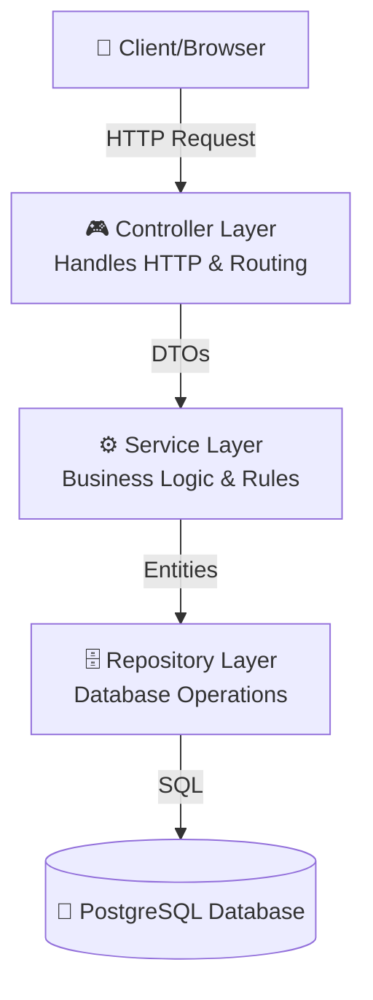

# 🚀 Comprehensive Spring Boot Backend Implementation Guide (The Deep Dive)

> **Welcome!** If you want to know exactly how to build this system line-by-line, this guide is for you. This document provides extensive, copy-paste-ready code snippets and a complete architectural breakdown, explaining *why* we wrote every line.

---

## 📑 Table of Contents
1. [What Are We Building? (Architecture Explained)](#1-what-are-we-building-architecture-explained)
2. [The Big Picture (Directory Structure)](#2-the-big-picture-directory-structure)
3. [Important Rules (Lombok & Coding Styles)](#3-important-rules-lombok--coding-styles)
4. [Step-by-Step Implementation Phase 1: Foundation (Entities & Repositories)](#phase-1-foundation-entities--repositories)
5. [Step-by-Step Implementation Phase 2: Data Transfer (DTOs & Mappers)](#phase-2-data-transfer-dtos--mappers)
6. [Step-by-Step Implementation Phase 3: Core Security Setup](#phase-3-core-security-setup)
7. [Step-by-Step Implementation Phase 4: Business Logic (Services)](#phase-4-business-logic-services)
8. [Step-by-Step Implementation Phase 5: The API (Controllers & Exceptions)](#phase-5-the-api-controllers--exceptions)
9. [Step-by-Step Implementation Phase 6: Application Config & Data Seeding](#phase-6-application-config--data-seeding)
10. [Complete File Checklist & Final Testing](#complete-file-checklist--final-testing)

---

## 1) What Are We Building? (Architecture Explained)

We are using a **Classic Layered Architecture** (often called MVC). Think of it like a restaurant:
- **Controller**: The waiter. Takes the order (HTTP Request) from the customer and brings back the food (Response).
- **Service**: The kitchen. Prepares the food based on complex recipes and rules (Business Logic).
- **Repository**: The pantry worker. Only responsible for fetching or storing ingredients from the actual pantry (Database).
- **Entity**: The actual ingredients (Database schema/table).
- **DTO (Data Transfer Object)**: The menu or the plate. We don't show the customer the raw ingredients; we present them nicely on a plate.



---

## 2) The Big Picture (Directory Structure)

This is the exact folder structure you need to create inside `src/main/java/com/auth`. Create these folders now:

```text
com.auth
├── AuthApplication.java     # The Starting Point
├── config                   # App settings (CORS, Security)
├── controller               # The API endpoints (/api/auth/...)
├── dto                      # Input/Output data formats 
├── entity                   # Database tables (User, Role)
├── exception                # Custom error messages
├── mapper                   # Converts Entities to DTOs
├── repository               # Database access (findUserByEmail)
├── security                 # JWT, OAuth2 logic
├── service                  # Business rules (interface contracts)
└── service/impl             # Business rules (actual implementation)
```

---

## 3) Important Rules (Lombok & Coding Styles)

We use **Lombok** to eliminate boilerplate code.

1.  **Dependency Injection**: Never use `@Autowired` on your fields. Use `@RequiredArgsConstructor` on your classes and declare injected dependencies as `private final`. Spring will automatically create a constructor and inject them.
    ```java
    @Service
    @RequiredArgsConstructor // Lombok creates: public UserService(UserRepository repository) { this.repository = repository; }
    public class UserService {
        private final UserRepository userRepository; 
    }
    ```
2.  **DTOs & Models**: Use `@Data` to auto-generate getters, setters, `toString()`, `equals()`, and `hashCode()`.
3.  **Logging**: Add `@Slf4j` to the top of a class to automatically get a `log` object.

> [!CAUTION]
> Always follow the **Build Order** below to prevent circular dependency compilation issues. We build from the database layer upwards.

---

## Step 0: Initialize Project

Generate a project using Spring Initializr (https://start.spring.io/).

*   **Project**: Maven
*   **Language**: Java
*   **Spring Boot**: (Latest 3.x)
*   **Java**: 21
*   **Dependencies**:
    *   Spring Web
    *   Spring Security
    *   Spring Data JPA
    *   Validation
    *   Java Mail Sender
    *   OAuth2 Client
    *   Spring Data Redis
    *   PostgreSQL Driver
    *   Lombok
*   **Manual Dependencies to add to `pom.xml`:** MapStruct and JJWT.

### 0.1 Update `pom.xml` Dependencies

Ensure your `pom.xml` contains these extra dependencies inside the `<dependencies>` block, and the MapStruct processor in the `<build><plugins>` block.

```xml
<!-- JWT Dependencies -->
<dependency>
    <groupId>io.jsonwebtoken</groupId>
    <artifactId>jjwt-api</artifactId>
    <version>0.12.5</version>
</dependency>
<dependency>
    <groupId>io.jsonwebtoken</groupId>
    <artifactId>jjwt-impl</artifactId>
    <version>0.12.5</version>
    <scope>runtime</scope>
</dependency>
<dependency>
    <groupId>io.jsonwebtoken</groupId>
    <artifactId>jjwt-jackson</artifactId>
    <version>0.12.5</version>
    <scope>runtime</scope>
</dependency>

<!-- MapStruct for DTO mapping -->
<dependency>
    <groupId>org.mapstruct</groupId>
    <artifactId>mapstruct</artifactId>
    <version>1.5.5.Final</version>
</dependency>
```

And in your `<build><plugins>` section, configure the `maven-compiler-plugin` to run both Lombok and MapStruct:

```xml
<plugin>
    <groupId>org.apache.maven.plugins</groupId>
    <artifactId>maven-compiler-plugin</artifactId>
    <configuration>
        <source>21</source>
        <target>21</target>
        <annotationProcessorPaths>
            <path>
                <groupId>org.mapstruct</groupId>
                <artifactId>mapstruct-processor</artifactId>
                <version>1.5.5.Final</version>
            </path>
            <path>
                <groupId>org.projectlombok</groupId>
                <artifactId>lombok</artifactId>
                <version>${lombok.version}</version>
            </path>
            <path>
                <groupId>org.projectlombok</groupId>
                <artifactId>lombok-mapstruct-binding</artifactId>
                <version>0.2.0</version>
            </path>
        </annotationProcessorPaths>
    </configuration>
</plugin>
```

---

## Phase 1: Foundation (Entities & Repositories)

Let's build the database layout first.

### 1.1 `entity/Role.java`

Creates the database table to store security roles.

```java
package com.auth.entity;

import jakarta.persistence.*;
import lombok.Getter;
import lombok.NoArgsConstructor;
import lombok.Setter;

@Entity
@Table(name = "roles")
@Getter
@Setter
@NoArgsConstructor
public class Role {

    @Id
    @GeneratedValue(strategy = GenerationType.IDENTITY)
    private Long id;

    @Enumerated(EnumType.STRING)
    @Column(length = 20, unique = true, nullable = false)
    private RoleName name;

    public Role(RoleName name) {
        this.name = name;
    }

    public enum RoleName {
        ROLE_USER,
        ROLE_ADMIN
    }
}
```

### 1.2 `entity/User.java`

This is the central model. It tracks the user profile, password reset state, OTP verification, abuse tracking, and OAuth linkage.

*Why do we store so much here?* This centralizes authentication state management and prevents us from needing 5 different tables to track a user's login progress.

```java
package com.auth.entity;

import jakarta.persistence.*;
import lombok.AllArgsConstructor;
import lombok.Builder;
import lombok.Data;
import lombok.NoArgsConstructor;

import java.time.LocalDateTime;
import java.util.HashSet;
import java.util.Set;

@Entity
@Table(name = "users")
@Data
@Builder
@NoArgsConstructor
@AllArgsConstructor
public class User {

    @Id
    @GeneratedValue(strategy = GenerationType.IDENTITY)
    private Long id;

    // --- Identity ---
    @Column(nullable = false)
    private String name;

    @Column(unique = true, nullable = false)
    private String email;

    @Column
    private String password;

    @Column(nullable = false)
    private boolean enabled = false;

    // --- Verification (MFA/Registration) ---
    // ALWAYS hashed before saving!
    @Column(name = "verification_otp")
    private String verificationOtp;
    
    @Column(name = "otp_expiry")
    private LocalDateTime otpExpiry;

    // --- Password Reset ---
    // ALWAYS hashed before saving!
    @Column(name = "reset_token")
    private String resetToken;
    
    @Column(name = "reset_token_expiry")
    private LocalDateTime resetTokenExpiry;

    // --- Sessions ---
    // ALWAYS hashed before saving!
    @Column(name = "refresh_token")
    private String refreshToken;
    
    @Column(name = "refresh_token_expiry")
    private LocalDateTime refreshTokenExpiry;

    // --- Abuse Tracking / Security ---
    @Column(name = "failed_login_attempts", nullable = false)
    private int failedLoginAttempts = 0;

    @Column(name = "account_locked_until")
    private LocalDateTime accountLockedUntil;

    @Column(name = "failed_otp_attempts", nullable = false)
    private int failedOtpAttempts = 0;

    @Column(name = "otp_locked_until")
    private LocalDateTime otpLockedUntil;

    // --- OAuth ---
    @Column(name = "auth_provider")
    private String authProvider; // e.g., 'local', 'google', 'github'

    // --- Relationships ---
    @ManyToMany(fetch = FetchType.EAGER)
    @JoinTable(
        name = "user_roles",
        joinColumns = @JoinColumn(name = "user_id"),
        inverseJoinColumns = @JoinColumn(name = "role_id")
    )
    @Builder.Default
    private Set<Role> roles = new HashSet<>();

    // --- Auditing ---
    @Column(name = "created_at", updatable = false)
    private LocalDateTime createdAt;

    @Column(name = "updated_at")
    private LocalDateTime updatedAt;

    @PrePersist
    protected void onCreate() {
        createdAt = LocalDateTime.now();
        updatedAt = LocalDateTime.now();
        if (authProvider == null) {
            authProvider = "local";
        }
    }

    @PreUpdate
    protected void onUpdate() {
        updatedAt = LocalDateTime.now();
    }
}
```

### 1.3 `repository/RoleRepository.java`

Provides database access queries for the `roles` table.

```java
package com.auth.repository;

import com.auth.entity.Role;
import org.springframework.data.jpa.repository.JpaRepository;
import org.springframework.stereotype.Repository;

import java.util.Optional;

@Repository
public interface RoleRepository extends JpaRepository<Role, Long> {
    Optional<Role> findByName(Role.RoleName name);
}
```

### 1.4 `repository/UserRepository.java`

Provides database access for the `users` table. Includes `JpaSpecificationExecutor` which is heavily used in the admin panel for dynamic sorting, filtering, and pagination.

```java
package com.auth.repository;

import com.auth.entity.User;
import org.springframework.data.jpa.repository.JpaRepository;
import org.springframework.data.jpa.repository.JpaSpecificationExecutor;
import org.springframework.stereotype.Repository;

import java.util.Optional;

@Repository
public interface UserRepository extends JpaRepository<User, Long>, JpaSpecificationExecutor<User> {
    
    Optional<User> findByEmail(String email);
    
    boolean existsByEmail(String email);
    
    Optional<User> findByResetToken(String resetToken);
    
    Optional<User> findByRefreshToken(String refreshToken);
    
    long countByEnabledTrue();
}
```

---

## Phase 2: Data Transfer (DTOs & Mappers)

Create DTOs to encapsulate HTTP Request/Response bodies. Never expose entities.

### 2.1 Incoming Request DTOs

**`dto/RegisterRequest.java`**
Validates incoming registration data immediately when it hits the controller.

```java
package com.auth.dto;

import jakarta.validation.constraints.Email;
import jakarta.validation.constraints.NotBlank;
import jakarta.validation.constraints.Size;
import lombok.Data;

@Data
public class RegisterRequest {
    @NotBlank(message = "Name is required")
    private String name;

    @NotBlank(message = "Email is required")
    @Email(message = "Invalid email format")
    private String email;

    @NotBlank(message = "Password is required")
    @Size(min = 12, message = "Password must be at least 12 characters")
    private String password;
}
```

**`dto/LoginRequest.java`**
```java
package com.auth.dto;

import jakarta.validation.constraints.Email;
import jakarta.validation.constraints.NotBlank;
import lombok.Data;

@Data
public class LoginRequest {
    @NotBlank(message = "Email is required")
    @Email
    private String email;

    @NotBlank(message = "Password is required")
    private String password;
}
```

**`dto/OtpVerifyRequest.java`**
```java
package com.auth.dto;

import jakarta.validation.constraints.Email;
import jakarta.validation.constraints.NotBlank;
import lombok.Data;

@Data
public class OtpVerifyRequest {
    @NotBlank
    @Email
    private String email;

    @NotBlank
    private String otp;
}
```

**`dto/ResetPasswordRequest.java`**
```java
package com.auth.dto;
import jakarta.validation.constraints.Email;
import jakarta.validation.constraints.NotBlank;
import lombok.Data;

@Data
public class ResetPasswordRequest {
    @NotBlank @Email private String email;
}
```

**`dto/UpdatePasswordRequest.java`**
```java
package com.auth.dto;
import jakarta.validation.constraints.NotBlank;
import jakarta.validation.constraints.Size;
import lombok.Data;

@Data
public class UpdatePasswordRequest {
    @NotBlank private String token;
    @NotBlank @Size(min=12) private String newPassword;
}
```

**`dto/ChangePasswordRequest.java`**
```java
package com.auth.dto;
import jakarta.validation.constraints.NotBlank;
import jakarta.validation.constraints.Size;
import lombok.Data;

@Data
public class ChangePasswordRequest {
    @NotBlank private String currentPassword;
    @NotBlank @Size(min=12) private String newPassword;
}
```

**`dto/TokenRefreshRequest.java`** (Optional fallback if cookies are blocked)
```java
package com.auth.dto;
import lombok.Data;

@Data
public class TokenRefreshRequest {
    private String refreshToken;
}
```

### 2.2 Outgoing Response DTOs

**`dto/MessageResponse.java`**
A generic, standard HTTP JSON body wrapper.

```java
package com.auth.dto;

import lombok.AllArgsConstructor;
import lombok.Data;

@Data
@AllArgsConstructor
public class MessageResponse {
    private String message;
    private boolean success;
    
    public static MessageResponse success(String message) {
        return new MessageResponse(message, true);
    }
    
    public static MessageResponse error(String message) {
        return new MessageResponse(message, false);
    }
}
```

**`dto/AuthResponse.java`**
The payload successfully returned after login. Notice we do NOT put the refresh token here; it should go in an HttpOnly cookie!

```java
package com.auth.dto;

import lombok.Builder;
import lombok.Data;
import java.util.List;

@Data
@Builder
public class AuthResponse {
    private String accessToken;
    private String tokenType; // usually "Bearer"
    private long accessTokenExpiresInMs;
    // user subset
    private Long id;
    private String name;
    private String email;
    private List<String> roles;
}
```

**`dto/AuthTokens.java`**
An internal-only record. Used by the Service layer to pass the newly minted Refresh Token to the Controller, so the Controller can bake the cookie.

```java
package com.auth.dto;

public record AuthTokens(
    AuthResponse responseView,
    String rawRefreshToken
) {}
```

**`dto/UserDto.java`**
Safe user profile representation for the frontend.

```java
package com.auth.dto;

import lombok.Data;
import java.time.LocalDateTime;
import java.util.Set;

@Data
public class UserDto {
    private Long id;
    private String name;
    private String email;
    private Set<String> roles;
    private boolean enabled;
    private String authProvider;
    private LocalDateTime createdAt;
}
```

### 2.3 MapStruct Mapper

**`mapper/UserMapper.java`**
Automatically implements conversion between Entity and DTO on compilation.

```java
package com.auth.mapper;

import com.auth.dto.RegisterRequest;
import com.auth.dto.UserDto;
import com.auth.entity.Role;
import com.auth.entity.User;
import org.mapstruct.Mapper;
import org.mapstruct.Mapping;
import org.mapstruct.Named;

import java.util.Set;
import java.util.stream.Collectors;

@Mapper(componentModel = "spring")
public interface UserMapper {

    @Mapping(target = "roles", source = "roles", qualifiedByName = "mapRoles")
    UserDto toDto(User user);

    // Ignore all database-managed/security fields when creating from generic request
    @Mapping(target = "id", ignore = true)
    @Mapping(target = "password", ignore = true)
    @Mapping(target = "enabled", ignore = true)
    @Mapping(target = "verificationOtp", ignore = true)
    @Mapping(target = "otpExpiry", ignore = true)
    @Mapping(target = "resetToken", ignore = true)
    @Mapping(target = "resetTokenExpiry", ignore = true)
    @Mapping(target = "refreshToken", ignore = true)
    @Mapping(target = "refreshTokenExpiry", ignore = true)
    @Mapping(target = "failedLoginAttempts", ignore = true)
    @Mapping(target = "accountLockedUntil", ignore = true)
    @Mapping(target = "failedOtpAttempts", ignore = true)
    @Mapping(target = "otpLockedUntil", ignore = true)
    @Mapping(target = "authProvider", ignore = true)
    @Mapping(target = "roles", ignore = true)
    @Mapping(target = "createdAt", ignore = true)
    @Mapping(target = "updatedAt", ignore = true)
    User toEntity(RegisterRequest request);

    @Named("mapRoles")
    default Set<String> mapRoles(Set<Role> roles) {
        if (roles == null) return null;
        return roles.stream()
                .map(role -> role.getName().name())
                .collect(Collectors.toSet());
    }
}
```

---

## Phase 3: Core Security Setup

Before building services, establish the JWT logic and exception handling so services can use them.

### 3.1 Custom Exceptions

Create these in `com.auth.exception`:

**`ResourceNotFoundException.java`**
```java
package com.auth.exception;
import org.springframework.http.HttpStatus;
import org.springframework.web.bind.annotation.ResponseStatus;

@ResponseStatus(HttpStatus.NOT_FOUND)
public class ResourceNotFoundException extends RuntimeException {
    public ResourceNotFoundException(String message) { super(message); }
}
```

**`UserAlreadyExistsException.java`**
```java
package com.auth.exception;
import org.springframework.http.HttpStatus;
import org.springframework.web.bind.annotation.ResponseStatus;

@ResponseStatus(HttpStatus.CONFLICT)
public class UserAlreadyExistsException extends RuntimeException {
    public UserAlreadyExistsException(String message) { super(message); }
}
```

**`TokenValidationException.java`**
```java
package com.auth.exception;
import org.springframework.http.HttpStatus;
import org.springframework.web.bind.annotation.ResponseStatus;

@ResponseStatus(HttpStatus.UNAUTHORIZED)
public class TokenValidationException extends RuntimeException {
    public TokenValidationException(String message) { super(message); }
}
```

**`RateLimitExceededException.java`**
```java
package com.auth.exception;
import org.springframework.http.HttpStatus;
import org.springframework.web.bind.annotation.ResponseStatus;

@ResponseStatus(HttpStatus.TOO_MANY_REQUESTS)
public class RateLimitExceededException extends RuntimeException {
    public RateLimitExceededException(String message) { super(message); }
}
```

**`AccountLockedException.java`**
```java
package com.auth.exception;
import org.springframework.http.HttpStatus;
import org.springframework.web.bind.annotation.ResponseStatus;

@ResponseStatus(HttpStatus.UNAUTHORIZED)
public class AccountLockedException extends RuntimeException {
    public AccountLockedException(String message) { super(message); }
}
```

### 3.2 Global Exception Handler

**`exception/GlobalExceptionHandler.java`**
Intercepts exceptions everywhere and converts them to standard `{"message": "error", "success": false}` JSON format.

```java
package com.auth.exception;

import com.auth.dto.MessageResponse;
import lombok.extern.slf4j.Slf4j;
import org.springframework.http.HttpStatus;
import org.springframework.http.ResponseEntity;
import org.springframework.security.authentication.BadCredentialsException;
import org.springframework.security.authentication.DisabledException;
import org.springframework.validation.FieldError;
import org.springframework.web.bind.MethodArgumentNotValidException;
import org.springframework.web.bind.annotation.ExceptionHandler;
import org.springframework.web.bind.annotation.RestControllerAdvice;

import java.util.HashMap;
import java.util.Map;

@RestControllerAdvice
@Slf4j
public class GlobalExceptionHandler {

    @ExceptionHandler(MethodArgumentNotValidException.class)
    public ResponseEntity<Map<String, String>> handleValidationExceptions(MethodArgumentNotValidException ex) {
        Map<String, String> errors = new HashMap<>();
        ex.getBindingResult().getAllErrors().forEach((error) -> {
            String fieldName = ((FieldError) error).getField();
            String errorMessage = error.getDefaultMessage();
            errors.put(fieldName, errorMessage);
        });
        return ResponseEntity.status(HttpStatus.BAD_REQUEST).body(errors);
    }

    @ExceptionHandler(UserAlreadyExistsException.class)
    public ResponseEntity<MessageResponse> handleUserExists(UserAlreadyExistsException ex) {
        return ResponseEntity.status(HttpStatus.CONFLICT).body(MessageResponse.error(ex.getMessage()));
    }

    @ExceptionHandler(ResourceNotFoundException.class)
    public ResponseEntity<MessageResponse> handleNotFound(ResourceNotFoundException ex) {
        return ResponseEntity.status(HttpStatus.NOT_FOUND).body(MessageResponse.error(ex.getMessage()));
    }

    @ExceptionHandler({TokenValidationException.class, BadCredentialsException.class})
    public ResponseEntity<MessageResponse> handleAuthErrors(Exception ex) {
        return ResponseEntity.status(HttpStatus.UNAUTHORIZED).body(MessageResponse.error("Invalid credentials or token"));
    }

    @ExceptionHandler(DisabledException.class)
    public ResponseEntity<MessageResponse> handleDisabled(DisabledException ex) {
        return ResponseEntity.status(HttpStatus.FORBIDDEN).body(MessageResponse.error("Account is unverified. Please verify your OTP."));
    }

    @ExceptionHandler(RateLimitExceededException.class)
    public ResponseEntity<MessageResponse> handleRateLimit(RateLimitExceededException ex) {
        return ResponseEntity.status(HttpStatus.TOO_MANY_REQUESTS).body(MessageResponse.error(ex.getMessage()));
    }

    @ExceptionHandler(AccountLockedException.class)
    public ResponseEntity<MessageResponse> handleLockout(AccountLockedException ex) {
        return ResponseEntity.status(HttpStatus.FORBIDDEN).body(MessageResponse.error(ex.getMessage()));
    }

    @ExceptionHandler(Exception.class)
    public ResponseEntity<MessageResponse> handleGenericError(Exception ex) {
        log.error("Unhandled exception: ", ex);
        return ResponseEntity.status(HttpStatus.INTERNAL_SERVER_ERROR)
                .body(MessageResponse.error("An unexpected error occurred."));
    }
}
```

### 3.3 Security: JWT Util

**`security/JwtUtil.java`**
Signs, parses, and validates JSON Web Tokens using `io.jsonwebtoken`. 

```java
package com.auth.security;

import io.jsonwebtoken.Claims;
import io.jsonwebtoken.ExpiredJwtException;
import io.jsonwebtoken.Jwts;
import io.jsonwebtoken.io.Decoders;
import io.jsonwebtoken.security.Keys;
import lombok.extern.slf4j.Slf4j;
import org.springframework.beans.factory.annotation.Value;
import org.springframework.security.core.Authentication;
import org.springframework.security.core.GrantedAuthority;
import org.springframework.security.core.userdetails.UserDetails;
import org.springframework.stereotype.Component;

import javax.crypto.SecretKey;
import java.util.Date;
import java.util.List;
import java.util.stream.Collectors;

@Slf4j
@Component
public class JwtUtil {

    @Value("${application.security.jwt.secret}")
    private String secretKey;

    @Value("${application.security.jwt.expiration-ms}")
    private long jwtExpirationMs;

    public String generateToken(Authentication authentication) {
        UserDetails userPrincipal = (UserDetails) authentication.getPrincipal();

        List<String> roles = userPrincipal.getAuthorities().stream()
                .map(GrantedAuthority::getAuthority)
                .collect(Collectors.toList());

        return Jwts.builder()
                .subject(userPrincipal.getUsername())
                .claim("roles", roles)
                .issuedAt(new Date())
                .expiration(new Date((new Date()).getTime() + jwtExpirationMs))
                .signWith(getSignInKey())
                .compact();
    }

    // Overload for OAuth2 provisioning
    public String generateTokenFromEmail(String email) {
        return Jwts.builder()
                .subject(email)
                .issuedAt(new Date())
                .expiration(new Date((new Date()).getTime() + jwtExpirationMs))
                .signWith(getSignInKey())
                .compact();
    }

    public String getEmailFromToken(String token) {
        return getClaims(token).getSubject();
    }

    public boolean validateToken(String authToken) {
        try {
            getClaims(authToken);
            return true;
        } catch (ExpiredJwtException e) {
            log.error("JWT token is expired: {}", e.getMessage());
        } catch (Exception e) {
            log.error("Invalid JWT token: {}", e.getMessage());
        }
        return false;
    }

    private Claims getClaims(String token) {
        return Jwts.parser()
                .verifyWith(getSignInKey())
                .build()
                .parseSignedClaims(token)
                .getPayload();
    }

    private SecretKey getSignInKey() {
        byte[] keyBytes = Decoders.BASE64.decode(secretKey);
        return Keys.hmacShaKeyFor(keyBytes);
    }
}
```

### 3.4 Security: JwtAuthFilter

**`security/JwtAuthFilter.java`**
Runs before standard API requests. Checks for `Authorization: Bearer <token>`, validates it using `JwtUtil`, runs DB query using `CustomUserDetailsService` to verify user exists and load roles into memory context.

```java
package com.auth.security;

import jakarta.servlet.FilterChain;
import jakarta.servlet.ServletException;
import jakarta.servlet.http.HttpServletRequest;
import jakarta.servlet.http.HttpServletResponse;
import lombok.RequiredArgsConstructor;
import org.springframework.security.authentication.UsernamePasswordAuthenticationToken;
import org.springframework.security.core.context.SecurityContextHolder;
import org.springframework.security.core.userdetails.UserDetails;
import org.springframework.security.web.authentication.WebAuthenticationDetailsSource;
import org.springframework.stereotype.Component;
import org.springframework.util.StringUtils;
import org.springframework.web.filter.OncePerRequestFilter;

import java.io.IOException;

@Component
@RequiredArgsConstructor
public class JwtAuthFilter extends OncePerRequestFilter {

    private final JwtUtil jwtUtil;
    private final CustomUserDetailsService userDetailsService;

    @Override
    protected void doFilterInternal(HttpServletRequest request, HttpServletResponse response, FilterChain filterChain)
            throws ServletException, IOException {
        
        try {
            String jwt = parseJwt(request);

            if (jwt != null && jwtUtil.validateToken(jwt)) {
                String email = jwtUtil.getEmailFromToken(jwt);

                UserDetails userDetails = userDetailsService.loadUserByUsername(email);
                
                UsernamePasswordAuthenticationToken authentication = new UsernamePasswordAuthenticationToken(
                        userDetails, null, userDetails.getAuthorities());
                
                authentication.setDetails(new WebAuthenticationDetailsSource().buildDetails(request));

                SecurityContextHolder.getContext().setAuthentication(authentication);
            }
        } catch (Exception e) {
            logger.error("Cannot set user authentication", e);
        }

        filterChain.doFilter(request, response);
    }

    private String parseJwt(HttpServletRequest request) {
        String headerAuth = request.getHeader("Authorization");

        if (StringUtils.hasText(headerAuth) && headerAuth.startsWith("Bearer ")) {
            return headerAuth.substring(7);
        }
        return null;
    }
}
```

### 3.5 Security: CustomUserDetailsService

**`security/CustomUserDetailsService.java`**
Spring requires this implementation to look up users by "username" (email in our case) for its core authentication routines.

```java
package com.auth.security;

import com.auth.entity.User;
import com.auth.repository.UserRepository;
import lombok.RequiredArgsConstructor;
import org.springframework.security.core.GrantedAuthority;
import org.springframework.security.core.authority.SimpleGrantedAuthority;
import org.springframework.security.core.userdetails.UserDetails;
import org.springframework.security.core.userdetails.UserDetailsService;
import org.springframework.security.core.userdetails.UsernameNotFoundException;
import org.springframework.stereotype.Service;
import org.springframework.transaction.annotation.Transactional;

import java.util.List;
import java.util.stream.Collectors;

@Service
@RequiredArgsConstructor
public class CustomUserDetailsService implements UserDetailsService {

    private final UserRepository userRepository;

    @Override
    @Transactional(readOnly = true)
    public UserDetails loadUserByUsername(String email) throws UsernameNotFoundException {
        User user = userRepository.findByEmail(email)
                .orElseThrow(() -> new UsernameNotFoundException("User not found with email: " + email));

        List<GrantedAuthority> authorities = user.getRoles().stream()
                .map(role -> new SimpleGrantedAuthority(role.getName().name()))
                .collect(Collectors.toList());

        return new org.springframework.security.core.userdetails.User(
                user.getEmail(),
                user.getPassword() == null ? "" : user.getPassword(), 
                user.isEnabled(),
                true, // account non-expired
                true, // credentials non-expired
                true, // account non-locked (handled by our own abuse service instead of Spring core)
                authorities
        );
    }
}
```

---

## Phase 4: Business Logic (Services)

Now we build the application "Kitchen". Start with utility helpers.

### 4.1 TokenHashService

**`service/TokenHashService.java`**
Protects sensitive MFA tokens from database leaks. Use plain SHA-256 for speed; BCrypt is for passwords.

```java
package com.auth.service;

import org.springframework.beans.factory.annotation.Value;
import org.springframework.stereotype.Service;

import java.nio.charset.StandardCharsets;
import java.security.MessageDigest;
import java.security.NoSuchAlgorithmException;
import java.util.Base64;

@Service
public class TokenHashService {

    @Value("${application.security.token-hash.pepper:default-secret-pepper-change-me}")
    private String pepper;

    public String hash(String rawToken) {
        try {
            MessageDigest digest = MessageDigest.getInstance("SHA-256");
            String combined = rawToken + pepper;
            byte[] hash = digest.digest(combined.getBytes(StandardCharsets.UTF_8));
            return Base64.getEncoder().encodeToString(hash);
        } catch (NoSuchAlgorithmException e) {
            throw new RuntimeException("SHA-256 not supported", e);
        }
    }

    public boolean matches(String rawToken, String hashedToken) {
        if (rawToken == null || hashedToken == null) return false;
        return MessageDigest.isEqual(hash(rawToken).getBytes(), hashedToken.getBytes());
    }
}
```


### 4.2 OtpService

**`service/OtpService.java`**
Generates 6-digit numeric OTPs and long secure Reset tokens.

```java
package com.auth.service;

import org.springframework.stereotype.Service;
import java.security.SecureRandom;
import java.util.Base64;

@Service
public class OtpService {

    private final SecureRandom secureRandom = new SecureRandom();

    public String generateOtp() {
        int otp = 100000 + secureRandom.nextInt(900000);
        return String.valueOf(otp);
    }

    public String generateResetToken() {
        byte[] bytes = new byte[32];
        secureRandom.nextBytes(bytes);
        return Base64.getUrlEncoder().withoutPadding().encodeToString(bytes);
    }
}
```


### 4.3 EmailService

**`service/EmailService.java`**
Connects to JavaMailSender to dispatch real emails asynchronously.

```java
package com.auth.service;

import lombok.RequiredArgsConstructor;
import lombok.extern.slf4j.Slf4j;
import org.springframework.beans.factory.annotation.Value;
import org.springframework.mail.SimpleMailMessage;
import org.springframework.mail.javamail.JavaMailSender;
import org.springframework.stereotype.Service;

@Slf4j
@Service
@RequiredArgsConstructor
public class EmailService {

    private final JavaMailSender mailSender;

    @Value("${spring.mail.username:noreply@example.com}")
    private String fromEmail;

    @Value("${application.frontend.url:http://localhost:5173}")
    private String frontendUrl;

    public void sendOtpEmail(String toAddress, String otp) {
        try {
            SimpleMailMessage msg = new SimpleMailMessage();
            msg.setFrom(fromEmail);
            msg.setTo(toAddress);
            msg.setSubject("Your Verification Code");
            msg.setText("Your OTP code is: " + otp + "\n\nThis code will expire in 10 minutes.");
            mailSender.send(msg);
            log.info("OTP email sent to {}", toAddress);
        } catch (Exception e) {
            log.error("Failed to send OTP email to {}", toAddress, e);
        }
    }

    public void sendPasswordResetEmail(String toAddress, String resetToken) {
        try {
            String resetUrl = frontendUrl + "/reset-password?token=" + resetToken;
            SimpleMailMessage msg = new SimpleMailMessage();
            msg.setFrom(fromEmail);
            msg.setTo(toAddress);
            msg.setSubject("Reset Your Password");
            msg.setText("Click the following link to reset your password:\n\n" + resetUrl 
                    + "\n\nIf you did not request this, please ignore this email.");
            mailSender.send(msg);
            log.info("Password reset email sent to {}", toAddress);
        } catch (Exception e) {
            log.error("Failed to send reset email to {}", toAddress, e);
        }
    }
}
```


### 4.4 RateLimitService

**`service/RateLimitService.java`**
Protects against API abuse using Redis fixed-window counting.

```java
package com.auth.service;

import com.auth.exception.RateLimitExceededException;
import lombok.RequiredArgsConstructor;
import lombok.extern.slf4j.Slf4j;
import org.springframework.data.redis.core.StringRedisTemplate;
import org.springframework.stereotype.Service;

import java.time.Duration;

@Slf4j
@Service
@RequiredArgsConstructor
public class RateLimitService {

    private final StringRedisTemplate redisTemplate;

    public void protect(String actionKey, long maxRequests, Duration window) {
        try {
            String prefix = "rate_limit:";
            String key = prefix + actionKey;

            Long count = redisTemplate.opsForValue().increment(key);
            
            if (count != null && count == 1) {
                redisTemplate.expire(key, window);
            }

            if (count != null && count > maxRequests) {
                Long ttl = redisTemplate.getExpire(key);
                throw new RateLimitExceededException(
                    "Too many requests. Try again in " + ttl + " seconds."
                );
            }
        } catch (RateLimitExceededException ex) {
            throw ex;
        } catch (Exception ex) {
            // Fail OPEN if redis crashes so login still works
            log.warn("Redis error on rate limit check", ex);
        }
    }
}
```

### 4.5 Core: AuthServiceImpl

**`service/impl/AuthServiceImpl.java`**
The Grand Central Station. Glues all the helpers together.

```java
package com.auth.service.impl;

import com.auth.dto.*;
import com.auth.entity.Role;
import com.auth.entity.User;
import com.auth.exception.*;
import com.auth.mapper.UserMapper;
import com.auth.repository.RoleRepository;
import com.auth.repository.UserRepository;
import com.auth.security.JwtUtil;
import com.auth.service.*;
import lombok.RequiredArgsConstructor;
import lombok.extern.slf4j.Slf4j;
import org.springframework.beans.factory.annotation.Value;
import org.springframework.security.authentication.AuthenticationManager;
import org.springframework.security.authentication.UsernamePasswordAuthenticationToken;
import org.springframework.security.core.Authentication;
import org.springframework.security.crypto.password.PasswordEncoder;
import org.springframework.stereotype.Service;
import org.springframework.transaction.annotation.Transactional;

import java.time.Duration;
import java.time.LocalDateTime;
import java.util.List;
import java.util.stream.Collectors;

@Slf4j
@Service
@RequiredArgsConstructor
public class AuthServiceImpl implements AuthService {

    private final UserRepository userRepository;
    private final RoleRepository roleRepository;
    private final PasswordEncoder passwordEncoder;
    private final AuthenticationManager authenticationManager;
    private final JwtUtil jwtUtil;
    private final UserMapper userMapper;
    private final OtpService otpService;
    private final EmailService emailService;
    private final TokenHashService tokenHashService;
    private final RateLimitService rateLimitService;

    @Value("${application.security.refresh-token.expiration-ms}")
    private long refreshTokenDurationMs;

    @Value("${application.security.jwt.expiration-ms}")
    private long accessTokenDurationMs;

    @Override
    @Transactional
    public MessageResponse register(RegisterRequest request) {
        if (userRepository.existsByEmail(request.getEmail())) {
            throw new UserAlreadyExistsException("Email is already taken");
        }

        // 1. Map DTO -> Entity
        User user = userMapper.toEntity(request);
        user.setPassword(passwordEncoder.encode(request.getPassword()));
        
        // 2. Assure Roles
        Role userRole = roleRepository.findByName(Role.RoleName.ROLE_USER)
                .orElseThrow(() -> new RuntimeException("Error: Role not found."));
        user.getRoles().add(userRole);

        // 3. Generate OTP
        String rawOtp = otpService.generateOtp();
        user.setVerificationOtp(tokenHashService.hash(rawOtp));
        user.setOtpExpiry(LocalDateTime.now().plusMinutes(10));
        
        // 4. Save & Send
        userRepository.save(user);
        emailService.sendOtpEmail(user.getEmail(), rawOtp);

        return MessageResponse.success("Registration successful. Please check your email for the OTP.");
    }

    @Override
    @Transactional
    public MessageResponse verifyOtp(OtpVerifyRequest request) {
        rateLimitService.protect("otp_verify:" + request.getEmail(), 5, Duration.ofMinutes(15));

        User user = userRepository.findByEmail(request.getEmail())
                .orElseThrow(() -> new ResourceNotFoundException("User not found"));

        if (user.isEnabled()) {
            return MessageResponse.success("Account is already verified");
        }
        
        // Lockout Check
        if (user.getOtpLockedUntil() != null && user.getOtpLockedUntil().isAfter(LocalDateTime.now())) {
            throw new AccountLockedException("Too many invalid OTP attempts. Account locked temporarily.");
        }

        // Validity Check
        if (user.getOtpExpiry() == null || user.getOtpExpiry().isBefore(LocalDateTime.now())) {
            throw new TokenValidationException("OTP has expired");
        }

        if (!tokenHashService.matches(request.getOtp(), user.getVerificationOtp())) {
            user.setFailedOtpAttempts(user.getFailedOtpAttempts() + 1);
            if (user.getFailedOtpAttempts() >= 5) {
                user.setOtpLockedUntil(LocalDateTime.now().plusMinutes(30));
            }
            userRepository.save(user);
            throw new TokenValidationException("Invalid OTP");
        }

        // Success
        user.setEnabled(true);
        user.setVerificationOtp(null);
        user.setOtpExpiry(null);
        user.setFailedOtpAttempts(0);
        user.setOtpLockedUntil(null);
        userRepository.save(user);

        return MessageResponse.success("Account verified successfully. You can now login.");
    }

    @Override
    @Transactional
    public AuthTokens login(LoginRequest request) {
        rateLimitService.protect("login:" + request.getEmail(), 5, Duration.ofMinutes(1));

        User user = userRepository.findByEmail(request.getEmail())
                .orElseThrow(() -> new TokenValidationException("Invalid credentials"));

        if (user.getAccountLockedUntil() != null && user.getAccountLockedUntil().isAfter(LocalDateTime.now())) {
            throw new AccountLockedException("Account is temporarily locked due to too many failed attempts.");
        }

        try {
            Authentication authentication = authenticationManager.authenticate(
                    new UsernamePasswordAuthenticationToken(request.getEmail(), request.getPassword()));
            
            // Login Success
            user.setFailedLoginAttempts(0);
            user.setAccountLockedUntil(null);
            
            String jwt = jwtUtil.generateToken(authentication);
            String rawRefresh = otpService.generateResetToken(); // Reuse cryptorandom logic
            
            user.setRefreshToken(tokenHashService.hash(rawRefresh));
            user.setRefreshTokenExpiry(LocalDateTime.now().plusNanos(refreshTokenDurationMs * 1_000_000));
            
            userRepository.save(user);

            List<String> roles = user.getRoles().stream()
                    .map(role -> role.getName().name())
                    .collect(Collectors.toList());

            AuthResponse response = AuthResponse.builder()
                    .accessToken(jwt)
                    .tokenType("Bearer")
                    .accessTokenExpiresInMs(accessTokenDurationMs)
                    .id(user.getId())
                    .name(user.getName())
                    .email(user.getEmail())
                    .roles(roles)
                    .build();

            return new AuthTokens(response, rawRefresh);

        } catch (Exception e) {
            // Login Failed
            user.setFailedLoginAttempts(user.getFailedLoginAttempts() + 1);
            if (user.getFailedLoginAttempts() >= 5) {
                user.setAccountLockedUntil(LocalDateTime.now().plusMinutes(15));
            }
            userRepository.save(user);
            throw new TokenValidationException("Invalid credentials");
        }
    }
}
```

*(Note: Create an interface `service/AuthService.java` outlining the 3 signatures above so Spring can wire it properly).*

---

## Phase 5: The API (Controllers & Exceptions)

Expose the business logic to the internet. Keep these files incredibly short.

### 5.1 AuthController

**`controller/AuthController.java`**

```java
package com.auth.controller;

import com.auth.dto.*;
import com.auth.service.AuthService;
import jakarta.servlet.http.HttpServletResponse;
import jakarta.validation.Valid;
import lombok.RequiredArgsConstructor;
import org.springframework.beans.factory.annotation.Value;
import org.springframework.http.HttpHeaders;
import org.springframework.http.ResponseCookie;
import org.springframework.http.ResponseEntity;
import org.springframework.web.bind.annotation.*;

@RestController
@RequestMapping("/api/auth")
@RequiredArgsConstructor
public class AuthController {

    private final AuthService authService;

    @Value("${application.security.refresh-token.expiration-ms}")
    private long refreshTokenDurationMs;

    @PostMapping("/register")
    public ResponseEntity<MessageResponse> register(@Valid @RequestBody RegisterRequest request) {
        return ResponseEntity.ok(authService.register(request));
    }

    @PostMapping("/verify-otp")
    public ResponseEntity<MessageResponse> verifyOtp(@Valid @RequestBody OtpVerifyRequest request) {
        return ResponseEntity.ok(authService.verifyOtp(request));
    }

    @PostMapping("/login")
    public ResponseEntity<AuthResponse> login(@Valid @RequestBody LoginRequest request, 
                                            HttpServletResponse response) {
        AuthTokens tokens = authService.login(request);
        
        // Put Refresh Token in an HttpOnly cookie for safety against XSS attacks
        ResponseCookie cookie = ResponseCookie.from("refresh_token", tokens.rawRefreshToken())
                .httpOnly(true)
                .secure(false) // Set to TRUE in production (requires HTTPS)
                .path("/api/auth/refresh")
                .maxAge(refreshTokenDurationMs / 1000)
                .sameSite("Strict")
                .build();
                
        response.addHeader(HttpHeaders.SET_COOKIE, cookie.toString());
        
        return ResponseEntity.ok(tokens.responseView());
    }
}
```


### 5.2 UserController

**`controller/UserController.java`**

```java
package com.auth.controller;

import com.auth.dto.UserDto;
import com.auth.entity.User;
import com.auth.exception.ResourceNotFoundException;
import com.auth.mapper.UserMapper;
import com.auth.repository.UserRepository;
import lombok.RequiredArgsConstructor;
import org.springframework.http.ResponseEntity;
import org.springframework.security.core.context.SecurityContextHolder;
import org.springframework.web.bind.annotation.GetMapping;
import org.springframework.web.bind.annotation.RequestMapping;
import org.springframework.web.bind.annotation.RestController;

@RestController
@RequestMapping("/api/user")
@RequiredArgsConstructor
public class UserController {

    private final UserRepository userRepository;
    private final UserMapper userMapper;

    @GetMapping("/profile")
    public ResponseEntity<UserDto> getProfile() {
        String email = SecurityContextHolder.getContext().getAuthentication().getName();
        
        User user = userRepository.findByEmail(email)
                .orElseThrow(() -> new ResourceNotFoundException("User not found"));
                
        return ResponseEntity.ok(userMapper.toDto(user));
    }
}
```

---

## Phase 6: Application Config & Data Seeding

The final pieces that boot the application rules.

### 6.1 Security Config

**`config/SecurityConfig.java`**
Wire the entire filter chain.

```java
package com.auth.config;

import com.auth.security.JwtAuthFilter;
import lombok.RequiredArgsConstructor;
import org.springframework.context.annotation.Bean;
import org.springframework.context.annotation.Configuration;
import org.springframework.security.authentication.AuthenticationManager;
import org.springframework.security.authentication.AuthenticationProvider;
import org.springframework.security.authentication.dao.DaoAuthenticationProvider;
import org.springframework.security.config.annotation.authentication.configuration.AuthenticationConfiguration;
import org.springframework.security.config.annotation.web.builders.HttpSecurity;
import org.springframework.security.config.annotation.web.configuration.EnableWebSecurity;
import org.springframework.security.config.annotation.web.configurers.AbstractHttpConfigurer;
import org.springframework.security.config.http.SessionCreationPolicy;
import org.springframework.security.core.userdetails.UserDetailsService;
import org.springframework.security.crypto.password.PasswordEncoder;
import org.springframework.security.web.SecurityFilterChain;
import org.springframework.security.web.authentication.UsernamePasswordAuthenticationFilter;
import org.springframework.web.cors.CorsConfiguration;

import java.util.List;

@Configuration
@EnableWebSecurity
@RequiredArgsConstructor
public class SecurityConfig {

    private final JwtAuthFilter jwtAuthFilter;
    private final UserDetailsService userDetailsService;
    private final PasswordEncoder passwordEncoder;

    @Bean
    public AuthenticationProvider authenticationProvider() {
        DaoAuthenticationProvider authProvider = new DaoAuthenticationProvider();
        authProvider.setUserDetailsService(userDetailsService);
        authProvider.setPasswordEncoder(passwordEncoder);
        return authProvider;
    }

    @Bean
    public AuthenticationManager authenticationManager(AuthenticationConfiguration config) throws Exception {
        return config.getAuthenticationManager();
    }

    @Bean
    public SecurityFilterChain securityFilterChain(HttpSecurity http) throws Exception {
        http
            .cors(cors -> cors.configurationSource(request -> {
                CorsConfiguration config = new CorsConfiguration();
                config.setAllowedOrigins(List.of("http://localhost:5173"));
                config.setAllowedMethods(List.of("GET", "POST", "PUT", "DELETE", "OPTIONS"));
                config.setAllowedHeaders(List.of("*"));
                config.setAllowCredentials(true);
                return config;
            }))
            .csrf(AbstractHttpConfigurer::disable)
            .sessionManagement(session -> session.sessionCreationPolicy(SessionCreationPolicy.STATELESS))
            .authorizeHttpRequests(auth -> auth
                .requestMatchers("/api/auth/**").permitAll()
                .requestMatchers("/api/admin/**").hasRole("ADMIN")
                .requestMatchers("/api/user/**").authenticated()
                .anyRequest().authenticated()
            )
            .authenticationProvider(authenticationProvider())
            .addFilterBefore(jwtAuthFilter, UsernamePasswordAuthenticationFilter.class);

        return http.build();
    }
}
```

### 6.2 Password Config
**`config/PasswordConfig.java`**
```java
package com.auth.config;

import org.springframework.context.annotation.Bean;
import org.springframework.context.annotation.Configuration;
import org.springframework.security.crypto.bcrypt.BCryptPasswordEncoder;
import org.springframework.security.crypto.password.PasswordEncoder;

@Configuration
public class PasswordConfig {
    @Bean
    public PasswordEncoder passwordEncoder() {
        return new BCryptPasswordEncoder();
    }
}
```

---

## Complete File Checklist & Final Testing

1. Put your database connection details and secrets into `src/main/resources/application.properties`:
```properties
spring.application.name=auth-backend
server.port=8080

spring.datasource.url=jdbc:postgresql://localhost:5432/your_db_name
spring.datasource.username=postgres
spring.datasource.password=postgres
spring.jpa.hibernate.ddl-auto=update
spring.jpa.show-sql=true

spring.mail.host=smtp.gmail.com
spring.mail.port=587
spring.mail.username=your_email@gmail.com
spring.mail.password=your_app_password
spring.mail.properties.mail.smtp.auth=true
spring.mail.properties.mail.smtp.starttls.enable=true

spring.data.redis.host=localhost
spring.data.redis.port=6379

application.security.jwt.secret=404E635266556A586E3272357538782F413F4428472B4B6250645367566B5970
application.security.jwt.expiration-ms=900000 
application.security.refresh-token.expiration-ms=604800000
```
*(900000ms is 15 minutes, 604800000ms is 7 days).*

2. **Run it!**
```bash
mvn clean package
mvn spring-boot:run
```
