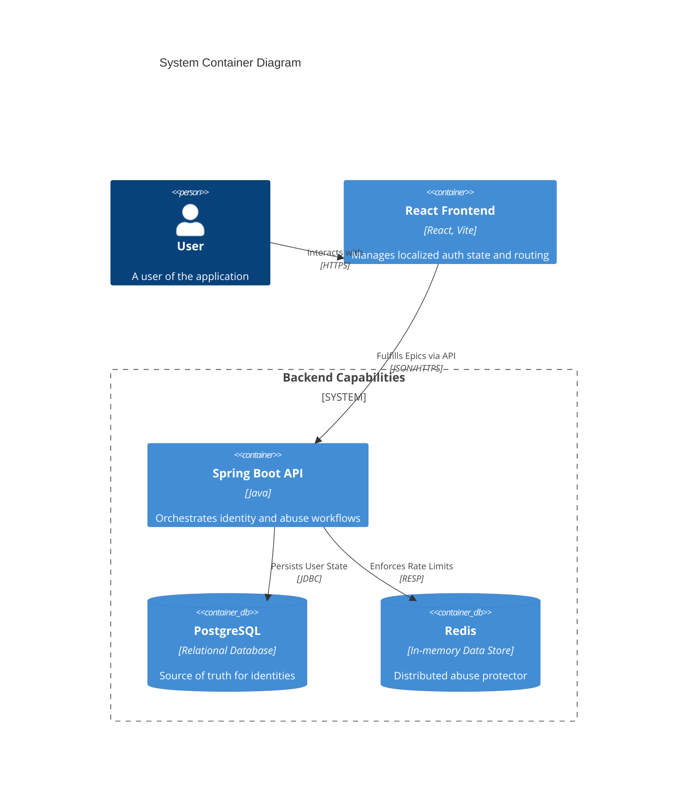

# 🚀 The Agile Architecture Playbook

> [!TIP]
> Welcome to our system's blueprint! We wrote this guide to map out our technical decisions using an Agile lens. This isn't just a dry architecture doc—it's the "why" and "how" behind our Epics and User Stories.

## 🏗️ 1. Our Vision & Rules of the Road

**The Goal:** Build a rock-solid, secure-by-default authentication layer that doesn't buckle under heavy load or get rolled over by basic web attacks.

### 🚦 The Guardrails (NFRs)
- **Scalability:** We keep the backend completely stateless—no sticky sessions here. 🐘 PostgreSQL holds the absolute truth, and 🔴 Redis handles the fast, distributed catching and rate limiting.
- **Security:** We play strictly by OWASP rules. Think `HttpOnly` cookies to nuke XSS risks, and aggressive Redis rate-limiter to shut down brute-forcers.
- **Snappy UI:** The ⚛️ React frontend keeps local auth state handy so we aren't hammering the backend on every single page transition.

### 🗺️ The Big Picture

---

## 📅 2. The Product Backlog

Here's how our system chunks down into Epics. For each one, we've outlined the core user stories and exactly how we've built the backend to solve them.

### 🟢 Epic 1: User Registration & Identity
**The Vibe:** Getting users on board securely without friction, while making sure they actually own the email they gave us.  
**Where it lives:** `AuthServiceImpl`

- **US-1.1:** *As a new user, I want to sign up with my email and password so I can get in.*
  - **How we built it:** The controller takes the hit, validates the shape of the data, and tosses it to the service layer. `AuthServiceImpl` cleans up the email, enforces our password policy, hashes the password (bcrypt/argon2), and drops a `DISABLED` user record into Postgres.
- **US-1.2:** *As a registered user, I need to verify my email using an OTP so you know I'm a real person.*
  - **How we built it:** We generate a spicy, secure OTP and hash it with SHA-256 before saving to the DB. (Never store plain OTPs!) We then email out the raw code. When the user submits it, we verify the hash, check if it's expired, and finally flip the account to active.

### 🔵 Epic 2: Core Authentication (JWTs)
**The Vibe:** Keeping users logged in without stateful server sessions dragging us down.  
**Where it lives:** `JwtAuthFilter`, `AuthTokenService`

- **US-2.1:** *As a user, I want to log in and get my access tokens.*
  - **How we built it:** We hand back a short-lived **JWT Access Token** directly in the response body. We also generate a heavy, opaque **Refresh Token**, hash it for the DB, and ship the raw value to the browser inside an unreadable, `HttpOnly`, `Secure` cookie.
- **US-2.2:** *As the frontend app, I want to silently refresh the session before the user even notices.*
  - **How we built it:** Our React Axios interceptors catch any `401` errors and automatically hit `/api/v1/auth/refresh`. The backend reads the secure cookie, matches it to the DB hash, rotates the DB record, and ships a fresh pair of tokens. Boom.

### 🔴 Epic 3: Abuse Protection & Rate Limiting
**The Vibe:** Locking the doors against bots, credential stuffers, and spam.  
**Where it lives:** `AuthAbuseProtectionService` + `Redis`

- **US-3.1:** *As an admin, I need the system to auto-block brute-force IP addresses.*
  - **How we built it:** Redis keeps tight counters on failed login attempts per-IP and per-account. Go over the limit, and you hit a brick wall.
- **US-3.2:** *As a dev, I don't want our OTP service used for SMS/email bombing.*
  - **How we built it:** Redis enforces a strict sliding window on OTP requests. If someone spams the resend button, we temporarily lock the Postgres `User` entity to chill things out.

### 🟡 Epic 4: OAuth2 (Social Login)
**The Vibe:** Let people bypass passwords entirely using Google or GitHub.  
**Where it lives:** `OAuth2UserProvisioningService`

- **US-4.1:** *As a user, I want to just click "Login with Google" and avoid typing.*
  - **How we built it:** Spring Security catches the IdP callback. Our provisioning service pulls the email and maps it to a local proxy user in Postgres. We then drop the exact same `HttpOnly` refresh cookie as a local login. Keeps the frontend completely blind to how the sausage is made!

### 🟣 Epic 5: Account Recovery
**The Vibe:** Because everyone forgets passwords, but we can't leak who has an account here.

- **US-5.1:** *As a locked-out user, I want a secure password reset link.*
  - **How we built it:** The API always returns a thumbs-up, even if the email doesn't exist (thwarts enumeration bots). If it *does* exist, we generate a time-bombed, hashed reset token and send the link.

---

## ✅ 3. Our Definition of Done (DoD)

Before any PR merges into these flows, it has to hit these marks:
- [x] **No Fat Controllers:** All validation, hashing, and rate limiting happens down in the `service` layers. Keep controllers for HTTP mapping only.
- [x] **Zero Stateful Auth:** We scale horizontally. Every API call needs a valid Bearer JWT.
- [x] **Hash Everything:** Plaintext tokens, passwords, and OTPs never touch the database.
- [x] **Survive Redis Drops:** If Redis goes down, we lose rate limiting—we *don't* lock out valid users. Fail open where it makes sense, but log loudly.
- [x] **Test the Edges:** Security features (like locking an account after 5 bad passwords) must have robust Spring Integration tests attached.
