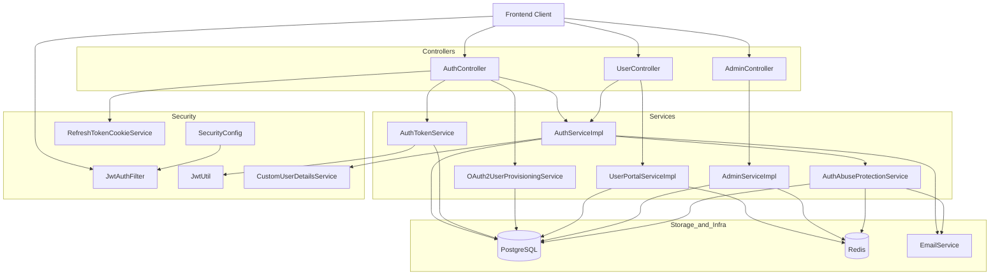
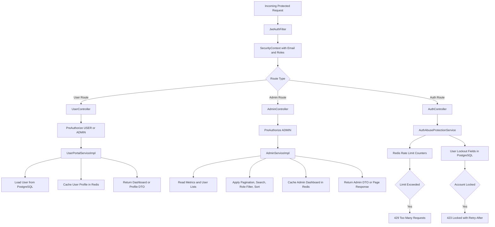

# Backend Implementation Guide

This document explains how the backend of this project is built, which technologies are used, and how the main backend features are implemented in the current codebase.

## Backend Technologies Used

1. **Java 21** is the main programming language used to build the backend services, business logic, and security flows.
2. **Spring Boot 3.5.10** is the application framework used to bootstrap the API, manage configuration, and wire the project components together.
3. **Spring Web** is used to expose REST APIs through controllers such as `AuthController`, `UserController`, and `AdminController`.
4. **Spring Security** is used for authentication, authorization, method-level protection, OAuth2 login, and request filtering.
5. **Spring Data JPA** is used to persist users and roles into PostgreSQL through repositories such as `UserRepository` and `RoleRepository`.
6. **PostgreSQL** is the main relational database and stores user accounts, roles, OTP hashes, reset token hashes, refresh token hashes, lockout fields, and audit timestamps.
7. **Redis** is used for rate limiting and caching. It supports login protection, OTP throttling, password reset throttling, and short-lived cached responses.
8. **JWT (JJWT library)** is used to create signed access tokens that carry the authenticated email and roles for stateless API authorization.
9. **BCrypt** is used as the password hashing algorithm through the Spring `PasswordEncoder` bean defined in `PasswordConfig`.
10. **OAuth2 Client** is used for Google, GitHub, Apple, and LinkedIn social login flows through Spring Security.
11. **Spring Mail and Thymeleaf** are used together to generate and send OTP, welcome, password reset, password changed, and account lock alert emails.
12. **MapStruct and Lombok** are used to reduce boilerplate. MapStruct handles DTO mapping and Lombok reduces manual getter, setter, and constructor code.
13. **Spring Cache** is used with Redis to cache profile and dashboard responses so repeated reads do not always hit the database.
14. **Docker and Docker Compose** are used to run the backend and its dependencies such as PostgreSQL and Redis in a consistent local environment.

## How the Backend Is Structured

1. The backend follows a layered architecture: `controller` for HTTP APIs, `service` for business logic, `repository` for database access, `security` for JWT and OAuth2 integration, and `support` services for reusable security helpers.
2. API versioning is centralized in `ApiPaths`, which defines `/api/v1/auth`, `/api/v1/user`, and `/api/v1/admin`.
3. Request DTOs are used for input validation, and response DTOs are used to return safe, frontend-friendly payloads.
4. `GlobalExceptionHandler` converts backend exceptions into a consistent `ApiResponse` format so the frontend gets stable error responses.

## Detailed Request Flow Inside the Backend

1. A request first enters a controller such as `AuthController`, `UserController`, or `AdminController`.
2. Spring validates request DTOs using `@Valid`, so invalid inputs are rejected before business logic runs.
3. The controller delegates to a service class, where the real workflow is implemented. Controllers stay thin and mostly handle HTTP concerns.
4. Services use repositories and helper services to read or update PostgreSQL and Redis.
5. Security checks are performed either before the controller through Spring Security filters or inside the service layer for flow-specific protections such as rate limits and lockouts.
6. The response is wrapped in `ApiResponse`, which keeps success and error payloads consistent for the frontend.
7. If something fails, `GlobalExceptionHandler` converts exceptions such as invalid credentials, expired tokens, or rate limit violations into clean API responses with the right HTTP status codes.

## Feature Diagrams

The diagrams below cover all major backend feature groups in this project.

### 1. Overall Backend Feature Map

### 2. Registration, OTP Verification, and Resend OTP

```mermaid
flowchart LR
    A[Register Request] --> B[Validate Request DTO]
    B --> C[Normalize Email]
    C --> D[Check Existing User]
    D --> E[Validate Password Policy]
    E --> F[Map Request to User Entity]
    F --> G[Hash Password with BCrypt]
    G --> H[Generate OTP]
    H --> I[Hash OTP]
    I --> J[Save Disabled User with ROLE_USER]
    J --> K[Send OTP Email]

    K --> L[Verify OTP Request]
    L --> M[OTP Abuse Guard]
    M --> N[Find User by Email]
    N --> O[Compare Submitted OTP with Stored Hash]
    O --> P[Check OTP Expiry]
    P --> Q[Enable Account]
    Q --> R[Clear OTP Fields and Failure Counters]
    R --> S[Send Welcome Email]

    K --> T[Resend OTP Request]
    T --> U[Resend Rate Limit and Cooldown Check]
    U --> V[Generate New OTP]
    V --> W[Hash New OTP and Update Expiry]
    W --> X[Send Fresh OTP Email]
```

### 3. Login, JWT Authentication, Refresh, Cookie Handling, and Logout

```mermaid
flowchart LR
    A[Login Request] --> B[Login Rate Limit and Lock Check]
    B --> C[Authenticate with AuthenticationManager]
    C --> D[Load User via CustomUserDetailsService]
    D --> E[Verify BCrypt Password]
    E --> F[Clear Login Failures]
    F --> G[Generate JWT Access Token]
    G --> H[Generate Opaque Refresh Token]
    H --> I[Hash Refresh Token]
    I --> J[Store Refresh Hash and Expiry in PostgreSQL]
    J --> K[Set HttpOnly Refresh Cookie]
    K --> L[Return Access Token in API Response]

    L --> M[Protected API Request with Bearer Token]
    M --> N[JwtAuthFilter Validates Token]
    N --> O[Extract Email and Roles]
    O --> P[Populate SecurityContext]
    P --> Q[User and Admin APIs Allowed]

    K --> R[Refresh Request]
    R --> S[Read Refresh Token from Body or Cookie]
    S --> T[Hash Incoming Refresh Token]
    T --> U[Find Matching User]
    U --> V[Check Refresh Expiry]
    V --> W[Rotate and Issue New Token Pair]
    W --> X[Set New Refresh Cookie]

    X --> Y[Logout Request]
    Y --> Z[Revoke Stored Refresh Hash]
    Z --> AA[Clear Browser Refresh Cookie]
```

### 4. Password Reset and Authenticated Password Change

```mermaid
flowchart LR
    A[Forgot Password Request] --> B[Reset Password Rate Limit Check]
    B --> C[Return Generic Success Message]
    C --> D{User Exists}
    D -->|Yes| E[Generate Reset Token]
    E --> F[Hash Reset Token]
    F --> G[Store Reset Hash and Expiry]
    G --> H[Send Password Reset Email]
    D -->|No| I[Stop Without Revealing Account Existence]

    H --> J[Update Password Request]
    J --> K[Hash Submitted Reset Token]
    K --> L[Find User by Reset Hash]
    L --> M[Check Reset Token Expiry]
    M --> N[Validate New Password Policy]
    N --> O[Hash New Password with BCrypt]
    O --> P[Clear Reset Token Fields]
    P --> Q[Send Password Changed Confirmation Email]

    R[Authenticated Change Password Request] --> S[Read Authenticated Email]
    S --> T[Verify Current Password]
    T --> U[Validate New Password Policy]
    U --> V[Hash and Save New Password]
    V --> W[Send Password Changed Confirmation Email]
```

### 5. OAuth2 Social Login

```mermaid
flowchart LR
    A[User Clicks Social Login] --> B[/oauth2/authorization/provider/]
    B --> C[OAuth Provider Login Screen]
    C --> D[/login/oauth2/code/provider/]
    D --> E[OAuth2AuthenticationSuccessHandler]
    E --> F[Read Provider User Attributes]
    F --> G[OAuth2UserProvisioningService]
    G --> H{Existing Provider User}
    H -->|Yes| I[Reuse Local User]
    H -->|No| J{Existing Local User by Email}
    J -->|Yes| K[Link Provider Details]
    J -->|No| L[Create New Enabled Local User]
    I --> M[Issue App Tokens]
    K --> M
    L --> M
    M --> N[Hash Refresh Token and Save]
    N --> O[Set HttpOnly Refresh Cookie]
    O --> P[Redirect to Frontend OAuth Callback]
    P --> Q[Frontend Calls /api/v1/auth/refresh]
    Q --> R[Backend Returns Access Token and User Payload]
```

### 6. Role-Based Access, User/Admin Features, Caching, and Abuse Protection

## How We Implement the Main Backend Features

### 1. User Registration
**Endpoint:** `POST /api/v1/auth/register`  
**Main classes:** `AuthController`, `AuthServiceImpl`, `UserMapper`, `PasswordPolicyService`, `RoleService`, `UserService`  
**Detailed implementation:**
1. The frontend sends `name`, `email`, and `password` in `RegisterRequest`.
2. `AuthController.register` accepts the request and relies on bean validation to reject invalid payloads.
3. `AuthServiceImpl.register` normalizes the email using `EmailNormalizer` so the system does not treat different letter cases as different users.
4. The service checks `userService.existsByEmail(email)` to prevent duplicate registration.
5. `PasswordPolicyService` enforces minimum security rules such as length, letters, numbers, no spaces, blocklisted passwords, and not including the email username.
6. `UserMapper.toEntity` converts the request DTO into a new `User` entity, while security-sensitive fields are intentionally ignored and set manually in the service.
7. The password is hashed with BCrypt through the Spring `PasswordEncoder` bean.
8. The account is marked as local auth by setting `authProvider = "local"`.
9. The default `ROLE_USER` role is attached by loading or creating the role through `RoleService`.
10. An OTP is generated and stored in hashed form before the user is saved.
11. The user is saved as `enabled = false`, meaning email verification is still pending.
12. A verification email is sent, and the API returns a success message telling the user to verify the account.

### 2. OTP Email Verification
**Endpoint:** `POST /api/v1/auth/verify-otp`  
**Main classes:** `AuthController`, `AuthServiceImpl`, `AuthAbuseProtectionService`, `TokenHashService`, `EmailService`  
**Detailed implementation:**
1. When the user submits email and OTP, the request reaches `AuthController.verifyOtp`.
2. `AuthServiceImpl.verifyOtp` first calls `AuthAbuseProtectionService.guardOtpVerification(email)` to enforce Redis-based request limits and check whether OTP verification is temporarily locked for that account.
3. The user is loaded from PostgreSQL. If no user exists, the service throws `ResourceNotFoundException`.
4. If the account is already verified, the service throws `UserAlreadyExistsException` with an "already verified" message.
5. The submitted raw OTP is never compared directly against a plaintext value because no plaintext OTP is stored in the database.
6. `TokenHashService.matches` hashes the incoming OTP with the server-side pepper and compares it with the stored hash using constant-time comparison.
7. If the OTP is wrong, failed OTP attempts are incremented in the user entity. After enough failures, `otpLockedUntil` is set so verification is temporarily blocked.
8. If the OTP is correct, the backend checks whether `otpExpiry` is still valid.
9. On success, the user is marked `enabled = true`, the OTP hash and expiry fields are cleared, failure counters are reset, and the updated user is saved.
10. A welcome email is sent using a Thymeleaf email template.

### 3. Resend OTP Flow
**Endpoint:** `POST /api/v1/auth/resend-otp?email=...`  
**Main classes:** `AuthController`, `AuthServiceImpl`, `AuthAbuseProtectionService`, `OtpService`, `EmailService`  
**Detailed implementation:**
1. The resend flow is meant for users who registered but did not complete verification in time.
2. Before doing any work, `AuthAbuseProtectionService.guardResendOtp` checks three Redis-backed protections: an email cooldown, an email request window, and an IP-based window.
3. This stops users or bots from repeatedly requesting new OTP emails.
4. The backend loads the user by email and ensures the account is still unverified.
5. A new OTP is generated by `OtpService.generateOtp()`.
6. The OTP is hashed and written back to `verificationOtp`, and a fresh expiry time is stored in `otpExpiry`.
7. The user entity is saved, replacing the previous OTP state.
8. The new raw OTP is sent by email, and the API returns a success response.

### 4. Email and Password Login
**Endpoint:** `POST /api/v1/auth/login`  
**Main classes:** `AuthController`, `AuthServiceImpl`, `AuthenticationManager`, `CustomUserDetailsService`, `AuthTokenService`  
**Detailed implementation:**
1. The login request contains email and password and is validated in `AuthController.login`.
2. `AuthServiceImpl.login` normalizes the email so authentication is case-insensitive.
3. `AuthAbuseProtectionService.guardLoginAttempt(email)` checks Redis rate limits and also checks whether the account is currently locked due to repeated failed logins.
4. The backend attempts to find the user. If the email is unknown, it still records a failed login path and throws a generic bad-credentials error so the API does not reveal whether the account exists.
5. Spring Security authenticates credentials through `AuthenticationManager`, which uses `CustomUserDetailsService` and the configured BCrypt `PasswordEncoder`.
6. `CustomUserDetailsService` loads the database user and maps application roles into Spring Security authorities.
7. A useful project-specific detail is that unverified users can still authenticate. In this backend, `enabled` is used for email verification state, not as a Spring Security account-disabled flag. This allows pending users to sign in and continue the verification flow.
8. If authentication fails, failed login counters are updated and may eventually trigger account lockout.
9. If authentication succeeds, login failure counters and lock fields are cleared.
10. The backend then issues a short-lived access token and a rotated refresh token.

### 5. JWT Access Token Authentication
**Endpoint usage:** Applied to protected routes such as `/api/v1/user/**` and `/api/v1/admin/**`  
**Main classes:** `SecurityConfig`, `JwtAuthFilter`, `JwtUtil`  
**Detailed implementation:**
1. `SecurityConfig` adds `JwtAuthFilter` before Spring's default username/password filter.
2. For each incoming protected request, `JwtAuthFilter` reads the `Authorization` header and checks for the `Bearer` prefix.
3. If a token is present, `JwtUtil.validateToken` verifies the signature and expiry using the configured secret key.
4. `JwtUtil` supports Base64, Base64URL, or plain-text secrets and enforces a minimum secret length for HS256 signing.
5. If validation succeeds, the filter extracts the email from the JWT subject and the role list from the `roles` claim.
6. The filter converts those roles into `SimpleGrantedAuthority` values and creates a Spring Security authentication object.
7. That authentication object is stored in `SecurityContextHolder`, making the request authenticated for the rest of the controller and service flow.
8. Because this is stateless JWT auth, the backend does not need server-side HTTP sessions for normal API requests.

### 6. Refresh Token Rotation
**Endpoint:** `POST /api/v1/auth/refresh`  
**Main classes:** `AuthController`, `AuthTokenService`, `TokenHashService`, `RefreshTokenCookieService`  
**Detailed implementation:**
1. The backend uses a split-token design: the access token is a JWT, while the refresh token is a random opaque secret.
2. `AuthTokenService.issueTokens` generates a refresh token using `SecureRandom`, Base64URL-encodes it, hashes it, and stores only the hash in the user table.
3. The refresh token expiry is stored in `refreshTokenExpiry`.
4. On refresh, `AuthController.refreshToken` looks for the token in two places: first in the request body, then in matching cookies. Distinct values are collected in order and tried one by one.
5. This gives flexibility for browser flows and API clients while still preferring the body token when provided.
6. `AuthTokenService.refreshTokens` hashes the raw token and finds the matching user by the stored hash.
7. If the token is unknown or expired, the backend throws `TokenValidationException`. Expired tokens are also cleared from the database.
8. If the token is valid, the backend rotates it immediately by generating a completely new refresh token and access token pair.
9. Rotation means an old refresh token should not continue to be used after a successful refresh.
10. The new refresh token is returned to the client through the cookie service, and the new access token is returned inside the response body.

### 7. Secure Refresh Cookie Handling
**Main classes:** `RefreshTokenCookieService`, `AuthController`  
**Detailed implementation:**
1. Refresh tokens are sent to the browser through `Set-Cookie`, not localStorage or JavaScript-readable storage.
2. `RefreshTokenCookieService` always marks the cookie as `HttpOnly`, which reduces XSS exposure for the refresh token.
3. The cookie path is limited to the auth routes, which narrows where the browser sends the cookie.
4. The service can auto-detect whether the current request should use `Secure` and whether the cookie should be `SameSite=Lax` or `SameSite=None`.
5. It decides this using request details such as forwarded protocol, origin, referer, and cross-site hints.
6. If a configuration attempts to use `SameSite=None` without `Secure`, the service throws an error because browsers reject that combination and it is not safe.
7. The same service also generates an expired cookie value for logout and invalidation flows.

### 8. Logout and Token Revocation
**Endpoint:** `POST /api/v1/auth/logout`  
**Main classes:** `AuthController`, `AuthTokenService`, `RefreshTokenCookieService`  
**Detailed implementation:**
1. Logout is implemented as refresh-token revocation rather than keeping a server-side login session.
2. `AuthController.logout` gathers refresh-token candidates from the request body and any cookies with the configured refresh cookie name.
3. For each candidate, `AuthTokenService.revokeRefreshToken` hashes the raw token and tries to find the matching stored hash in the database.
4. If a match is found, the backend clears `refreshToken` and `refreshTokenExpiry` on the user record.
5. If a token is missing or unknown, the method quietly returns without failing the request.
6. After server-side revocation, the controller sends a clearing cookie so the browser drops the refresh token too.
7. The API then returns a simple success message saying logout completed.

### 9. Password Reset
**Endpoints:** `POST /api/v1/auth/reset-password` and `POST /api/v1/auth/update-password`  
**Main classes:** `AuthServiceImpl`, `OtpService`, `TokenHashService`, `EmailService`  
**Detailed implementation:**
1. The reset-request endpoint begins with `AuthAbuseProtectionService.guardResetPassword(email)`, which applies Redis limits per email and per IP.
2. The backend intentionally returns the same success message whether the email exists or not. This prevents attackers from discovering valid accounts by comparing responses.
3. If the account exists, the service generates a URL-safe reset token using `OtpService.generateResetToken()`.
4. The raw token is never stored directly. It is hashed by `TokenHashService` and saved to `resetToken`, while the expiry timestamp is saved to `resetTokenExpiry`.
5. `EmailService` builds a reset URL using the frontend reset-password route and sends the link through a Thymeleaf email template.
6. When the user submits the new password with the reset token, `AuthServiceImpl.updatePassword` hashes the incoming token and looks up the user by the stored hash.
7. The backend checks token expiry before accepting the new password.
8. `PasswordPolicyService` validates the new password, then BCrypt hashes it and stores the result in the user record.
9. The reset token hash and expiry are cleared so the link cannot be reused.
10. A password-changed confirmation email is sent after success.

### 10. Authenticated Password Change
**Endpoint:** `POST /api/v1/user/change-password`  
**Main classes:** `UserController`, `AuthPrincipalUtil`, `AuthServiceImpl`, `PasswordPolicyService`  
**Detailed implementation:**
1. This feature is for an already authenticated user, not a user coming from the forgot-password flow.
2. The route is protected by `@PreAuthorize("hasRole('USER') or hasRole('ADMIN')")`.
3. `UserController.changePassword` reads the authenticated email from the Spring Security principal using `AuthPrincipalUtil`.
4. `AuthServiceImpl.changePassword` loads the current user from PostgreSQL.
5. The submitted current password is compared against the stored BCrypt hash.
6. If the current password is wrong, the backend throws a bad-credentials style error.
7. The new password is validated through the same password policy used in registration and password reset.
8. The user password is then replaced with a freshly encoded BCrypt hash.
9. The updated user is saved, and a password change confirmation email is sent as an extra security signal.

### 11. Social Login with OAuth2
**Endpoints:** `/oauth2/authorization/{provider}` and `/login/oauth2/code/{provider}`  
**Main classes:** `SecurityConfig`, `OAuth2AuthenticationSuccessHandler`, `OAuth2AuthenticationFailureHandler`, `OAuth2UserProvisioningService`  
**Detailed implementation:**
1. Spring Security handles the OAuth2 redirect flow and provider callback.
2. `SecurityConfig` registers a custom LinkedIn authorization resolver plus success and failure handlers for provider login.
3. On successful provider authentication, `OAuth2AuthenticationSuccessHandler` receives the provider token and OAuth2 user attributes.
4. `OAuth2UserProvisioningService` normalizes the provider name and extracts a provider user id plus the best available email and display name from the provider attributes.
5. If a local user already exists for that provider user id, the backend reuses it.
6. If a local user exists by email, the backend updates it with provider linkage when appropriate.
7. If no user exists, a new enabled local user is created with a random generated password, provider metadata, and `ROLE_USER`.
8. After provisioning, the backend issues application tokens exactly like a normal login flow and stores the refresh token hash in PostgreSQL.
9. The success handler sets the refresh token in an HttpOnly cookie and redirects the browser to the frontend callback route.
10. On the frontend callback page, the React app completes the session by calling the normal `/refresh` endpoint once, which returns the access token and user payload.
11. If OAuth fails, the failure handler redirects the browser back to the frontend login screen with an error message in the query string.

### 12. Role-Based Access Control
**Main classes:** `SecurityConfig`, `User`, `Role`, `CustomUserDetailsService`, controller `@PreAuthorize` annotations  
**Detailed implementation:**
1. Roles are modeled as a separate entity and linked to users with a JPA `@ManyToMany` association through the `user_roles` table.
2. `RoleName` stores the allowed system roles such as `ROLE_USER` and `ROLE_ADMIN`.
3. During authentication, `CustomUserDetailsService` converts each role into a Spring Security authority.
4. When JWTs are generated, those role names are also written into the `roles` claim.
5. `SecurityConfig` protects routes at the HTTP layer by allowing admin routes only to `ROLE_ADMIN` and user routes to either `ROLE_USER` or `ROLE_ADMIN`.
6. Controllers add another layer of protection with `@PreAuthorize`, which keeps access rules visible close to the endpoint logic.
7. This combination ensures that both URL-based checks and method-level checks enforce the authorization model.

### 13. Abuse Protection and Brute-Force Defense
**Main classes:** `AuthAbuseProtectionService`, `RateLimitService`, `User`, `GlobalExceptionHandler`  
**Detailed implementation:**
1. Sensitive auth routes call `AuthAbuseProtectionService` before performing expensive or security-sensitive work.
2. Redis rate-limit keys are separated by feature and identity, such as login by IP, login by email, OTP verification by IP, resend OTP by email, and reset-password by IP.
3. `RateLimitService.consume` increments a Redis counter, applies an expiry window, and returns whether the request is allowed plus retry timing information.
4. If a limit is exceeded, `RateLimitExceededException` is thrown and `GlobalExceptionHandler` returns HTTP `429 Too Many Requests` with a `Retry-After` header.
5. Beyond Redis rate limits, the backend also stores per-user brute-force state in PostgreSQL using fields such as `failedLoginAttempts`, `accountLockedUntil`, `failedOtpAttempts`, and `otpLockedUntil`.
6. When login failures hit the configured threshold, the account is temporarily locked and an account lock alert email may be sent.
7. When OTP verification failures hit the threshold, OTP verification is temporarily locked as well.
8. If Redis becomes unavailable, `RateLimitService` fails open and logs a warning instead of taking the whole authentication system offline.

### 14. Admin Dashboard and User Management
**Endpoints:** `GET /api/v1/admin/dashboard` and `GET /api/v1/admin/users`  
**Main classes:** `AdminController`, `AdminServiceImpl`, `UserRepository`, `UserMapper`  
**Detailed implementation:**
1. Admin routes are protected at both the route level and controller level so only administrators can use them.
2. `AdminServiceImpl.getDashboard` returns summary data such as the authenticated admin email, total users, enabled users, and a formatted timestamp.
3. The dashboard method is cacheable through Redis-backed Spring Cache, which helps avoid recalculating the same summary on every request.
4. `getUsers` supports paging, size limits, search text, enabled status filtering, role filtering, and sort direction.
5. Search is implemented through JPA specifications and matches both `name` and `email`.
6. Role filtering accepts both `USER` and `ROLE_USER` style inputs and normalizes them before querying.
7. Sorting is restricted to an allowed-field whitelist so callers cannot sort by arbitrary columns.
8. The repository returns a Spring Data `Page<User>`, which is mapped into a `Page<UserDto>` before being sent to the frontend.

### 15. User Dashboard, Profile, and Response Mapping
**Endpoints:** `GET /api/v1/user/dashboard` and `GET /api/v1/user/profile`  
**Main classes:** `UserController`, `UserPortalServiceImpl`, `UserMapper`, `AuthPrincipalUtil`  
**Detailed implementation:**
1. User routes require an authenticated JWT and are accessible to both normal users and admins.
2. `AuthPrincipalUtil` extracts the authenticated email from the security principal populated earlier by `JwtAuthFilter`.
3. `UserPortalServiceImpl.getDashboard` loads the user by email and maps the entity to `UserDashboardDto`.
4. The service adds extra presentation-friendly values such as a welcome message and a formatted timestamp rather than making the frontend assemble them manually.
5. `getProfile` loads the same user entity and maps it into `UserDto`, which exposes safe account information including roles and login source.
6. MapStruct handles conversion from entity fields to API DTO fields, including role name formatting and display-specific values.
7. The profile response is cacheable through Redis to reduce repeated database reads for frequently opened account pages.

## Important Security Design Choices

1. Passwords are stored with **BCrypt**, not in plain text.
2. OTP codes, reset tokens, and refresh tokens are stored as **hashes**, not raw values.
3. Access tokens are **short-lived JWTs**, while refresh tokens are **opaque random secrets**.
4. Refresh tokens are delivered through **HttpOnly cookies**, which keeps them away from normal JavaScript access.
5. Rate limiting and temporary lockouts are applied to sensitive auth endpoints to reduce brute-force abuse.
6. The backend uses centralized exception handling so security and validation errors return predictable API responses.

## Supporting Backend Components

1. `BaseEntity` automatically manages `createdAt` and `updatedAt` timestamps for persistent entities.
2. `DataInitializer` creates the default roles at startup and can seed an admin account when enabled by configuration.
3. `CorsConfig` allows only configured frontend origins and rejects unsafe wildcard credential settings.
4. `CacheConfig` defines Redis-backed cache TTLs for user profile and admin dashboard responses.
5. The backend already includes tests for controllers, services, JWT utilities, OAuth2 provisioning, and helper utilities under `backend/src/test/java`.

## Conclusion

This backend is implemented as a production-style authentication system instead of a basic demo. It combines Spring Boot, Spring Security, PostgreSQL, Redis, JWT, OAuth2, BCrypt, and email templating to cover the full authentication lifecycle: registration, verification, login, refresh, logout, password reset, password change, user APIs, and admin APIs.
